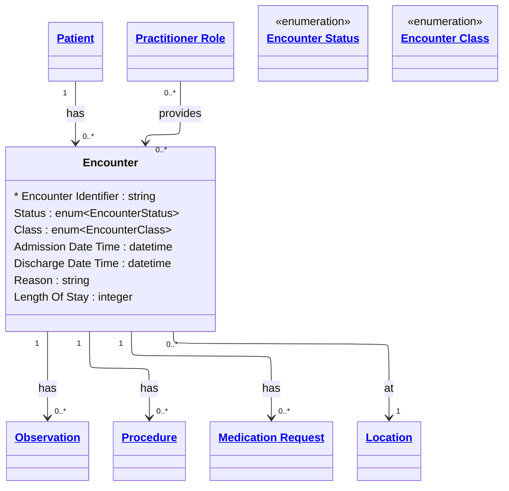

# [Healthcare](../domain.md)

## Entities

### Encounter

An interaction between a patient and healthcare provider(s) for the purpose of providing healthcare service(s) or assessing the health status of a patient. Aligned to the FHIR R4 Encounter resource, an Encounter is a period-based entity with a defined start (admission/arrival) and end (discharge/departure).

Encounters are the primary clinical context container — observations, procedures, diagnoses, and medication requests are recorded within the scope of an encounter.



```yaml
existence: dependent
mutability: slowly_changing
temporal:
  tracking: valid_time
  description: >
    Valid time tracks the clinical period of the encounter from admission
    to discharge. Encounter records may be updated (e.g. status transitions,
    discharge coding) but the admission and discharge timestamps define the
    encounter's valid time window.
attributes:
  Encounter Identifier:
    type: string
    identifier: primary
    description: Unique identifier for this encounter.

  Status:
    type: enum:Encounter Status
    description: Current lifecycle status of the encounter.

  Class:
    type: enum:Encounter Class
    description: Classification of the encounter type (inpatient, outpatient, emergency, etc.).

  Admission Date Time:
    type: datetime
    description: Date and time the encounter began (patient arrived or was admitted).

  Discharge Date Time:
    type: datetime
    description: Date and time the encounter ended (patient discharged or departed).

  Reason:
    type: string
    description: Clinical reason for the encounter.

  Length Of Stay:
    type: integer
    description: Duration of the encounter in days, calculated from admission to discharge.
```

```yaml
constraints:
  Discharge After Admission:
    check: "Discharge Date Time IS NULL OR Discharge Date Time > Admission Date Time"
    description: Discharge must occur after admission. Null discharge indicates encounter is ongoing.
```

```yaml
governance:
  retention_basis: Inherited from domain default retention of 7 years post last encounter
```

## Relationships

### Encounter Has Observations

An Encounter can produce multiple Observations — vital signs, lab results, clinical assessments.

```yaml
source: Encounter
type: has
target: Observation
cardinality: one-to-many
granularity: atomic
ownership: Encounter
```

### Encounter Has Procedures

An Encounter can involve multiple Procedures performed during the clinical interaction.

```yaml
source: Encounter
type: has
target: Procedure
cardinality: one-to-many
granularity: atomic
ownership: Encounter
```

### Encounter Has Medication Requests

Medication Requests can originate from an Encounter as part of the treatment plan.

```yaml
source: Encounter
type: has
target: Medication Request
cardinality: one-to-many
granularity: atomic
ownership: Encounter
```

### Encounter At Location

An Encounter takes place at a specific Location (ward, room, clinic).

```yaml
source: Encounter
type: references
target: Location
cardinality: many-to-one
granularity: atomic
ownership: Encounter
```
