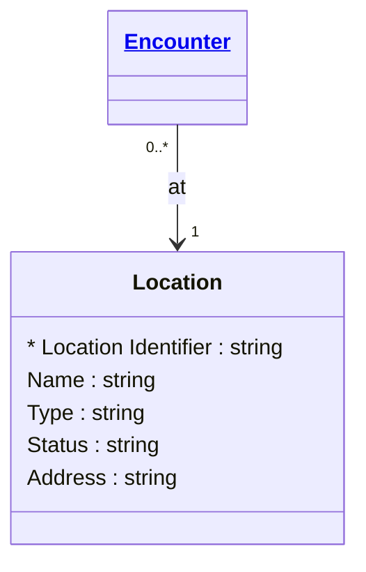

# [Healthcare](../domain.md)

## Entities

### Location

A physical place where healthcare services are provided and resources and participants may be stored, found, contained, or accommodated. Aligned to the FHIR R4 Location resource, this entity represents wards, rooms, operating theatres, clinics, and other service delivery points.

Locations are spatial reference entities — they change infrequently and are managed by facilities teams.



```yaml
existence: independent
mutability: reference
attributes:
  Location Identifier:
    type: string
    identifier: primary
    description: Unique identifier for this location.

  Name:
    type: string
    description: Human-readable name of the location (e.g. Ward 3B, Operating Theatre 2).

  Type:
    type: string
    description: Type of function performed at the location (e.g. ward, clinic, operating theatre).

  Status:
    type: string
    description: Operational status of the location (active, suspended, inactive).

  Address:
    type: string
    description: Physical address of the location.
```

```yaml
governance:
  pii: false
  classification: Internal
  retention_basis: >
    Location records are reference data with no PII. Retained as long as
    the facility exists or has historical clinical records referencing it.
```
