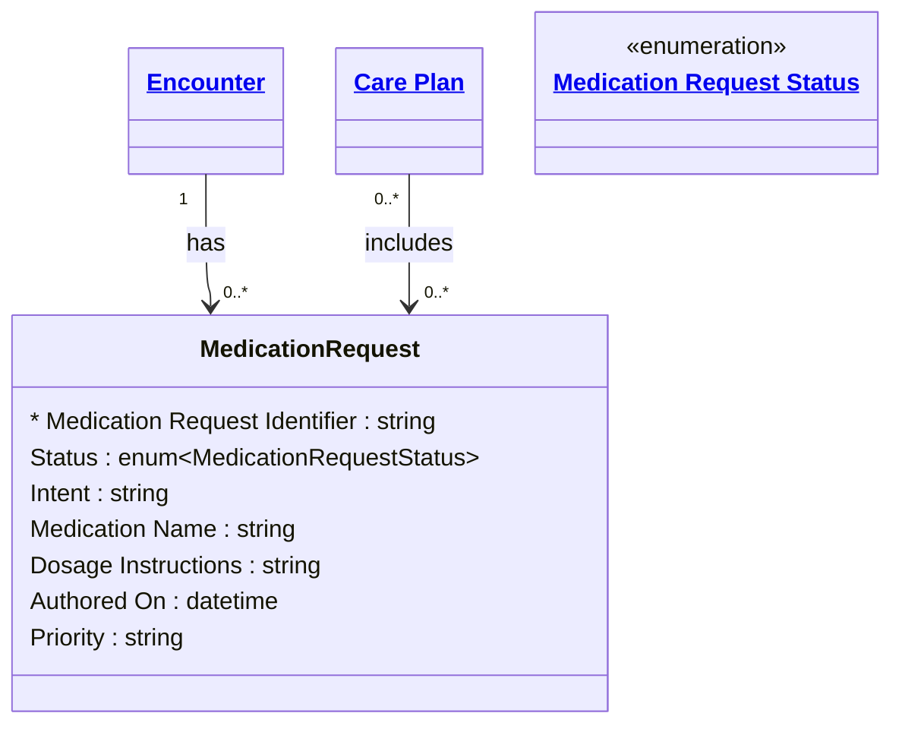

# [Healthcare](../domain.md)

## Entities

### Medication Request

An order or request for both supply of the medication and the instructions for administration of the medication to a patient. Aligned to the FHIR R4 MedicationRequest resource, this entity covers prescriptions across inpatient and outpatient settings — from stat doses in the emergency department to long-term maintenance medications.

Medication Requests are complex dependent entities with strict governance — they carry personally identifiable clinical information, require audit trails, and are subject to prescribing authority validation.



```yaml
existence: dependent
mutability: slowly_changing
temporal:
  tracking: transaction_time
  description: >
    Transaction time tracks when the medication order was recorded and
    any subsequent status changes. Prescribing audit requires knowing
    exactly when an order entered the system and who authored it.
attributes:
  Medication Request Identifier:
    type: string
    identifier: primary
    description: Unique identifier for this medication request.

  Status:
    type: enum:Medication Request Status
    description: Lifecycle status of the medication request (active, on-hold, cancelled, completed, etc.).

  Intent:
    type: string
    description: >
      Whether this is a proposal, plan, order, or instance-order. Distinguishes
      between a suggested medication and a confirmed prescription.

  Medication Name:
    type: string
    description: Name of the medication prescribed.

  Dosage Instructions:
    type: string
    description: Free-text instructions for how the medication should be taken.

  Authored On:
    type: datetime
    description: Date and time the medication request was initially authored.

  Priority:
    type: string
    description: Urgency of the medication request (routine, urgent, asap, stat).
```

```yaml
governance:
  pii: true
  classification: Highly Confidential
  retention: 7 years
  retention_basis: >
    Medication records are PHI under HIPAA and subject to prescribing
    audit requirements. Retained per domain default.
  access_role:
    - CLINICAL_STAFF
    - PHARMACY
    - HEALTH_INFORMATION_MANAGEMENT
```
