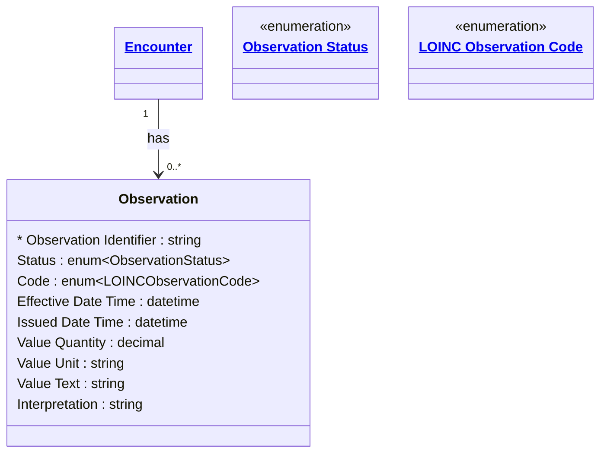

# [Healthcare](../domain.md)

## Entities

### Observation

Measurements and simple assertions made about a patient, device, or other subject. Aligned to the FHIR R4 Observation resource, this entity captures clinical measurements (vital signs, lab results, imaging findings) and social determinants of health assessments.

Observations are high-volume, append-only records. Once a clinical observation is recorded and finalized, it is never modified — corrections are issued as new observations that supersede the original. Transaction time tracking is essential because the time a result was recorded in the system may differ significantly from when the measurement was taken (e.g. lab results arriving hours after specimen collection).



```yaml
existence: dependent
mutability: append_only
temporal:
  tracking: transaction_time
  description: >
    Transaction time tracks when the observation was recorded in the system.
    This is critical for clinical data because lab results, imaging reports,
    and other observations frequently arrive after the clinical measurement
    was taken. The system must know both when the measurement happened
    (Effective Date Time) and when it became known to the system (Issued
    Date Time / transaction time).
attributes:
  Observation Identifier:
    type: string
    identifier: primary
    description: Unique identifier for this observation.

  Status:
    type: enum:Observation Status
    description: Status of the observation result (registered, preliminary, final, amended).

  Code:
    type: enum:LOINC Observation Code
    description: >
      LOINC code identifying the type of observation. Uses Logical Observation
      Identifiers Names and Codes for interoperability.

  Effective Date Time:
    type: datetime
    description: Clinically relevant time when the observation was made or specimen collected.

  Issued Date Time:
    type: datetime
    description: Date and time this observation version was made available to the system.

  Value Quantity:
    type: decimal
    description: Numeric result value of the observation.

  Value Unit:
    type: string
    description: Unit of measure for the numeric result (e.g. mg/dL, mmHg, bpm).

  Value Text:
    type: string
    description: Text result when the observation is non-numeric.

  Interpretation:
    type: string
    description: Clinical interpretation indicator (e.g. normal, high, low, critical).
```

```yaml
governance:
  pii: true
  classification: Highly Confidential
  retention: 7 years
  retention_basis: >
    Clinical observations are PHI under HIPAA. Retention aligns with domain
    default of 7 years post last encounter.
  access_role:
    - CLINICAL_STAFF
    - LABORATORY
    - HEALTH_INFORMATION_MANAGEMENT
```
