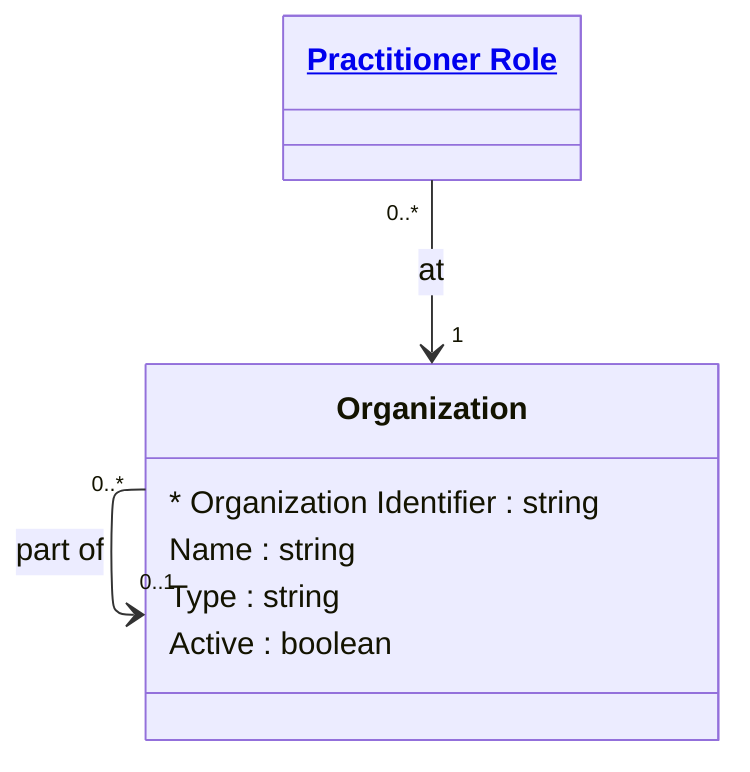

# [Healthcare](../domain.md)

## Entities

### Organization

A formally or informally recognized grouping of people or organizations providing healthcare services. Aligned to the FHIR R4 Organization resource, this entity represents hospitals, clinics, departments, health systems, and other healthcare organizational units.

Organizations form a hierarchy — a hospital is part of a health system, a department is part of a hospital. This hierarchical structure is modelled through the self-referencing `Part Of` relationship in FHIR.



```yaml
existence: independent
mutability: reference
attributes:
  Organization Identifier:
    type: string
    identifier: primary
    description: Unique identifier for this organization.

  Name:
    type: string
    description: Name used for the organization.

  Type:
    type: string
    description: Kind of organization (hospital, clinic, department, health system).

  Active:
    type: boolean
    description: Whether this organization record is still in active use.
```

```yaml
governance:
  pii: false
  classification: Internal
  retention_basis: >
    Organization records are reference data with no PII. Retained indefinitely
    as long as the organization exists or has historical clinical records
    referencing it.
```
