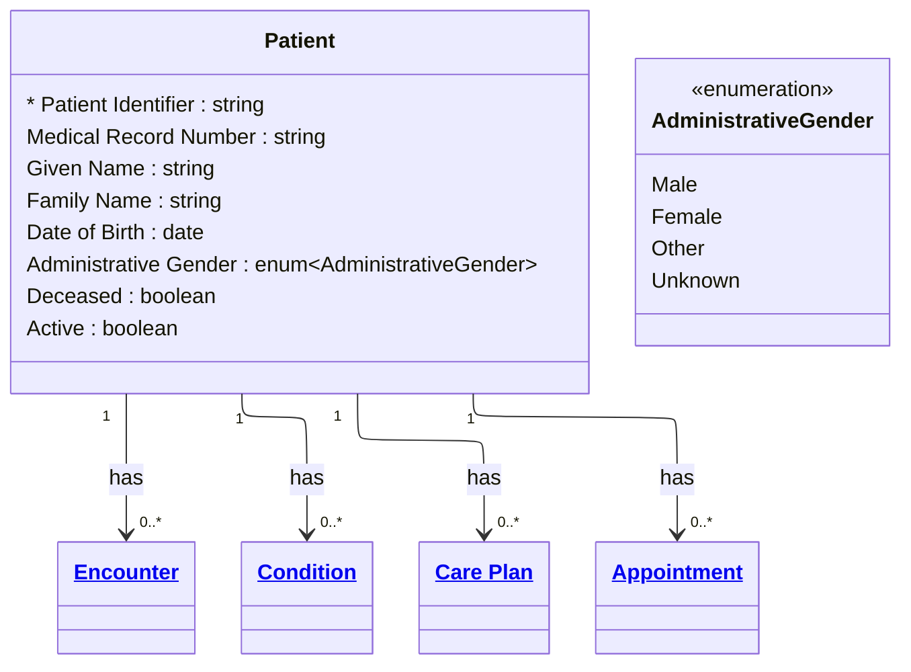

# [Healthcare](../domain.md)

## Entities

### Patient

Demographics and administrative information about an individual receiving care or other health-related services. Aligned to the FHIR R4 Patient resource, this entity represents the core identity record for any person who is a subject of clinical care.

In the Healthcare domain, Patient is the central entity to which all clinical activities — encounters, observations, conditions, procedures, and care plans — are linked. HIPAA governs Patient as Protected Health Information (PHI), requiring strict access controls, audit logging, and minimum necessary disclosure.



```yaml
existence: independent
mutability: slowly_changing
temporal:
  tracking: valid_time
  description: >
    Patient demographic records change over time (name changes, address
    updates) and historical states must be recoverable for clinical and
    billing audit purposes.
attributes:
  Patient Identifier:
    type: string
    identifier: primary
    description: Globally unique patient identifier across systems.

  Medical Record Number:
    type: string
    identifier: alternate
    description: Facility-assigned medical record number.

  Given Name:
    type: string
    pii: true
    description: Patient's given (first) name.

  Family Name:
    type: string
    pii: true
    description: Patient's family (last) name.

  Date of Birth:
    type: date
    pii: true
    description: Patient's date of birth.

  Administrative Gender:
    type: enum:Administrative Gender
    description: Administrative gender for clinical and administrative purposes.

  Deceased:
    type: boolean
    description: Whether the patient is deceased.

  Active:
    type: boolean
    description: Whether this patient record is in active use.
```

```yaml
governance:
  pii: true
  classification: Highly Confidential
  retention: 7 years
  retention_basis: >
    HIPAA requires retention of medical records for a minimum of 6 years
    from date of creation or last effective date. Domain default of 7 years
    post last encounter provides margin.
  access_role:
    - CLINICAL_STAFF
    - REGISTRATION
    - HEALTH_INFORMATION_MANAGEMENT
  compliance_relevance:
    - HIPAA Privacy Rule — 45 CFR Part 164
    - HIPAA Security Rule — 45 CFR Part 164 Subpart C
    - HITECH Act — Breach Notification
```

## Relationships

### Patient Has Encounters

A Patient can have multiple Encounters over time — inpatient admissions, outpatient visits, emergency presentations.

```yaml
source: Patient
type: has
target: Encounter
cardinality: one-to-many
granularity: atomic
ownership: Patient
```

### Patient Has Conditions

A Patient can have multiple diagnosed Conditions tracked across their care history.

```yaml
source: Patient
type: has
target: Condition
cardinality: one-to-many
granularity: atomic
ownership: Patient
```

### Patient Has Care Plans

A Patient can have multiple active Care Plans addressing different conditions or care goals.

```yaml
source: Patient
type: has
target: Care Plan
cardinality: one-to-many
granularity: atomic
ownership: Patient
```

### Patient Has Appointments

A Patient can have scheduled Appointments for future healthcare events.

```yaml
source: Patient
type: has
target: Appointment
cardinality: one-to-many
granularity: atomic
ownership: Patient
```
