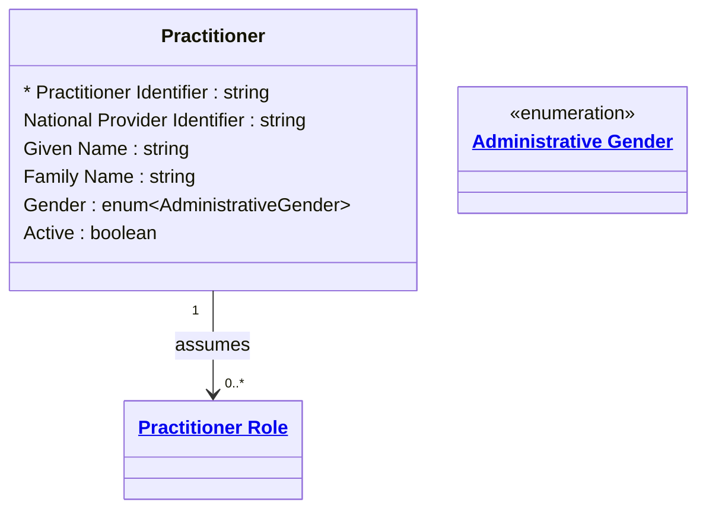

# [Healthcare](../domain.md)

## Entities

### Practitioner

A person directly or indirectly involved in the provisioning of healthcare. Aligned to the FHIR R4 Practitioner resource, this entity represents the clinician identity independent of any specific organizational role or location assignment.

Practitioners are reference data — the set of licensed clinicians changes infrequently and is managed by credentialing and human resources teams. A Practitioner may hold multiple Practitioner Roles across different organizations and specialties simultaneously.



```yaml
existence: independent
mutability: reference
attributes:
  Practitioner Identifier:
    type: string
    identifier: primary
    description: Unique identifier for this practitioner.

  National Provider Identifier:
    type: string
    identifier: alternate
    description: NPI assigned by the national provider registry.

  Given Name:
    type: string
    pii: true
    description: Practitioner's given (first) name.

  Family Name:
    type: string
    pii: true
    description: Practitioner's family (last) name.

  Gender:
    type: enum:Administrative Gender
    description: Administrative gender of the practitioner.

  Active:
    type: boolean
    description: Whether this practitioner record is in active use.
```

```yaml
governance:
  pii: true
  classification: Confidential
  retention: 7 years
  retention_basis: >
    Practitioner records are retained for 7 years post employment end.
    While less sensitive than patient PHI, practitioner identity is still
    PII requiring access controls.
  access_role:
    - CREDENTIALING
    - HEALTH_INFORMATION_MANAGEMENT
    - CLINICAL_ADMINISTRATION
```

## Relationships

### Practitioner Assumes Practitioner Role

A Practitioner can hold multiple Practitioner Roles across different organizations, locations, and specialties. The same physician may serve as an attending in one department and a consultant in another.

```yaml
source: Practitioner
type: has
target: Practitioner Role
cardinality: one-to-many
granularity: atomic
ownership: Practitioner
```
