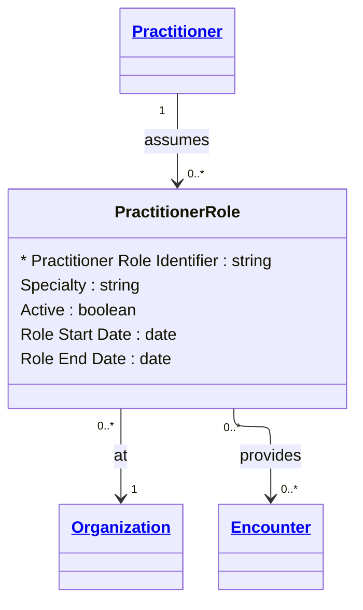

# [Healthcare](../domain.md)

## Entities

### Practitioner Role

A specific set of roles, locations, and specialties that a practitioner may perform at an organization for a period of time. Aligned to the FHIR R4 PractitionerRole resource, this entity separates *who* a clinician is (the Practitioner) from *what they do in a given context* (the Role).

This mirrors the Party Role pattern in the Financial Crime domain — the same structural concept (role as a context-specific assignment of an independent entity) applied in a healthcare context. A cardiologist at Hospital A and the same person serving as a consultant at Clinic B are two distinct Practitioner Roles.



```yaml
existence: dependent
mutability: slowly_changing
temporal:
  tracking: valid_time
  description: >
    Valid time tracks the period during which the practitioner held this
    role at the specified organization. Credentialing and privilege
    renewals drive role period changes.
attributes:
  Practitioner Role Identifier:
    type: string
    identifier: primary
    description: Unique identifier for this practitioner role assignment.

  Specialty:
    type: string
    description: Clinical specialty for this role (e.g. cardiology, oncology, general practice).

  Active:
    type: boolean
    description: Whether this role assignment is currently active.

  Role Start Date:
    type: date
    description: Date from which this role assignment became effective.

  Role End Date:
    type: date
    description: Date on which this role assignment ended, if applicable.
```

```yaml
constraints:
  Role End After Start:
    check: "Role End Date IS NULL OR Role End Date > Role Start Date"
    description: Role end date must be after start date. Null end date indicates currently active role.
```

```yaml
governance:
  classification: Confidential
  retention_basis: >
    Practitioner role assignments are retained with practitioner records
    for credentialing audit and clinical attribution.
  access_role:
    - CREDENTIALING
    - CLINICAL_ADMINISTRATION
```

## Relationships

### Practitioner Role Provides Encounter

A Practitioner Role participates in Encounters as the attending, consulting, or admitting clinician.

```yaml
source: Practitioner Role
type: associates_with
target: Encounter
cardinality: many-to-many
granularity: atomic
ownership: Practitioner Role
```

### Practitioner Role At Organization

A Practitioner Role is affiliated with a specific Organization where the practitioner performs that role.

```yaml
source: Practitioner Role
type: references
target: Organization
cardinality: many-to-one
granularity: atomic
ownership: Practitioner Role
```
