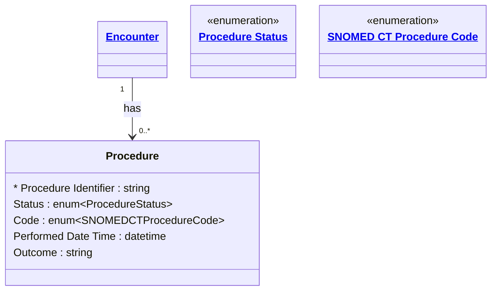

# [Healthcare](../domain.md)

## Entities

### Procedure

An action that is or was performed on or for a patient. Aligned to the FHIR R4 Procedure resource, this entity captures surgical operations, diagnostic procedures, therapeutic interventions, and other clinical actions. Procedures are coded using SNOMED CT for international clinical terminology interoperability.

Procedures are event-driven with a clear actor model — every procedure is performed by one or more practitioners in specific roles.



```yaml
existence: dependent
mutability: append_only
temporal:
  tracking: transaction_time
  description: >
    Transaction time tracks when the procedure record was entered into the
    system. Procedure records are append-only — once documented, corrections
    are issued as amendments rather than overwrites.
attributes:
  Procedure Identifier:
    type: string
    identifier: primary
    description: Unique identifier for this procedure record.

  Status:
    type: enum:Procedure Status
    description: Lifecycle status of the procedure (preparation, in-progress, completed, etc.).

  Code:
    type: enum:SNOMED CT Procedure Code
    description: >
      SNOMED CT code identifying the procedure performed. Uses SNOMED Clinical
      Terms for precise clinical procedure classification.

  Performed Date Time:
    type: datetime
    description: Date and time the procedure was performed.

  Outcome:
    type: string
    description: Outcome of the procedure (e.g. successful, complications noted).
```

```yaml
governance:
  pii: true
  classification: Highly Confidential
  retention_basis: Inherited from domain default retention of 7 years post last encounter
```
