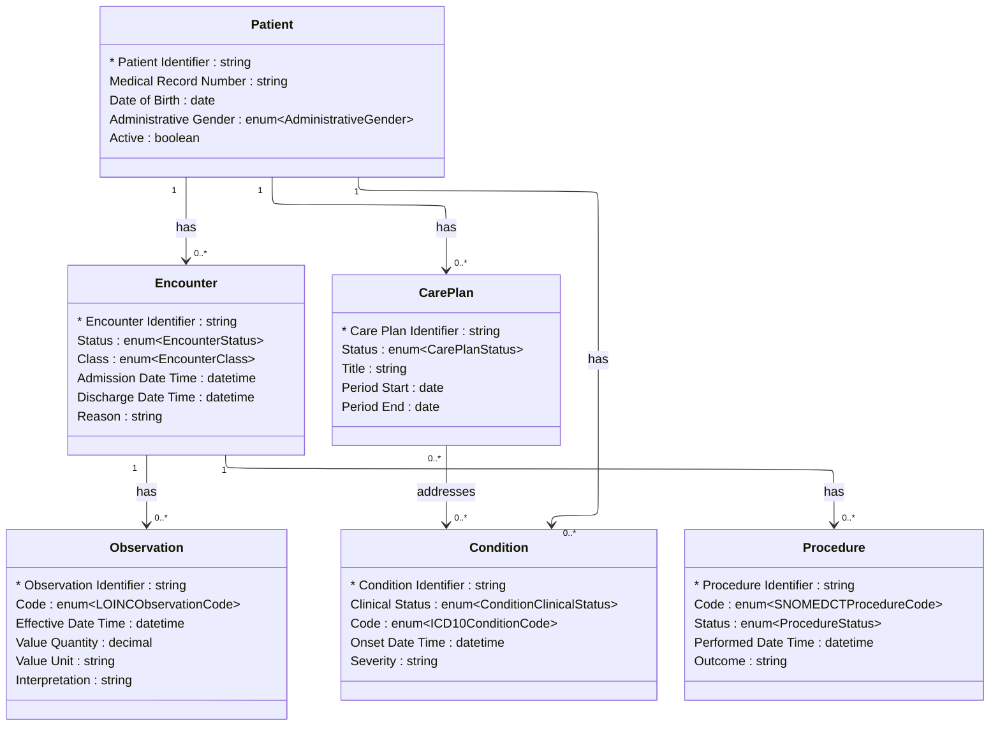

# [Healthcare](../domain.md)

## Data Products

### Clinical Outcomes Dashboard

A consumer-aligned analytics product optimised for clinical outcomes
research, population health analysis, and quality-of-care metrics.
Exposes the relationships between patients, conditions, procedures, and
care plans as a knowledge graph for flexible traversal queries.

```yaml
class: consumer-aligned
schema_type: knowledge-graph
owner: analytics.team@hospital.org
consumers:
  - Clinical Research
  - Quality Improvement
  - Population Health Management
status: Active
version: "1.0.0"

entities:
  - Patient
  - Encounter
  - Observation
  - Condition
  - Procedure
  - Care Plan

lineage:
  - domain: Healthcare
    entities:
      - Patient
      - Encounter
      - Observation
      - Condition
      - Procedure
      - Care Plan

governance:
  classification: PHI
  pii: true
  retention: "7 years post last encounter"
  regulatory_scope:
    - HIPAA
    - HITECH
  masking:
    - attribute: "Patient.Given Name"
      strategy: redact
    - attribute: "Patient.Family Name"
      strategy: redact
    - attribute: "Patient.Date of Birth"
      strategy: year-only
    - attribute: "Observation.Value Quantity"
      strategy: truncate

sla:
  freshness: "< 4 hours"
  availability: "99.9%"

refresh: hourly
```

#### Logical Model

Knowledge graph of clinical entities and their traversal relationships.
Nodes carry key attributes; edges represent clinical associations used
in outcomes traversal queries.



#### Attribute Mapping

##### Patient

Product Attribute | Source | Transform
--- | --- | ---
Patient Identifier | Patient.Patient Identifier | —
Medical Record Number | Patient.Medical Record Number | —
Date of Birth | Patient.Date of Birth | —
Administrative Gender | Patient.Administrative Gender | —
Active | Patient.Active | —

##### Encounter

Product Attribute | Source | Transform
--- | --- | ---
Encounter Identifier | Encounter.Encounter Identifier | —
Status | Encounter.Status | —
Class | Encounter.Class | —
Admission Date Time | Encounter.Admission Date Time | —
Discharge Date Time | Encounter.Discharge Date Time | —
Reason | Encounter.Reason | —

##### Observation

Product Attribute | Source | Transform
--- | --- | ---
Observation Identifier | Observation.Observation Identifier | —
Code | Observation.Code | —
Effective Date Time | Observation.Effective Date Time | —
Value Quantity | Observation.Value Quantity | —
Value Unit | Observation.Value Unit | —
Interpretation | Observation.Interpretation | —

##### Condition

Product Attribute | Source | Transform
--- | --- | ---
Condition Identifier | Condition.Condition Identifier | —
Clinical Status | Condition.Clinical Status | —
Code | Condition.Code | —
Onset Date Time | Condition.Onset Date Time | —
Severity | Condition.Severity | —

##### Procedure

Product Attribute | Source | Transform
--- | --- | ---
Procedure Identifier | Procedure.Procedure Identifier | —
Code | Procedure.Code | —
Status | Procedure.Status | —
Performed Date Time | Procedure.Performed Date Time | —
Outcome | Procedure.Outcome | —

##### Care Plan

Product Attribute | Source | Transform
--- | --- | ---
Care Plan Identifier | Care Plan.Care Plan Identifier | —
Status | Care Plan.Status | —
Title | Care Plan.Title | —
Period Start | Care Plan.Period Start | —
Period End | Care Plan.Period End | —
