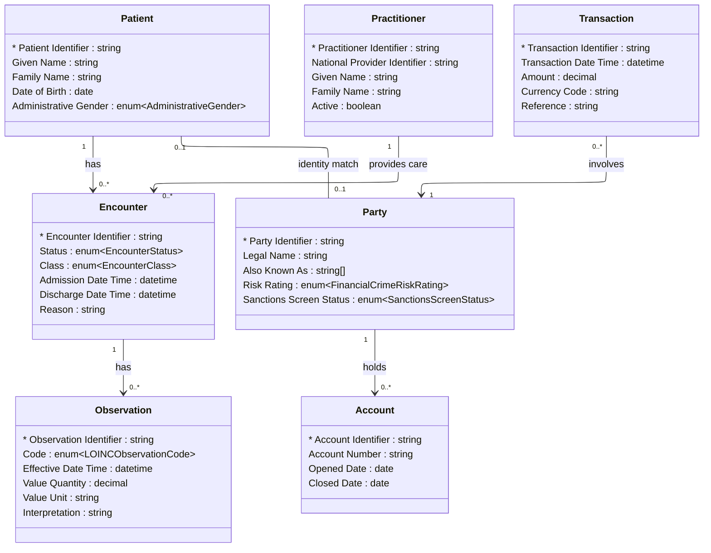

# [Healthcare](../domain.md)

## Data Products

### Clinical Billing Fraud Detection

Consumer-aligned product combining encounter and patient context with
financial transaction behavior to detect billing anomalies, duplicated
claims, and suspicious reimbursement patterns.

```yaml
class: consumer-aligned
schema_type: normalized
owner: revenue.integrity@hospital.org
consumers:
  - Revenue Integrity
  - Clinical Compliance
  - Financial Crime Operations
status: Active
version: "1.0.0"

entities:
  - Patient
  - Encounter
  - Practitioner
  - Observation
  - Transaction
  - Party
  - Account

lineage:
  - domain: Healthcare
    entities:
      - Patient
      - Encounter
      - Practitioner
      - Observation
  - domain: Financial Crime
    entities:
      - Transaction
      - Party
      - Account

governance:
  # Classification conflict: Healthcare (Highly Confidential) vs Financial
  # Crime (Highly Confidential). Highest wins.
  classification: Highly Confidential
  # Retention conflict: Healthcare 7 years vs Financial Crime 10 years.
  # Longest wins.
  retention: "10 years"
  # PII/PHI union across both contributing domains.
  pii: true
  # Regulatory scope union across both contributing domains.
  regulatory_scope:
    - HIPAA (Health Insurance Portability and Accountability Act)
    - HITECH Act
    - 21st Century Cures Act
    - AML (Anti-Money Laundering)
    - KYC (Know Your Customer)
    - CTF (Counter-Terrorist Financing)
    - FATF Recommendations
    - BSA (Bank Secrecy Act)
    - EU 5AMLD / 6AMLD
    - USA PATRIOT Act
  masking:
    - attribute: "Patient.Given Name"
      strategy: redact
    - attribute: "Patient.Family Name"
      strategy: redact
    - attribute: "Patient.Date of Birth"
      strategy: year-only
    - attribute: "Practitioner.Given Name"
      strategy: tokenize
    - attribute: "Practitioner.Family Name"
      strategy: tokenize
    - attribute: "Party.Legal Name"
      strategy: hash
    - attribute: "Party.Also Known As"
      strategy: hash
    - attribute: "Transaction.Reference"
      strategy: null
    - attribute: "Account.Account Number"
      strategy: hash

sla:
  freshness: "< 4 hours"
  availability: "99.9%"
  latency_p99: "< 800ms"

refresh: hourly
```

#### Logical Model

Normalized structure preserving entity boundaries across both contributing
domains. Healthcare entities source from the Clinical Patient Record
canonical product; Financial Crime entities source from the Canonical
Party and related products.



#### Attribute Mapping

##### Patient

Product Attribute | Source | Transform
--- | --- | ---
Patient Identifier | Patient.Patient Identifier | —
Given Name | Patient.Given Name | —
Family Name | Patient.Family Name | —
Date of Birth | Patient.Date of Birth | —
Administrative Gender | Patient.Administrative Gender | —

##### Encounter

Product Attribute | Source | Transform
--- | --- | ---
Encounter Identifier | Encounter.Encounter Identifier | —
Status | Encounter.Status | —
Class | Encounter.Class | —
Admission Date Time | Encounter.Admission Date Time | —
Discharge Date Time | Encounter.Discharge Date Time | —
Reason | Encounter.Reason | —

##### Practitioner

Product Attribute | Source | Transform
--- | --- | ---
Practitioner Identifier | Practitioner.Practitioner Identifier | —
National Provider Identifier | Practitioner.National Provider Identifier | —
Given Name | Practitioner.Given Name | —
Family Name | Practitioner.Family Name | —
Active | Practitioner.Active | —

##### Observation

Product Attribute | Source | Transform
--- | --- | ---
Observation Identifier | Observation.Observation Identifier | —
Code | Observation.Code | —
Effective Date Time | Observation.Effective Date Time | —
Value Quantity | Observation.Value Quantity | —
Value Unit | Observation.Value Unit | —
Interpretation | Observation.Interpretation | —

##### Transaction

Product Attribute | Source | Transform
--- | --- | ---
Transaction Identifier | Financial Crime.Transaction.Transaction Identifier | —
Transaction Date Time | Financial Crime.Transaction.Transaction Date Time | —
Amount | Financial Crime.Transaction.Amount | —
Currency Code | Financial Crime.Transaction.Currency Code | —
Reference | Financial Crime.Transaction.Reference | —

##### Party

Product Attribute | Source | Transform
--- | --- | ---
Party Identifier | Financial Crime.Party.Party Identifier | —
Legal Name | Financial Crime.Party.Legal Name | —
Also Known As | Financial Crime.Party.Also Known As | —
Risk Rating | Financial Crime.Party.Risk Rating | —
Sanctions Screen Status | Financial Crime.Party.Sanctions Screen Status | —

##### Account

Product Attribute | Source | Transform
--- | --- | ---
Account Identifier | Financial Crime.Account.Account Identifier | —
Account Number | Financial Crime.Account.Account Number | —
Opened Date | Financial Crime.Account.Opened Date | —
Closed Date | Financial Crime.Account.Closed Date | —
