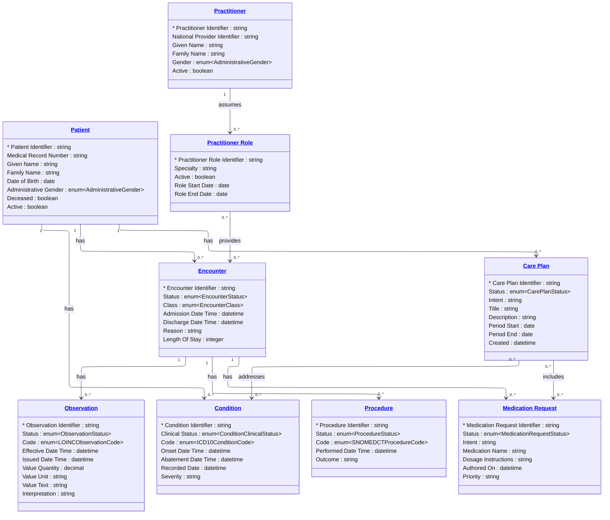

# [Healthcare](../domain.md)

## Data Products

### Clinical Patient Record

The governed canonical representation of Patient, Encounter, Condition,
and related clinical entities for consumption by downstream domains and
cross-facility integration points. This product provides the standardized
clinical data model for any system that needs the full-fidelity patient
care record.

```yaml
class: domain-aligned
schema_type: normalized
owner: clinical.data@hospital.org
consumers:
  - Cross-facility Integration
  - Health Information Exchange
  - Regulatory Reporting
status: Active
version: "1.0.0"

entities:
  - Patient
  - Encounter
  - Observation
  - Condition
  - Procedure
  - Medication Request
  - Care Plan
  - Practitioner
  - Practitioner Role

lineage:
  - source: hospital-ehr
    tables:
      - table_patient_demographics
      - table_encounter
      - table_diagnosis
      - table_medication_order
      - table_care_plan
      - table_provider
      - table_provider_role
  - source: lab-information-system
    tables:
      - table_lab_result
      - table_lab_procedure

sla:
  freshness: "< 30 minutes"
  availability: "99.95%"

refresh: real-time
```

#### Logical Model


