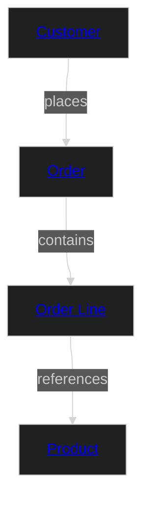

# Retail Sales

This domain covers the sales lifecycle for a multi-channel retailer: product browsing, purchase ordering, and order fulfilment. It defines "Customer" from the sales perspective — a buyer identity with purchase history, loyalty status, and marketing preferences.

This is a greenfield domain with no mandated industry standard. It uses the Bounded Context modelling strategy — Customer is intentionally defined differently here than in the Retail Service domain, reflecting the autonomy of the sales and service teams. Integration between the two domains happens at the product (data product) layer, not at the canonical entity layer.

## Metadata

```yaml
# Accountability
owners:
  - domain.sales@retailer.com
stewards:
  - data.governance@retailer.com
technical_leads:
  - platform.engineering@retailer.com

# Governance & Security
classification: "Internal"
pii: true
regulatory_scope:
  - GDPR (General Data Protection Regulation)
  - Consumer Protection Act
default_retention: "5 years post last purchase"

# Lifecycle & Discovery
status: "Production"
version: "1.0.0"
tags:
  - Retail
  - Sales
  - E-Commerce
  - BoundedContext
```

### Domain Overview Diagram



## Entities

Name | Specializes | Description | Reference
--- | --- | --- | ---
[Customer](entities/customer.md#customer) | | A buyer — an individual or household that places orders. Sales-context definition: focused on purchase history, loyalty tier, and marketing preferences. | —
[Product](entities/product.md#product) | | A sellable item in the retailer's catalog with pricing and stock information. | —
[Order](entities/order.md#order) | | A purchase order placed by a Customer, representing their intent to buy one or more Products. | —
[Order Line](entities/order_line.md#order-line) | | An individual line on an Order, linking the Order to a specific Product and quantity. Associative entity resolving the many-to-many between Orders and Products. | —

## Enums

Name | Description | Reference
--- | --- | ---
[Order Status](enums.md#order-status) | Lifecycle status of a purchase order. | —
[Customer Tier](enums.md#customer-tier) | Loyalty tier of the customer. | —

## Relationships

Name | Description | Reference
--- | --- | ---
[Customer Places Order](entities/customer.md#customer-places-order) | A Customer can place one or more Orders. | —
[Order Contains Order Lines](entities/order.md#order-contains-order-lines) | An Order contains one or more Order Lines. | —
[Order Line References Product](entities/order_line.md#order-line-references-product) | Each Order Line references the Product being purchased. | —

## Events

Name | Actor | Entity | Description
--- | --- | --- | ---
[Order Placed](events/order-placed.md#order-placed) | Customer | Order | Emitted when a customer submits a new order.

## Data Products

Name | Class | Consumers | Status
--- | --- | --- | ---
[Sales Domain Model](products/domain-aligned.md#sales-domain-model) | domain-aligned | Cross-domain Integration | Production
[Customer 360](products/customer-360.md#customer-360) | consumer-aligned | Customer Experience; Marketing | Production
[Sales Funnel Report (Legacy)](products/sales-funnel-legacy.md#sales-funnel-report-legacy) | consumer-aligned | Marketing Analytics (migrating) | Deprecated

---
