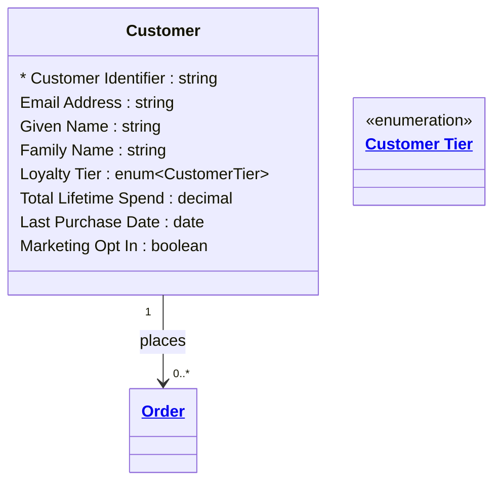

# [Retail Sales](../domain.md)

## Entities

### Customer

A buyer — an individual or household that places purchase orders. This is the Sales domain's definition of Customer, focused on purchase history, loyalty tier, and marketing preferences.

**Bounded Context note:** This entity intentionally differs from Customer in the Retail Service domain. In the Sales domain, Customer is a buyer identity optimised for marketing segmentation, loyalty management, and purchase analytics. In the Service domain, Customer is a contact identity optimised for case management and support history. The two domains own their definitions independently. Integration happens at the product layer via the Customer 360 product.



```yaml
existence: independent
mutability: slowly_changing
temporal:
  tracking: valid_time
  description: >
    Valid time tracks changes to the customer's profile — loyalty tier
    upgrades, marketing preference changes, and contact detail updates.
    History is required for GDPR right-of-access requests.
attributes:
  Customer Identifier:
    type: string
    identifier: primary
    description: Unique identifier for the customer in the sales system.

  Email Address:
    type: string
    description: Primary email address. Used as the primary contact channel and unique identifier for account recovery.

  Given Name:
    type: string
    description: Customer's given name.

  Family Name:
    type: string
    description: Customer's family name.

  Loyalty Tier:
    type: enum:Customer Tier
    description: Current loyalty tier based on cumulative spend (Standard, Silver, Gold, Platinum).

  Total Lifetime Spend:
    type: decimal
    description: Cumulative value of all confirmed orders. Drives loyalty tier calculation.

  Last Purchase Date:
    type: date
    description: Date of the most recent confirmed order.

  Marketing Opt In:
    type: boolean
    description: Whether the customer has consented to receive marketing communications.
```

```yaml
governance:
  pii: true
  classification: Internal
  retention: "5 years post last purchase"
  retention_basis: >
    Customer profile data retained for loyalty management, GDPR access requests,
    and fraud prevention. Marketing data subject to consent withdrawal.
  access_role:
    - SALES_OPERATIONS
    - MARKETING
    - DATA_GOVERNANCE
  compliance_relevance:
    - GDPR Article 6 — lawful basis for marketing processing (consent)
    - GDPR Article 17 — right to erasure applies after retention period
```

## Relationships

### Customer Places Order

A Customer can place one or more Orders over time.

```yaml
source: Customer
type: has
target: Order
cardinality: one-to-many
granularity: atomic
ownership: Customer
```
