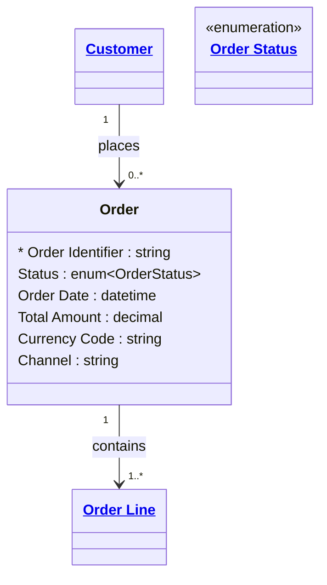

# [Retail Sales](../domain.md)

## Entities

### Order

A purchase order placed by a Customer representing their intent to buy one or more Products. Orders are `append_only` — once placed, an order record is never modified. Status transitions (Pending → Confirmed → Shipped → Delivered) are tracked as new rows, preserving the full order history for dispute resolution.



```yaml
existence: dependent
mutability: append_only
temporal:
  tracking: transaction_time
  description: >
    Transaction time records when each order status row was committed.
    The append_only pattern means each status change creates a new record.
    The full sequence of status transitions is preserved for SLA measurement
    and dispute resolution.
attributes:
  Order Identifier:
    type: string
    identifier: primary
    description: Unique identifier for the order.

  Status:
    type: enum:Order Status
    description: Current lifecycle status of the order.

  Order Date:
    type: datetime
    description: Timestamp when the customer placed the order.

  Total Amount:
    type: decimal
    description: Total value of the order including all line items.

  Currency Code:
    type: string
    description: ISO 4217 currency code for all amounts on this order.

  Channel:
    type: string
    description: Sales channel through which the order was placed (e.g. Web, Mobile App, In-Store, Phone).
```

```yaml
governance:
  pii: false
  classification: Internal
  retention: "5 years post order date"
  retention_basis: >
    Order records are retained for consumer protection compliance, financial
    reporting, and fraud prevention.
  access_role:
    - SALES_OPERATIONS
    - CUSTOMER_SERVICE
    - FINANCE
```

## Relationships

### Order Contains Order Lines

An Order contains one or more Order Lines, each representing a distinct product and quantity combination.

```yaml
source: Order
type: has
target: Order Line
cardinality: one-to-many
granularity: atomic
ownership: Order
```
