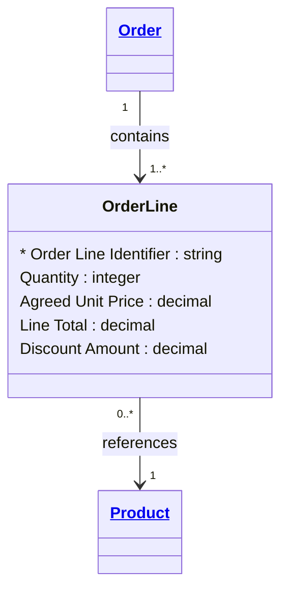

# [Retail Sales](../domain.md)

## Entities

### Order Line

An individual line on an Order, linking a specific Product to the Order with a quantity and agreed price. Order Line is an `associative` entity — it resolves the many-to-many relationship between Orders and Products while carrying the attributes of the relationship (quantity purchased, unit price at time of purchase, line total).

The agreed unit price is captured on the Order Line at point of purchase and is immutable — it reflects the price the customer paid, which may differ from the Product's current price if a promotion was active or the catalog price has since changed.



```yaml
existence: associative
mutability: append_only
temporal:
  tracking: transaction_time
  description: >
    Transaction time records when this order line was committed at point of sale.
    Order lines are never modified after creation — the agreed price and quantity
    at the moment of purchase are preserved permanently.
attributes:
  Order Line Identifier:
    type: string
    identifier: primary
    description: Unique identifier for this order line.

  Quantity:
    type: integer
    description: Number of units of the product ordered on this line.

  Agreed Unit Price:
    type: decimal
    description: >
      Unit price of the product at the time of purchase. Captured immutably
      at point of sale — independent of any subsequent catalog price changes.

  Line Total:
    type: decimal
    description: Total value of this line (Quantity × Agreed Unit Price − Discount Amount).

  Discount Amount:
    type: decimal
    description: Discount applied to this line (promotional, voucher, or loyalty discount).
```

```yaml
constraints:
  Quantity Positive:
    check: "Quantity > 0"
    description: Order line quantity must be at least 1.
  Line Total Consistent:
    check: "Line Total = (Quantity * Agreed Unit Price) - Discount Amount"
    description: Line total must equal quantity multiplied by agreed unit price minus any discount.
```

```yaml
governance:
  pii: false
  classification: Internal
  access_role:
    - SALES_OPERATIONS
    - FINANCE
    - MERCHANDISING
```

## Relationships

### Order Line References Product

Each Order Line references the Product being purchased, capturing the catalog item identity at point of sale.

```yaml
source: Order Line
type: references
target: Product
cardinality: many-to-one
granularity: atomic
ownership: Order Line
```
