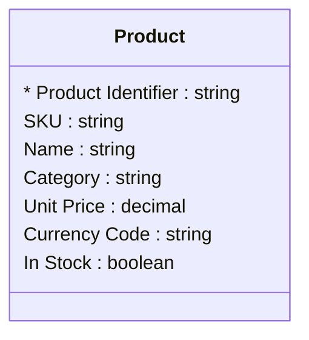

# [Retail Sales](../domain.md)

## Entities

### Product

A sellable item in the retailer's catalog with its current price and stock availability. Product is reference data — managed centrally by the merchandising team and updated infrequently relative to the order volume it supports.



```yaml
existence: independent
mutability: reference
attributes:
  Product Identifier:
    type: string
    identifier: primary
    description: Unique identifier for the product in the catalog.

  SKU:
    type: string
    description: Stock Keeping Unit code — the retailer's internal product code.

  Name:
    type: string
    description: Display name of the product as shown to customers.

  Category:
    type: string
    description: Product category (e.g. Electronics, Clothing, Home & Garden).

  Unit Price:
    type: decimal
    description: Current selling price per unit.

  Currency Code:
    type: string
    description: ISO 4217 currency code for the Unit Price.

  In Stock:
    type: boolean
    description: Whether the product is currently in stock and available for purchase.
```

```yaml
governance:
  pii: false
  classification: Internal
  access_role:
    - MERCHANDISING
    - SALES_OPERATIONS
```
