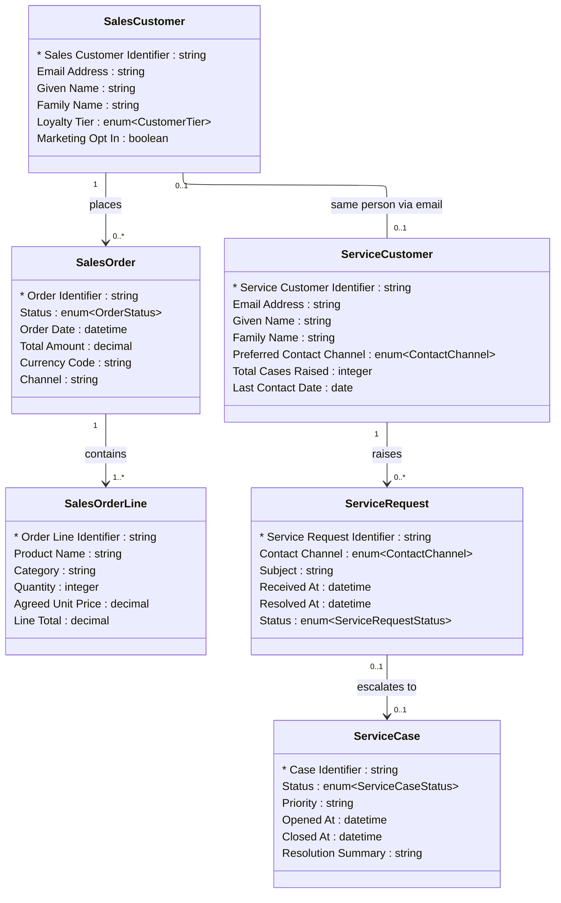

# [Retail Sales](../domain.md)

## Data Products

### Customer 360

Consumer-aligned product combining the Retail Sales Customer (buyer identity) with the Retail Service Customer (contact identity) to produce a unified view of the customer across both domains. Designed for customer experience teams who need to see a customer's purchase history alongside their service interactions in a single view.

This product demonstrates the Bounded Context integration pattern: because the two domains define Customer differently (Sales = buyer; Service = contact), they cannot share a canonical entity. Instead, each domain publishes its own domain-aligned product and this consumer-aligned product joins them at the product layer, under explicit governance.

```yaml
class: consumer-aligned
schema_type: normalized
owner: customer.experience@retailer.com
consumers:
  - Customer Experience
  - Marketing
  - Customer Service
status: Production
version: "1.0.0"

entities:
  - Sales Customer
  - Sales Order
  - Sales Order Line
  - Service Customer
  - Service Request
  - Service Case

lineage:
  - domain: Retail Sales
    entities:
      - Customer
      - Order
      - Order Line
  - domain: Retail Service
    entities:
      - Customer
      - Service Request
      - Service Case

governance:
  classification: Internal
  pii: true
  retention: "5 years post last interaction"
  masking:
    - attribute: "Sales Customer.Email Address"
      strategy: hash
    - attribute: "Sales Customer.Given Name"
      strategy: redact
    - attribute: "Sales Customer.Family Name"
      strategy: redact
    - attribute: "Service Customer.Email Address"
      strategy: hash

sla:
  freshness: "< 30 minutes"
  availability: "99.5%"

refresh: hourly
```

#### Logical Model

Normalized product joining two bounded-context Customer definitions. Sales
Customer and Service Customer are distinct product entities linked by email
address — they do not share an identifier because the two domains manage
their Customer identifiers independently. Order and service history hang off
their respective domain's Customer entity.



#### Attribute Mapping

##### Sales Customer

Product Attribute | Source | Transform
--- | --- | ---
Sales Customer Identifier | Customer.Customer Identifier | —
Email Address | Customer.Email Address | —
Given Name | Customer.Given Name | —
Family Name | Customer.Family Name | —
Loyalty Tier | Customer.Loyalty Tier | —
Marketing Opt In | Customer.Marketing Opt In | —

##### Sales Order

Product Attribute | Source | Transform
--- | --- | ---
Order Identifier | Order.Order Identifier | —
Status | Order.Status | —
Order Date | Order.Order Date | —
Total Amount | Order.Total Amount | —
Currency Code | Order.Currency Code | —
Channel | Order.Channel | —

##### Sales Order Line

Product Attribute | Source | Path | Transform
--- | --- | --- | ---
Order Line Identifier | Order Line.Order Line Identifier | — | —
Product Name | Product.Name | Order Line → Product | —
Category | Product.Category | Order Line → Product | —
Quantity | Order Line.Quantity | — | —
Agreed Unit Price | Order Line.Agreed Unit Price | — | —
Line Total | Order Line.Line Total | — | —

##### Service Customer

Product Attribute | Source | Transform
--- | --- | ---
Service Customer Identifier | Retail Service.Customer.Customer Identifier | —
Email Address | Retail Service.Customer.Email Address | —
Given Name | Retail Service.Customer.Given Name | —
Family Name | Retail Service.Customer.Family Name | —
Preferred Contact Channel | Retail Service.Customer.Preferred Contact Channel | —
Total Cases Raised | Retail Service.Customer.Total Cases Raised | —
Last Contact Date | Retail Service.Customer.Last Contact Date | —

##### Service Request

Product Attribute | Source | Transform
--- | --- | ---
Service Request Identifier | Retail Service.Service Request.Service Request Identifier | —
Contact Channel | Retail Service.Service Request.Contact Channel | —
Subject | Retail Service.Service Request.Subject | —
Received At | Retail Service.Service Request.Received At | —
Resolved At | Retail Service.Service Request.Resolved At | —
Status | Retail Service.Service Request.Status | —

##### Service Case

Product Attribute | Source | Transform
--- | --- | ---
Case Identifier | Retail Service.Service Case.Case Identifier | —
Status | Retail Service.Service Case.Status | —
Priority | Retail Service.Service Case.Priority | —
Opened At | Retail Service.Service Case.Opened At | —
Closed At | Retail Service.Service Case.Closed At | —
Resolution Summary | Retail Service.Service Case.Resolution Summary | —
