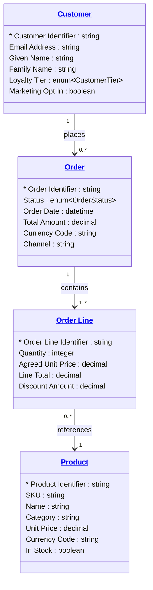

# [Retail Sales](../domain.md)

## Data Products

### Sales Domain Model

The authoritative domain-aligned view of the Retail Sales bounded context. Exposes the canonical Customer (sales definition), Product catalog, Order, and Order Line entities for integration with other domains. This product is the integration surface for the Customer 360 consumer product.

```yaml
class: domain-aligned
schema_type: normalized
owner: domain.sales@retailer.com
consumers:
  - Cross-domain Integration
  - Customer Experience Platform
status: Production
version: "1.0.0"

entities:
  - Customer
  - Product
  - Order
  - Order Line

# TODO: Add lineage once sources/ directory is populated for this domain.
# lineage:
#   - source: <pos-system or ecommerce-platform>
#     tables:
#       - <transform files>

governance:
  classification: Internal
  pii: true

masking:
  - attribute: "Customer.Email Address"
    strategy: hash

sla:
  freshness: "< 10 minutes"
  availability: "99.5%"

refresh: real-time
```

#### Logical Model


