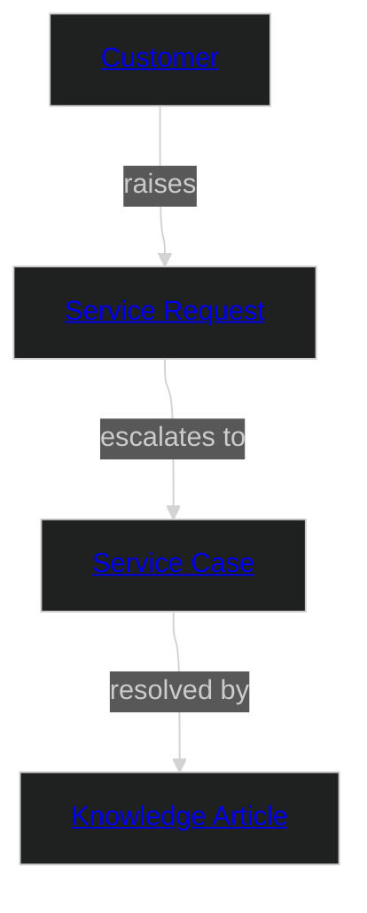

# Retail Service

This domain covers post-sale customer service: support requests, case management, and knowledge-base resolution for a multi-channel retailer. It defines "Customer" from the service perspective — a contact identity with support history, case load, and channel preferences.

This is a greenfield domain with no mandated industry standard. It uses the Bounded Context modelling strategy — Customer is intentionally defined differently here than in the Retail Sales domain, reflecting the different concerns of the service team (contact channel, case history, resolution metrics) versus the sales team (purchase history, loyalty, marketing).

## Metadata

```yaml
# Accountability
owners:
  - domain.service@retailer.com
stewards:
  - data.governance@retailer.com
technical_leads:
  - platform.engineering@retailer.com

# Governance & Security
classification: "Internal"
pii: true
regulatory_scope:
  - GDPR (General Data Protection Regulation)
  - Consumer Protection Act
default_retention: "5 years post last interaction"

# Lifecycle & Discovery
status: "Production"
version: "1.0.0"
tags:
  - Retail
  - Service
  - CRM
  - BoundedContext
```

### Domain Overview Diagram



## Entities

Name | Specializes | Description | Reference
--- | --- | --- | ---
[Customer](entities/customer.md#customer) | | A contact — an individual who interacts with the service team. Service-context definition: focused on contact channel, communication preference, and support history. | —
[Service Request](entities/service_request.md#service-request) | | An initial inbound contact from a Customer requesting assistance. Immutable once created; escalation creates a Service Case. | —
[Service Case](entities/service_case.md#service-case) | | A managed service case for complex or multi-interaction customer issues. Tracks resolution progress from open to closed. | —
[Knowledge Article](entities/knowledge_article.md#knowledge-article) | | A self-service or agent-facing article that documents the resolution for a known issue category. Reference data managed by the service team. | —

## Enums

Name | Description | Reference
--- | --- | ---
[Service Request Status](enums.md#service-request-status) | Status of an initial service request. | —
[Service Case Status](enums.md#service-case-status) | Lifecycle status of a service case. | —
[Contact Channel](enums.md#contact-channel) | Channel through which the customer contacted support. | —

## Relationships

Name | Description | Reference
--- | --- | ---
[Customer Raises Service Request](entities/customer.md#customer-raises-service-request) | A Customer can raise one or more Service Requests. | —
[Service Request Escalates To Service Case](entities/service_request.md#service-request-escalates-to-service-case) | A Service Request may escalate to a Service Case for complex issues. | —
[Service Case Resolved By Knowledge Article](entities/service_case.md#service-case-resolved-by-knowledge-article) | A Service Case may be resolved by referencing a Knowledge Article. | —

## Source Systems

This is a greenfield domain — data originates here and is not ingested from a legacy source system. No source transforms are defined by design.

## Events

Name | Actor | Entity | Description
--- | --- | --- | ---
[Service Request Received](events/service-request-received.md#service-request-received) | Customer | Service Request | Emitted when a new service request is received from a customer.

## Data Products

Name | Class | Consumers | Status
--- | --- | --- | ---
[Service Domain Model](products/domain-aligned.md#service-domain-model) | domain-aligned | Cross-domain Integration | Production

---
