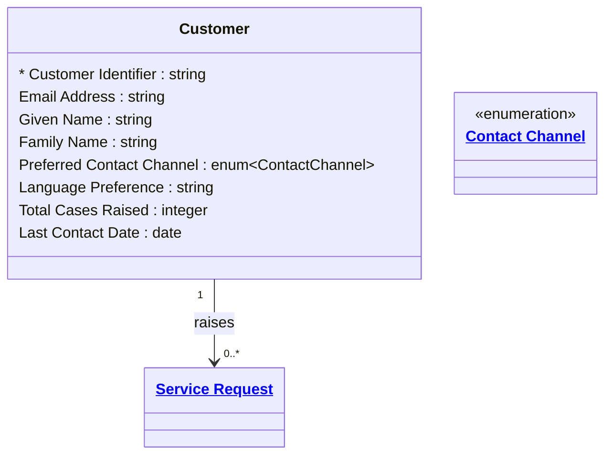

# [Retail Service](../domain.md)

## Entities

### Customer

A contact — an individual who interacts with the service team for post-sale support. This is the Service domain's definition of Customer, focused on contact channel preferences, communication history, and case load.

**Bounded Context note:** This entity intentionally differs from Customer in the Retail Sales domain. In the Service domain, Customer is a support contact identity optimised for case routing, communication preference management, and resolution metrics. It does not carry purchase history or loyalty tier — those live in the Sales domain. Integration between the two Customer definitions happens at the product layer via the Customer 360 product (owned by Retail Sales).



```yaml
existence: independent
mutability: slowly_changing
temporal:
  tracking: valid_time
  description: >
    Valid time tracks changes to the customer's contact preferences and profile.
    History supports GDPR access requests and channel effectiveness analysis.
attributes:
  Customer Identifier:
    type: string
    identifier: primary
    description: Unique identifier for the customer in the service system. Not the same as the Sales domain Customer Identifier.

  Email Address:
    type: string
    description: Primary email address for service communications.

  Given Name:
    type: string
    description: Customer's given name.

  Family Name:
    type: string
    description: Customer's family name.

  Preferred Contact Channel:
    type: enum:Contact Channel
    description: Customer's preferred channel for service communications.

  Language Preference:
    type: string
    description: ISO 639-1 language code for the customer's preferred communication language.

  Total Cases Raised:
    type: integer
    description: Cumulative count of service cases raised. Used for VIP and priority routing decisions.

  Last Contact Date:
    type: date
    description: Date of the most recent service interaction.
```

```yaml
governance:
  pii: true
  classification: Internal
  retention: "5 years post last interaction"
  retention_basis: >
    Customer service records retained for consumer protection compliance and
    GDPR right-of-access obligations.
  access_role:
    - CUSTOMER_SERVICE
    - SERVICE_OPERATIONS
    - DATA_GOVERNANCE
```

## Relationships

### Customer Raises Service Request

A Customer can raise one or more Service Requests via any supported contact channel.

```yaml
source: Customer
type: has
target: Service Request
cardinality: one-to-many
granularity: atomic
ownership: Customer
```
