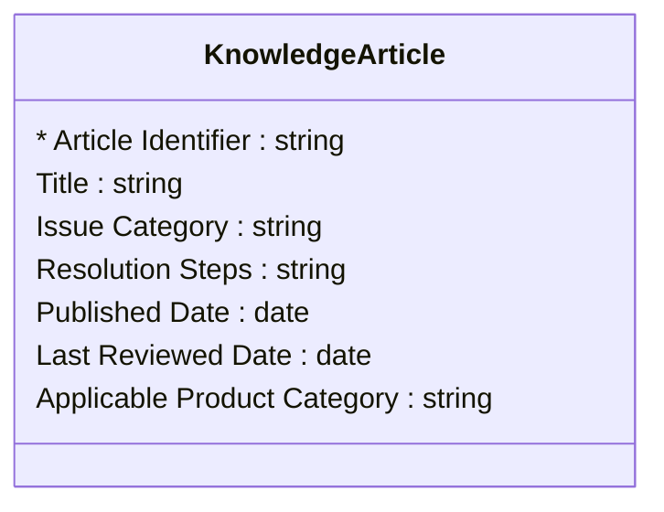

# [Retail Service](../domain.md)

## Entities

### Knowledge Article

A self-service or agent-facing article that documents the standard resolution procedure for a known issue category. Knowledge Articles are reference data: managed centrally by the service knowledge team, published after review, and updated infrequently.



```yaml
existence: independent
mutability: reference
attributes:
  Article Identifier:
    type: string
    identifier: primary
    description: Unique identifier for the knowledge article.

  Title:
    type: string
    description: Short descriptive title of the article.

  Issue Category:
    type: string
    description: Category of issue addressed by this article (e.g. Returns, Delivery, Product Fault, Billing).

  Resolution Steps:
    type: string
    description: Step-by-step resolution procedure for agents and self-service customers.

  Published Date:
    type: date
    description: Date the article was published and made available.

  Last Reviewed Date:
    type: date
    description: Date the article was last reviewed and confirmed as current.

  Applicable Product Category:
    type: string
    description: Product category to which this article applies. Null for cross-category articles.
```

```yaml
governance:
  pii: false
  classification: Internal
  access_role:
    - CUSTOMER_SERVICE
    - KNOWLEDGE_MANAGEMENT
```
