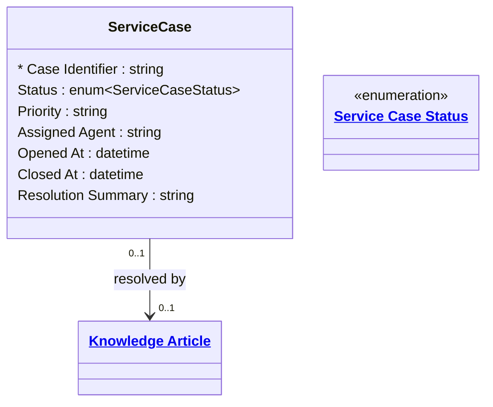

# [Retail Service](../domain.md)

## Entities

### Service Case

A managed service case for complex or multi-interaction customer issues that require investigation, coordination, or multiple resolution attempts. A Service Case is created when a Service Request cannot be resolved at first contact.

Service Case is `slowly_changing` — cases evolve over time as investigation progresses, agents are reassigned, and resolution approaches are tried. The full change history is retained for quality assurance, SLA reporting, and regulatory compliance.



```yaml
existence: dependent
mutability: slowly_changing
temporal:
  tracking: valid_time
  description: >
    Valid time tracks the active period of the case (Opened At to Closed At).
    Status changes and agent reassignments are the primary change events.
    History is required for SLA reporting and quality audits.
attributes:
  Case Identifier:
    type: string
    identifier: primary
    description: Unique identifier for the service case.

  Status:
    type: enum:Service Case Status
    description: Current lifecycle status of the case.

  Priority:
    type: string
    description: Priority level assigned to the case (e.g. Low, Medium, High, Critical).

  Assigned Agent:
    type: string
    description: Identifier of the service agent currently assigned to the case.

  Opened At:
    type: datetime
    description: Timestamp when the case was created.

  Closed At:
    type: datetime
    description: Timestamp when the case was resolved and closed. Null if still open.

  Resolution Summary:
    type: string
    description: Agent's description of how the case was resolved. Populated on close.
```

```yaml
constraints:
  Closed At After Opened At:
    check: "Closed At IS NULL OR Closed At > Opened At"
    description: Case closure timestamp must be after the opening timestamp.
```

```yaml
governance:
  pii: false
  classification: Internal
  retention: "5 years post closure"
  access_role:
    - CUSTOMER_SERVICE
    - SERVICE_OPERATIONS
    - QUALITY_ASSURANCE
```

## Relationships

### Service Case Resolved By Knowledge Article

A Service Case may be resolved by referencing a Knowledge Article that documents the standard resolution for the issue type.

```yaml
source: Service Case
type: references
target: Knowledge Article
cardinality: many-to-one
granularity: atomic
ownership: Service Case
```
