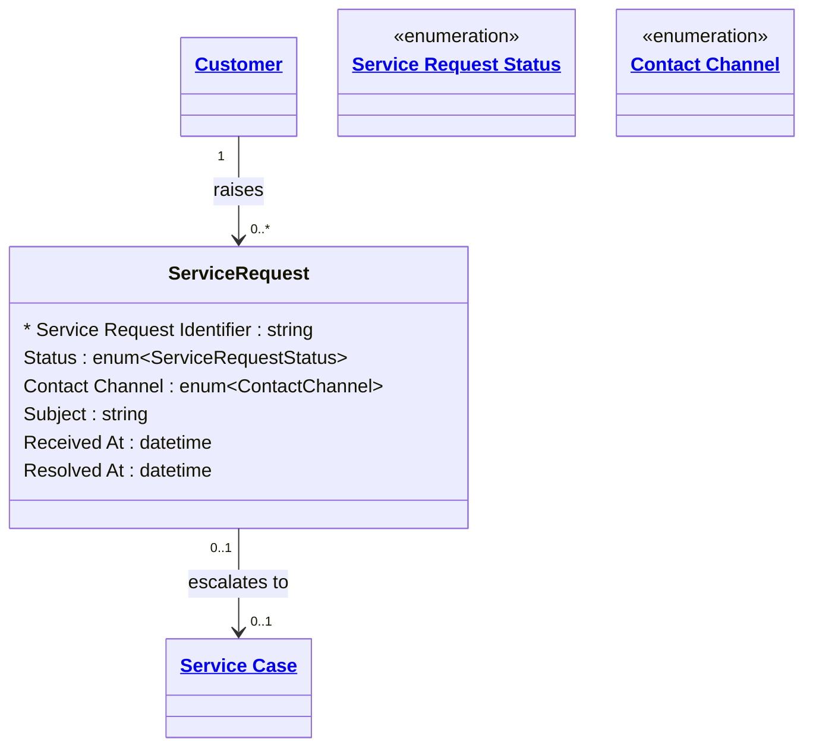

# [Retail Service](../domain.md)

## Entities

### Service Request

An initial inbound contact from a Customer requesting assistance. Service Request captures the first touch: when the customer reached out, through what channel, and what they needed. Simple issues are resolved at this level; complex issues escalate to a Service Case.

Service Request is `append_only` — each contact event creates a new Service Request record. Existing records are never updated; resolution or escalation creates linked follow-on records.



```yaml
existence: dependent
mutability: append_only
temporal:
  tracking: transaction_time
  description: >
    Transaction time records when the service request was received.
    The append_only pattern preserves the complete contact history —
    each inbound contact is a permanent record regardless of outcome.
attributes:
  Service Request Identifier:
    type: string
    identifier: primary
    description: Unique identifier for this service request.

  Status:
    type: enum:Service Request Status
    description: Current status of the service request (Open, Resolved, Escalated, Closed).

  Contact Channel:
    type: enum:Contact Channel
    description: Channel through which this request was received.

  Subject:
    type: string
    description: Brief description of the customer's issue or query.

  Received At:
    type: datetime
    description: Timestamp when the service request was received.

  Resolved At:
    type: datetime
    description: Timestamp when the request was resolved or escalated. Null if still open.
```

```yaml
governance:
  pii: false
  classification: Internal
  retention: "5 years post creation"
  access_role:
    - CUSTOMER_SERVICE
    - SERVICE_OPERATIONS
```

## Relationships

### Service Request Escalates To Service Case

A Service Request may escalate to a Service Case when the issue cannot be resolved at first contact and requires ongoing management.

```yaml
source: Service Request
type: produces
target: Service Case
cardinality: many-to-one
granularity: atomic
ownership: Service Request
```
