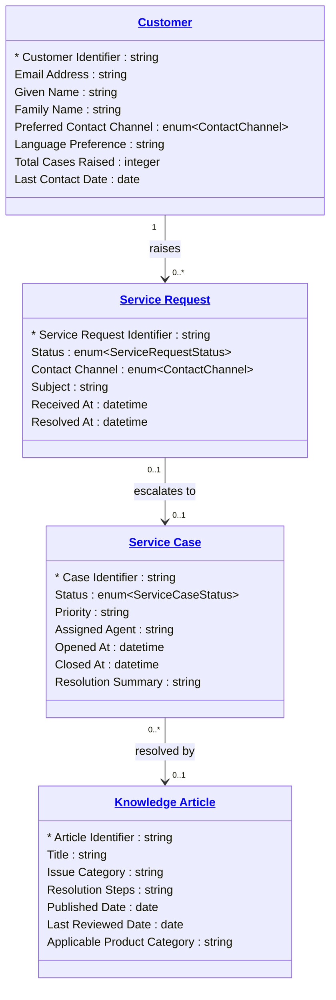

# [Retail Service](../domain.md)

## Data Products

### Service Domain Model

The authoritative domain-aligned view of the Retail Service bounded context. Exposes the canonical Customer (service definition), Service Request, Service Case, and Knowledge Article entities for integration with other domains.

```yaml
class: domain-aligned
schema_type: normalized
owner: domain.service@retailer.com
consumers:
  - Cross-domain Integration
  - Customer Experience Platform
status: Production
version: "1.0.0"

entities:
  - Customer
  - Service Request
  - Service Case
  - Knowledge Article

# TODO: Add lineage once sources/ directory is populated for this domain.
# lineage:
#   - source: <crm-system or service-platform>
#     tables:
#       - <transform files>

governance:
  classification: Internal
  pii: true

masking:
  - attribute: "Customer.Email Address"
    strategy: hash

sla:
  freshness: "< 10 minutes"
  availability: "99.5%"

refresh: real-time
```

#### Logical Model


