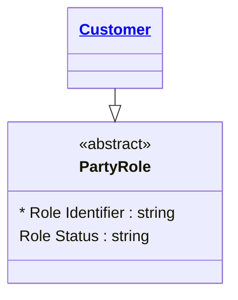
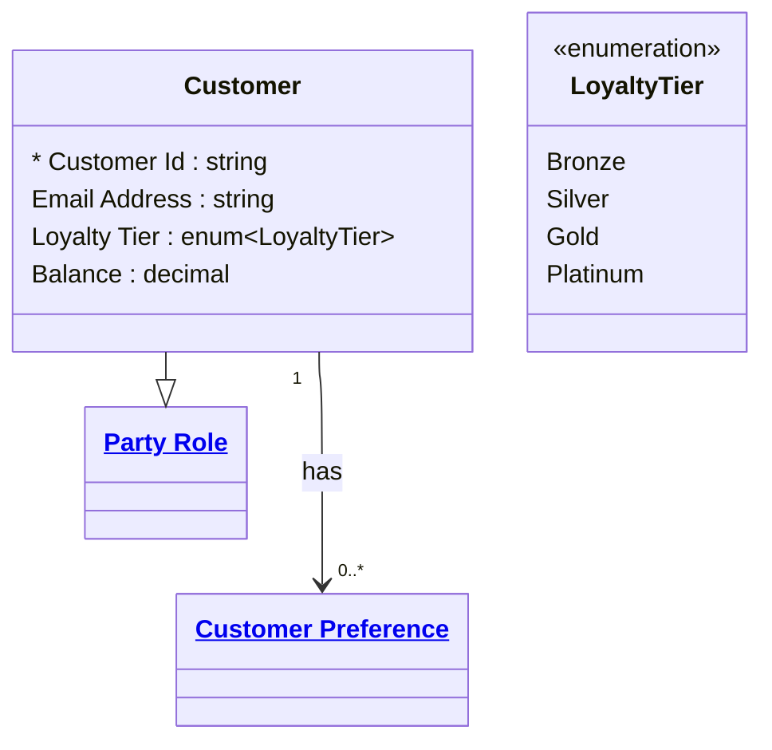
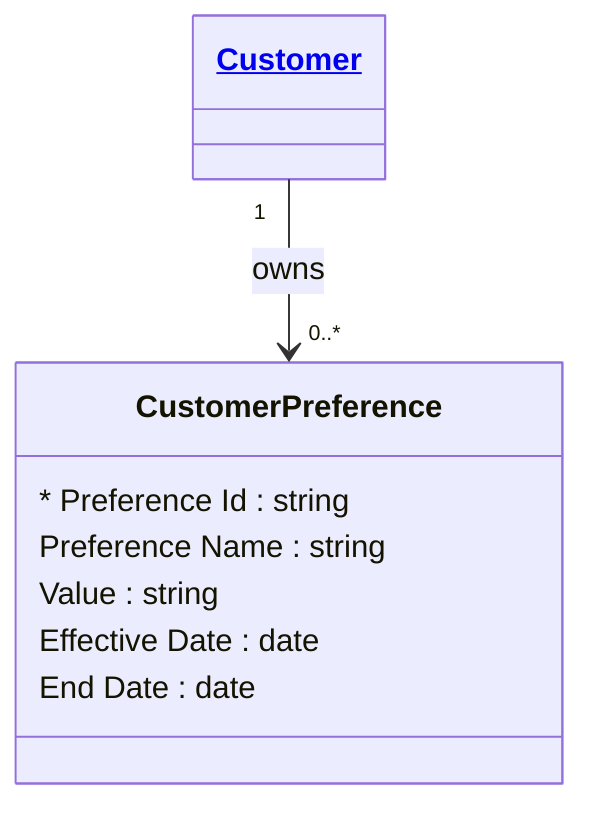

# [Customer Domain](domain.md)

*Note: this example uses a single detail file for entities, enums, relationships,
and events. This is for brevity and to demonstrate how cross-section linking works
within one file. In practice, organise detail files to suit readability for humans
and context management for AI — for example, one file per entity with its
originating relationships co-located.*

## Entities

### Party Role

Abstract representation of a party's participation in a business context.



```yaml
existence: independent
mutability: slowly_changing
temporal:
  tracking: valid_time
  description: Party role records are valid for a period of business activity.
attributes:
  Role Identifier:
    type: string
    identifier: primary
  Role Status:
    type: string
```

---

### Customer

The primary representation of a customer in the organisation. A Customer is a
specialisation of Party Role — any party that holds an account, uses a product
or service, or has an active relationship with the institution.



```yaml
extends: Party Role
existence: independent
mutability: slowly_changing
temporal:
  tracking: valid_time
  description: Customer records are valid for the duration of the relationship and retained thereafter per regulatory requirements
attributes:
  Customer Id:
    type: string
    identifier: primary
  Email Address:
    type: string
    pii: true
  Loyalty Tier:
    type: enum:Loyalty Tier
  Balance:
    type: decimal
```

```yaml
constraints:
  Positive Liquidity:
    check: "Balance > 0"
```

```yaml
governance:
  pii: true
  classification: Confidential
  retention: 10 years
  retention_basis: Aligned to domain default retention policy
  access_role:
    - CUSTOMER_SERVICE
```

---

### Customer Preference

Represents customer-specific settings and preferences for communication,
privacy, and interaction. A preference cannot exist without a Customer —
its lifecycle is bound to the Customer relationship.



```yaml
existence: dependent
mutability: slowly_changing
temporal:
  tracking: valid_time
  description: Preferences are valid for specific time periods and can be future-dated
attributes:
  Preference Id:
    type: string
    identifier: primary
  Preference Name:
    type: string
  Value:
    type: string
  Effective Date:
    type: date
  End Date:
    type: date
```

```yaml
governance:
  retention: 10 years
  retention_basis: Aligned to domain default retention policy
```

---

## Enums

### Loyalty Tier

Categorises customers by their annual spend and engagement level. Tier determines
eligibility for benefits, fee waivers, and service prioritisation.

```yaml
values:
  Bronze:
    description: Entry level — default tier at onboarding
    score: 1
  Silver:
    description: Established customer with moderate engagement
    score: 2
  Gold:
    description: High-value customer with strong product engagement
    score: 3
  Platinum:
    description: Top-tier customer — highest spend and engagement
    score: 4
```

---

## Relationships

### Customer Has Preferences

A Customer can have zero or more Preferences. A Preference cannot exist without
a Customer — if a Customer is deleted, their Preferences must also be deleted.
A Customer can exist without any Preferences.

```yaml
source: Customer
type: owns
target: Customer Preference
cardinality: one-to-many
granularity: atomic
ownership: Customer
```

```yaml
constraints:
  Active Customer Preference Only:
    check: "Customer Preference.End Date IS NULL OR Customer Preference.End Date > Customer Preference.Effective Date"
    description: Preference validity period must end after it begins when End Date is provided
```

---

## Events

### Preference Updated

Emitted when a customer preference is created or updated.

```yaml
actor: Customer
entity: Customer Preference
emitted_on:
  - create
  - update
business_meaning: Customer interaction or communication preferences have changed
downstream_impact:
  - Customer communication settings are recalculated
  - Consent-aware workflows consume the latest preference state
attributes:
  - event timestamp:
      type: datetime
      description: Time the preference update occurred
```
