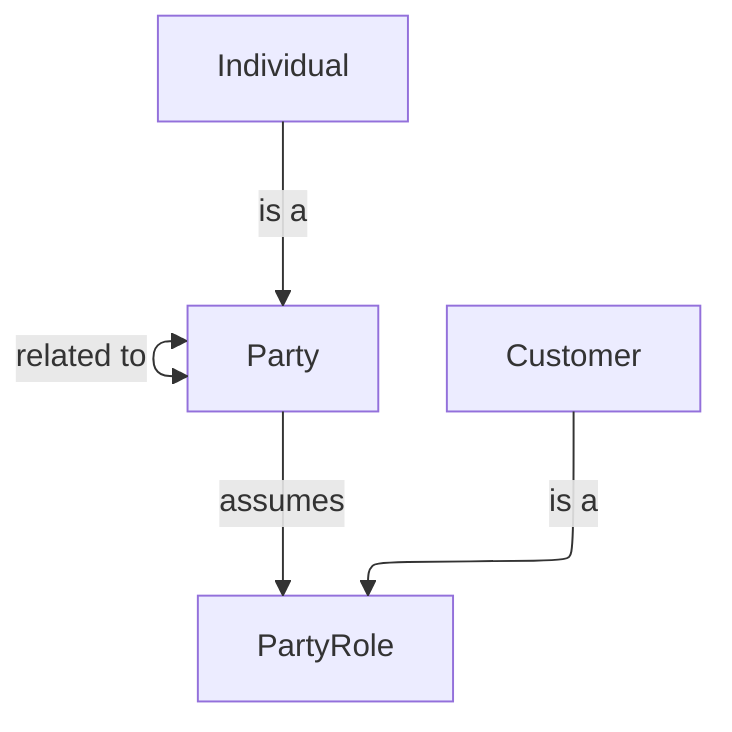

# Customer Domain

The Customer domain contains all concepts related to customer identity, profiles, preferences, and lifecycle.

## Metadata

```yaml
owners:
  - data.manager@example.com
stewards:
  - jane.doe@example.com
tags:
  - core
  - pii
```

### Customer Overview Diagram



## Entities

name | specializes | description | reference
---- | ----- | ---- | ----
[Customer](./details.md#Customer) | [PartyRole](./details.md#PartyRole) | A customer is an individual who has a relationship with the organisation. | [BIAN BOM - Party Role](https://bian-modelapi-v4.azurewebsites.net/BOClassByName/PartyRole)

## Enums

name | description | reference
---- | ----- | ----
[Loyalty Tier](./details.md#LoyaltyTier) | A structured level within a loyalty program that offers different benefits and rewards based on engagement or spending. | [BIAN BOM - Loyalty Tier](https://bian-modelapi-v4.azurewebsites.net/BOClassByName/LoyaltyTier)

## Relationships

name | description | reference
---- | ----- | ----
[Customer Has Preferences](./details.md#CustomerHasPreferences) | Customers can have zero or more preferences, and preferences are owned by a customer. | [BIAN BOM - Customer Has Preferences](https://bian-modelapi-v4.azurewebsites)
