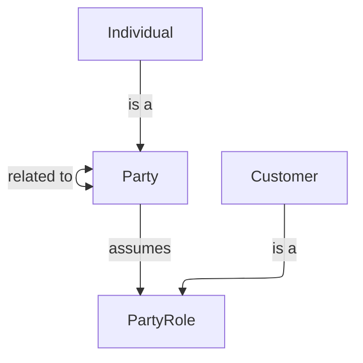

# Customer Domain

The Customer domain contains all concepts related to customer identity, profiles, preferences, and lifecycle.

## Metadata

```yaml
# Accountability
owners:
  - financial.crime@org.com
stewards:
  - compliance.officer@org.com
technical_leads:
  - data.architecture@org.com

# Governance & Security
classification: "Highly Confidential"
pii: true
regulatory_scope:
  - AML (Anti-Money Laundering)
default_retention: "10 years post relationship end"

# Lifecycle & Discovery
status: "Production"
version: "1.0.0"
tags:
  - Core
source_systems:
  - "Core System"
```

### Customer Overview Diagram



## Entities

name | specializes | description | reference
---- | ----- | ---- | ----
[Customer](./details.md#customer) | [PartyRole](./details.md#PartyRole) | A customer is an individual who has a relationship with the organisation. | [BIAN BOM - Party Role](https://bian-modelapi-v4.azurewebsites.net/BOClassByName/PartyRole)

## Enums

name | description | reference
---- | ----- | ----
[Loyalty Tier](./details.md#loyalty-tier) | A structured level within a loyalty program that offers different benefits and rewards based on engagement or spending. | [BIAN BOM - Loyalty Tier](https://bian-modelapi-v4.azurewebsites.net/BOClassByName/LoyaltyTier)

## Relationships

name | description | reference
---- | ----- | ----
[Customer Has Preferences](./details.md#customer-has-preferences) | Customers can have zero or more preferences, and preferences are owned by a customer. | [BIAN BOM - Customer Has Preferences](https://bian-modelapi-v4.azurewebsites)
