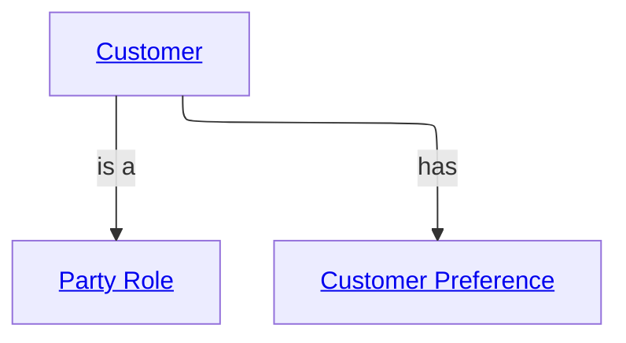

# Customer Domain

The Customer domain contains concepts related to customer identity, customer preferences, and customer lifecycle interactions.

## Metadata

```yaml
# Accountability
owners:
  - customer.domain@org.com
stewards:
  - customer.data.steward@org.com
technical_leads:
  - data.architecture@org.com

# Governance & Security
classification: "Highly Confidential"
pii: true
regulatory_scope:
  - AML (Anti-Money Laundering)
default_retention: "10 years post relationship end"

# Lifecycle & Discovery
status: "Production"
version: "1.0.0"
tags:
  - Core
  - Customer
source_systems:
  - "Core System"
  - "CRM"
```

### Customer Overview Diagram



## Entities

Name | Specializes | Description | Reference
--- | --- | --- | ---
[Party Role](details.md#party-role) | | Abstract representation of a party's role in a business context. | [BIAN BOM - Party Role](https://bian-modelapi-v4.azurewebsites.net/BOClassByName/PartyRole)
[Customer](details.md#customer) | [Party Role](details.md#party-role) | A customer who has an active relationship with the organisation. | [BIAN BOM - Party Role](https://bian-modelapi-v4.azurewebsites.net/BOClassByName/PartyRole)
[Customer Preference](details.md#customer-preference) | | Customer-specific interaction and communication preferences. | [BIAN BOM - Party Preference](https://bian-modelapi-v4.azurewebsites.net/BOClassByName/PartyPreference)

## Enums

Name | Description | Reference
--- | --- | ---
[Loyalty Tier](details.md#loyalty-tier) | Tier classification used to segment customers by engagement or value. | -

## Relationships

Name | Description | Reference
--- | --- | ---
[Customer Has Preferences](details.md#customer-has-preferences) | A customer can own zero or more preference records. | [BIAN BOM - Party Preference](https://bian-modelapi-v4.azurewebsites.net/BOClassByName/PartyPreference)

## Events

Name | Actor | Entity | Description
--- | --- | --- | ---
[Preference Updated](details.md#preference-updated) | Customer | Customer Preference | Emitted when a customer preference value is created or changed.
