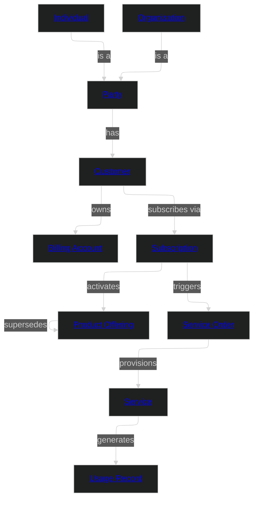

# Telecom

This domain encompasses subscriber management, product offerings, service provisioning, and usage recording for a telecommunications operator. It covers individual and business subscribers, their subscriptions to product offerings, and the usage data generated by active services.

This is a business-aligned domain that draws concepts from TM Forum's Open Digital Architecture (ODA) and Open APIs to ensure alignment with industry-standard telecom data models.

## Metadata

```yaml
# Accountability
owners:
  - domain.telecom@telco.com
stewards:
  - data.governance@telco.com
technical_leads:
  - data.architecture@telco.com

# Governance & Security
classification: "Confidential"
pii: true
regulatory_scope:
  - PCI-DSS (Payment Card Industry Data Security Standard)
  - GDPR (General Data Protection Regulation)
  - Telecommunications Act
  - CPNI (Customer Proprietary Network Information)
default_retention: "7 years post contract end"

# Lifecycle & Discovery
status: "Production"
version: "1.0.0"
tags:
  - Telecom
  - Subscriber
  - TM Forum
  - ODA
```

### Domain Overview Diagram



## Source Systems

Business Application | Platform | Capability Domain
--- | --- | ---
[BSS/OSS Platform](sources/bss-oss/source.md) | Amdocs-compatible BSS | Subscriber & Order Management

## Entities

Name | Specializes | Description | Reference
--- | --- | --- | ---
[Party](entities/party.md#party) | | Abstract representation of any individual or organization that can hold a subscriber relationship. | [TM Forum TMF632 - Party](https://www.tmforum.org/oda/open-apis/)
[Individual](entities/individual.md#individual) | [Party](entities/party.md#party) | A natural person who is or may become a subscriber. | [TM Forum TMF632 - Individual](https://www.tmforum.org/oda/open-apis/)
[Organization](entities/organization.md#organization) | [Party](entities/party.md#party) | A legal entity — company, government body, or other organisation — that holds a business subscriber relationship. | [TM Forum TMF632 - Organization](https://www.tmforum.org/oda/open-apis/)
[Customer](entities/customer.md#customer) | | The commercial relationship between a Party and the telco. Distinct from the Party — a single Individual may hold multiple Customer records across brands or segments. | [TM Forum TMF629 - Customer](https://www.tmforum.org/oda/open-apis/)
[Billing Account](entities/billing_account.md#billing-account) | | A financial account to which charges are posted. Assigned to a Customer and holds current balance, credit limit, and payment method. | [TM Forum TMF666 - Account](https://www.tmforum.org/oda/open-apis/)
[Product Offering](entities/product_offering.md#product-offering) | | A commercial package of services and terms available for subscription. May supersede an earlier version of the same offering. | [TM Forum TMF620 - Product Catalog](https://www.tmforum.org/oda/open-apis/)
[Subscription](entities/subscription.md#subscription) | | The associative entity that links a Customer to a Product Offering. Carries the commercial terms agreed at point of sale. Triggers a Service Order on activation. | [TM Forum TMF637 - Product Inventory](https://www.tmforum.org/oda/open-apis/)
[Service](entities/service.md#service) | | A provisioned network or application service delivered to the subscriber. Linked to a Subscription and generates Usage Records. | [TM Forum TMF638 - Service Inventory](https://www.tmforum.org/oda/open-apis/)
[Service Order](entities/service_order.md#service-order) | | A work order to provision, modify, or decommission a Service. Triggered by a Subscription event. | [TM Forum TMF641 - Service Order](https://www.tmforum.org/oda/open-apis/)
[Usage Record](entities/usage_record.md#usage-record) | | A single call detail record (CDR) or data session record capturing metered usage of a Service. Immutable once written. | [TM Forum TMF635 - Usage](https://www.tmforum.org/oda/open-apis/)

## Enums

Name | Description | Reference
--- | --- | ---
[Party Type](enums.md#party-type) | Discriminator identifying whether a Party is an Individual or Organization. | [TM Forum TMF632](https://www.tmforum.org/oda/open-apis/)
[Customer Status](enums.md#customer-status) | Lifecycle status of a customer record. | [TM Forum TMF629](https://www.tmforum.org/oda/open-apis/)
[Subscription Status](enums.md#subscription-status) | Lifecycle status of a subscription. | [TM Forum TMF637](https://www.tmforum.org/oda/open-apis/)
[Service Status](enums.md#service-status) | Operational status of a provisioned service. | [TM Forum TMF638](https://www.tmforum.org/oda/open-apis/)
[Service Order Status](enums.md#service-order-status) | Processing status of a service order. | [TM Forum TMF641](https://www.tmforum.org/oda/open-apis/)
[Service Order Type](enums.md#service-order-type) | Type of service order action requested. | [TM Forum TMF641](https://www.tmforum.org/oda/open-apis/)
[Usage Type](enums.md#usage-type) | Category of metered network usage. | [TM Forum TMF635](https://www.tmforum.org/oda/open-apis/)
[Product Offering Type](enums.md#product-offering-type) | Commercial classification of a product offering. | [TM Forum TMF620](https://www.tmforum.org/oda/open-apis/)
[Billing Account Status](enums.md#billing-account-status) | Operational status of a billing account. | [TM Forum TMF666](https://www.tmforum.org/oda/open-apis/)

## Relationships

Name | Description | Reference
--- | --- | ---
[Party Has Customer](entities/party.md#party-has-customer) | A Party can have one or more Customer records (one per brand, segment, or market). | [TM Forum TMF629](https://www.tmforum.org/oda/open-apis/)
[Customer Owns Billing Account](entities/customer.md#customer-owns-billing-account) | A Customer owns one or more Billing Accounts. | [TM Forum TMF666](https://www.tmforum.org/oda/open-apis/)
[Billing Account Assigned To Customer](entities/billing_account.md#billing-account-assigned-to-customer) | Each Billing Account is assigned to its responsible Customer. | [TM Forum TMF666](https://www.tmforum.org/oda/open-apis/)
[Customer Has Subscriptions](entities/customer.md#customer-has-subscriptions) | A Customer holds one or more Subscriptions over time. | [TM Forum TMF637](https://www.tmforum.org/oda/open-apis/)
[Subscription References Product Offering](entities/subscription.md#subscription-references-product-offering) | Each Subscription is bound to exactly one Product Offering at point of sale. | [TM Forum TMF637](https://www.tmforum.org/oda/open-apis/)
[Product Offering Supersedes Product Offering](entities/product_offering.md#product-offering-supersedes-product-offering) | A Product Offering may supersede an earlier version, replacing it in the active catalog. | [TM Forum TMF620](https://www.tmforum.org/oda/open-apis/)
[Subscription Triggers Service Order](entities/subscription.md#subscription-triggers-service-order) | Activating or modifying a Subscription triggers a Service Order to provision or change the underlying Service. | [TM Forum TMF641](https://www.tmforum.org/oda/open-apis/)
[Service Order Provisions Service](entities/service_order.md#service-order-provisions-service) | A completed Service Order results in a provisioned or modified Service. | [TM Forum TMF641](https://www.tmforum.org/oda/open-apis/)
[Service Generates Usage Records](entities/service.md#service-generates-usage-records) | An active Service generates Usage Records for each metered interaction. | [TM Forum TMF635](https://www.tmforum.org/oda/open-apis/)

## Events

Name | Actor | Entity | Description
--- | --- | --- | ---
[Subscription Activated](events/subscription-activated.md#subscription-activated) | Customer | Subscription | Emitted when a new subscription moves to Active status.
[Service Provisioned](events/service-provisioned.md#service-provisioned) | Service Order | Service | Emitted when a service order completes and the service is live.
[Usage Recorded](events/usage-recorded.md#usage-recorded) | Network | Usage Record | Emitted when a usage record is committed for a completed call or data session.

## Data Products

Name | Class | Consumers | Status
--- | --- | --- | ---
[Canonical Subscriber](products/canonical.md#canonical-subscriber) | domain-aligned | Cross-domain Integration | Production
[Subscriber Usage Analytics](products/analytics.md#subscriber-usage-analytics) | consumer-aligned | Network Analytics; Revenue Assurance | Production
[Telecom Fraud Intelligence](products/fraud-intelligence.md#telecom-fraud-intelligence) | consumer-aligned | Financial Crime Analytics; Telecom Fraud Operations | Production
[CDR Raw Feed](products/cdr-feed.md#cdr-raw-feed) | source-aligned | Data Engineering | Production
[Subscriber Report (Legacy)](products/subscriber-report-legacy.md#subscriber-report-legacy) | consumer-aligned | Customer Analytics (migrating) | Deprecated

---
