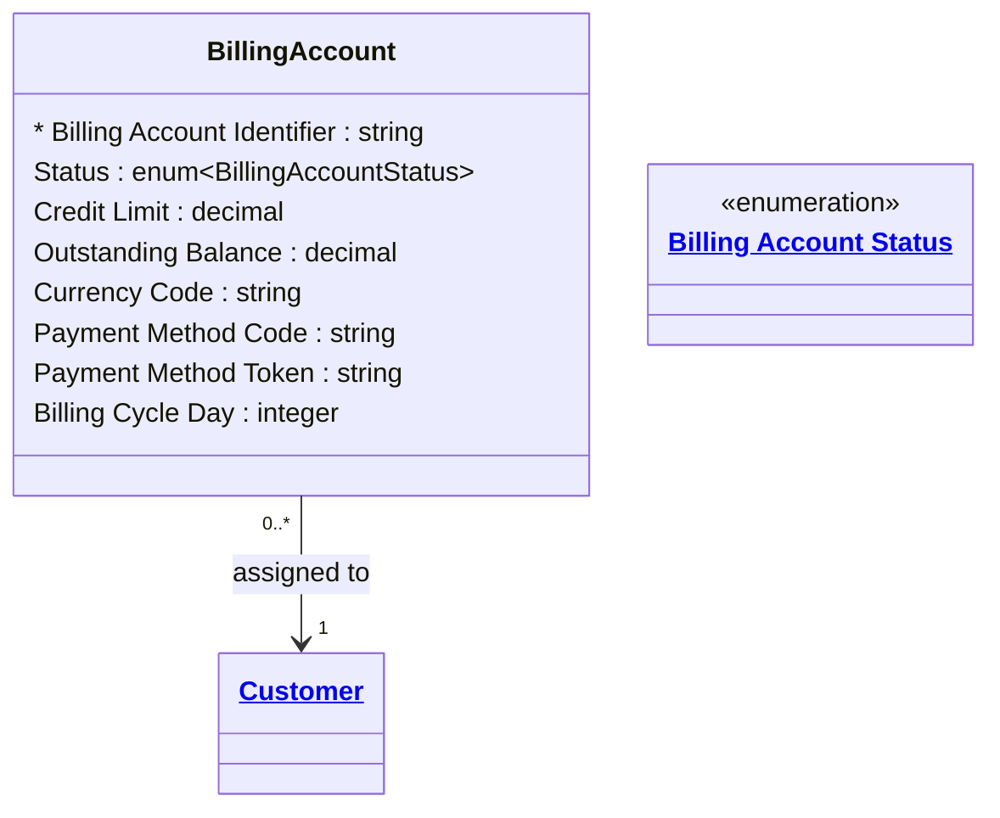

# [Telecom](../domain.md)

## Entities

### Billing Account

A financial account to which charges for subscribed services are posted and invoiced. Each Billing Account is assigned to exactly one Customer. A Customer may hold multiple Billing Accounts to separate charges across business units, cost centres, or product lines.

Billing Account is a `frequently_changing` entity — outstanding balance, credit limit, and payment method are updated with each billing cycle, payment receipt, or credit control event. Because the current values are what drive operations (credit checks, dunning, invoice generation), only the current state matters for most use cases. Valid time tracks the account's active period.

Billing Account holds payment method data, making it subject to PCI-DSS. Credit card numbers are never stored in plain text — the Payment Method Token attribute holds a reversible token managed by the tokenization service.



```yaml
existence: dependent
mutability: frequently_changing
temporal:
  tracking: valid_time
  description: >
    Valid time tracks the active period of the billing account (open date to
    close date). Balance and payment method reflect the current state only —
    historical values are captured in the billing system's ledger, not this entity.
attributes:
  Billing Account Identifier:
    type: string
    identifier: primary
    description: Unique identifier for the billing account.

  Status:
    type: enum:Billing Account Status
    description: Operational status of the billing account.

  Credit Limit:
    type: decimal
    description: Maximum outstanding balance permitted before service suspension is triggered.

  Outstanding Balance:
    type: decimal
    description: Current amount owed by the customer on this billing account.

  Currency Code:
    type: string
    description: ISO 4217 currency code for all amounts on this account.

  Payment Method Code:
    type: string
    description: Code identifying the payment method type (e.g. CARD, DIRECT_DEBIT, INVOICE).

  Payment Method Token:
    type: string
    description: >
      Reversible token representing the stored payment method (credit card, bank account).
      The underlying payment credentials are held by the tokenization service, never by this domain.
      PCI-DSS scope is limited to this token — raw card data is never persisted.

  Billing Cycle Day:
    type: integer
    description: Day of month on which invoices are generated for this account (1–28).
```

```yaml
constraints:
  Credit Limit Non Negative:
    check: "Credit Limit >= 0"
    description: Credit limit must be zero or positive.
  Billing Cycle Day Valid:
    check: "Billing Cycle Day >= 1 AND Billing Cycle Day <= 28"
    description: Billing cycle day must be between 1 and 28 to be valid across all months.
```

```yaml
governance:
  pii: true
  classification: Highly Confidential
  retention: "7 years post account close"
  retention_basis: >
    Billing account records are subject to PCI-DSS data retention requirements
    and financial record-keeping obligations.
  access_role:
    - BILLING_OPERATIONS
    - CREDIT_CONTROL
    - REVENUE_ASSURANCE
  compliance_relevance:
    - PCI-DSS Requirement 3 — protect stored cardholder data (tokenization approach)
    - PCI-DSS Requirement 7 — restrict access to cardholder data by business need-to-know
```

## Relationships

### Billing Account Assigned To Customer

Each Billing Account is assigned to its responsible Customer. Charges, invoices, and credit control actions flow through this assignment.

```yaml
source: Billing Account
type: assigned_to
target: Customer
cardinality: many-to-one
granularity: atomic
ownership: Billing Account
```
