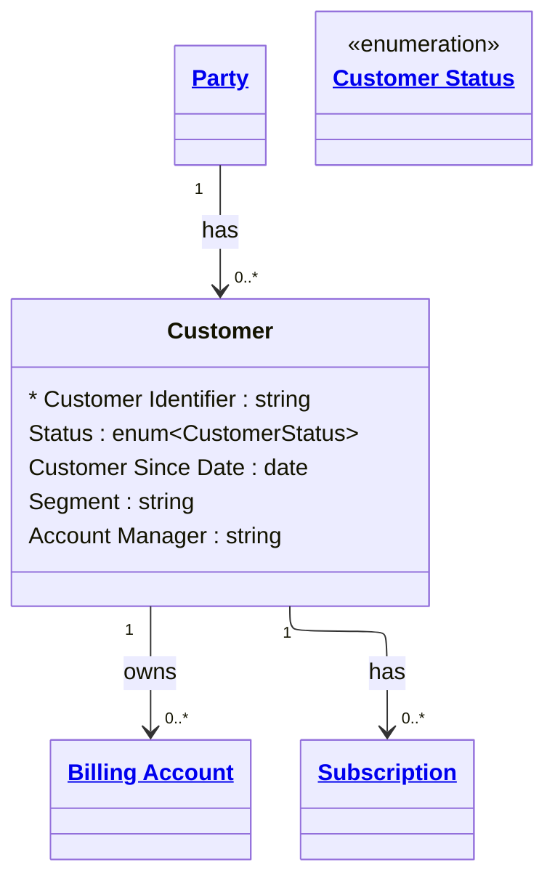

# [Telecom](../domain.md)

## Entities

### Customer

The commercial relationship between a Party and the telco. Distinct from the underlying Party — a single Individual or Organization may hold multiple Customer records across different brands, market segments, or product portfolios.

Aligned to TM Forum TMF629, Customer is the primary commercial object. All billing, subscriptions, and service ownership flow through Customer, not Party. This separation ensures that a consumer can switch brands without losing their underlying identity record, and that the same business can hold separate residential and enterprise accounts.

Customer records change slowly: status transitions (Prospect → Active → Suspended → Closed) and segment reclassifications are the most common changes. Bitemporal tracking supports point-in-time reporting for regulatory submissions and revenue analysis.



```yaml
existence: dependent
mutability: slowly_changing
temporal:
  tracking: bitemporal
  description: >
    Bitemporal tracking is required for customer-level reporting. Valid time
    captures when the customer status was true in the business (e.g. when they
    were actually Suspended), while transaction time captures when that status
    was recorded in the system. This combination supports regulatory point-in-time
    queries: "what was this customer's status on the reporting date" vs "what did
    our system believe on that date" — critical for disputes and regulatory submissions.
attributes:
  Customer Identifier:
    type: string
    identifier: primary
    description: Globally unique identifier for the customer relationship.

  Status:
    type: enum:Customer Status
    description: Lifecycle status of the customer (Prospect, Active, Suspended, Closed).

  Customer Since Date:
    type: date
    description: Date the customer relationship was established (first activation).

  Segment:
    type: string
    description: Commercial segment assigned to this customer (e.g. Consumer, SME, Enterprise, Wholesale).

  Account Manager:
    type: string
    description: Name or identifier of the account manager assigned to enterprise customers.
```

```yaml
constraints:
  Active Customer Requires Since Date:
    check: "Status != 'Active' OR Customer Since Date IS NOT NULL"
    description: An Active customer must have a Customer Since Date.
```

```yaml
governance:
  pii: true
  classification: Confidential
  retention: "7 years post contract end"
  retention_basis: >
    Customer relationship records are retained for contractual, billing dispute,
    and regulatory compliance purposes.
  access_role:
    - SUBSCRIBER_MANAGEMENT
    - ACCOUNT_MANAGEMENT
    - REVENUE_ASSURANCE
  compliance_relevance:
    - GDPR — right to erasure (status must be Closed before erasure eligibility assessed)
    - CPNI — customer relationship data protections
```

## Relationships

### Customer Owns Billing Account

A Customer owns one or more Billing Accounts to which service charges are posted.

```yaml
source: Customer
type: owns
target: Billing Account
cardinality: one-to-many
granularity: atomic
ownership: Customer
```

### Customer Has Subscriptions

A Customer holds one or more Subscriptions, each binding the customer to a Product Offering for a defined period.

```yaml
source: Customer
type: has
target: Subscription
cardinality: one-to-many
granularity: period
ownership: Customer
```
