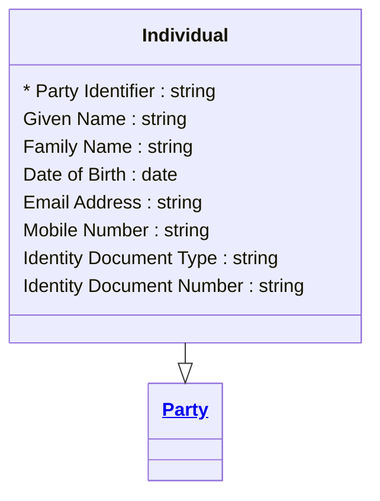

# [Telecom](../domain.md)

## Entities

### Individual

A natural person who holds or may hold a subscriber relationship. Specialises Party with personal identity attributes aligned to TM Forum TMF632 Individual. Consumer subscribers, sole traders, and household accounts are all represented as Individuals.

Individual records change slowly — typically when a subscriber updates their contact details, changes their name, or when periodic re-verification triggers a data refresh. The full history of changes is retained for regulatory compliance (GDPR right-of-access audit trail) and fraud detection.



```yaml
extends: Party
existence: independent
mutability: slowly_changing
temporal:
  tracking: valid_time
  description: >
    Valid time tracks when each version of the individual's personal details
    was accurate. Required for GDPR right-of-access requests — the operator
    must be able to reconstruct what data was held at any point in time.
attributes:
  Given Name:
    type: string
    description: Given name(s) of the individual as they appear on their identity document.

  Family Name:
    type: string
    description: Family name (surname) of the individual.

  Date of Birth:
    type: date
    description: Date of birth. Used for age verification and fraud detection.

  Email Address:
    type: string
    description: Primary email address for account communications.

  Mobile Number:
    type: string
    description: Mobile number in E.164 format. Used for authentication and notifications.

  Identity Document Type:
    type: string
    description: Type of identity document used for verification (e.g. Passport, Driver Licence, National ID).

  Identity Document Number:
    type: string
    description: Document number from the identity verification document.
```

```yaml
governance:
  pii: true
  classification: Confidential
  retention: "7 years post contract end"
  retention_basis: >
    Personal subscriber data is retained to meet regulatory obligations under
    telecommunications legislation and fraud prevention requirements.
  access_role:
    - SUBSCRIBER_MANAGEMENT
    - IDENTITY_VERIFICATION
    - DATA_GOVERNANCE
  compliance_relevance:
    - GDPR Article 5 — data minimisation and accuracy
    - CPNI — customer proprietary network information protections
```
