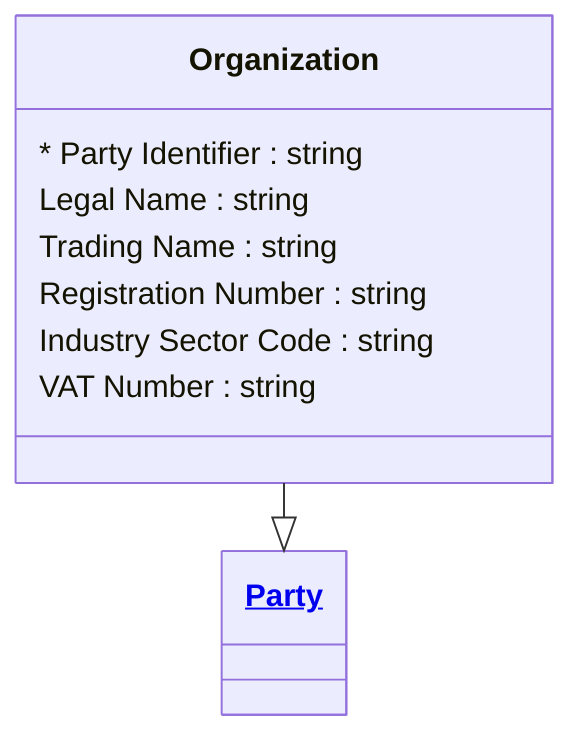

# [Telecom](../domain.md)

## Entities

### Organization

A legal entity — company, government body, partnership, or other formally recognised organisation — that holds a business subscriber relationship. Specialises Party with commercial identity attributes aligned to TM Forum TMF632 Organization.

Business accounts represent the telco's enterprise and SME customer base. Organization records change slowly; the most common change is a trading name or registered address update following a corporate restructure.



```yaml
extends: Party
existence: independent
mutability: slowly_changing
temporal:
  tracking: valid_time
  description: >
    Valid time tracks when each version of the organisation's registered
    details was accurate. Corporate restructures and name changes must
    be preserved to support contract dispute resolution and audit.
attributes:
  Legal Name:
    type: string
    description: Full legal name of the organisation as registered with the relevant authority.

  Trading Name:
    type: string
    description: Trading or brand name if different from the legal name.

  Registration Number:
    type: string
    description: Company registration number issued by the relevant corporate registry.

  Industry Sector Code:
    type: string
    description: Industry classification code (e.g. ANZSIC, SIC) describing the organisation's primary business activity.

  VAT Number:
    type: string
    description: VAT or GST registration number, where applicable.
```

```yaml
governance:
  pii: false
  classification: Internal
  retention: "7 years post contract end"
  retention_basis: >
    Business entity records retained for contract and regulatory audit purposes.
  access_role:
    - SUBSCRIBER_MANAGEMENT
    - ENTERPRISE_SALES
    - DATA_GOVERNANCE
```
