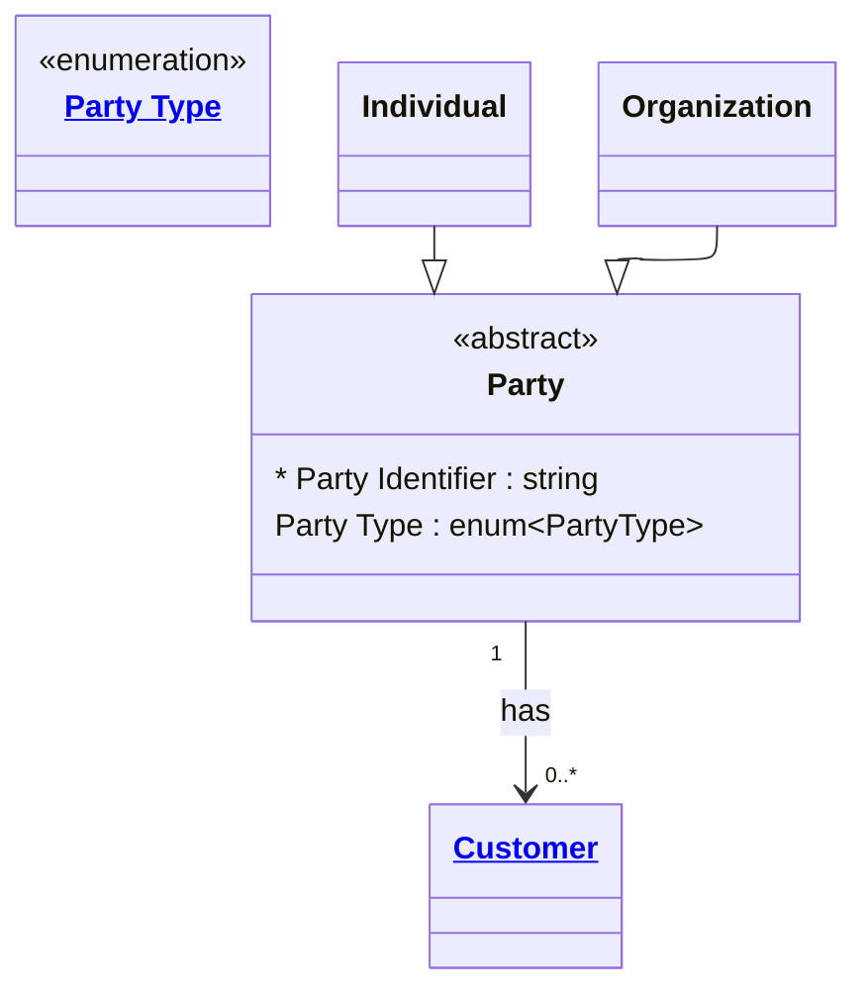

# [Telecom](../domain.md)

## Entities

### Party

The abstract base representation of any individual or organisation that can hold a subscriber relationship with the telco. Aligned to TM Forum TMF632, Party is never instantiated directly — all parties are expressed through the specialisations Individual or Organization.

Party is a reference entity: it changes infrequently and is administered by a small number of systems. The core identity attributes of a Party (legal name, registration status) are authoritative reference data managed by a master data team, not operational systems.



```yaml
existence: independent
mutability: reference
attributes:
  Party Identifier:
    type: string
    identifier: primary
    description: Globally unique identifier for the party, assigned at creation and never reused.

  Party Type:
    type: enum:Party Type
    description: Discriminator identifying whether this party is an Individual or Organization.
```

```yaml
governance:
  pii: false
  classification: Internal
  access_role:
    - SUBSCRIBER_MANAGEMENT
    - MASTER_DATA_TEAM
```

## Relationships

### Party Has Customer

A Party can hold one or more Customer records — one per brand, market segment, or product line where a distinct commercial relationship exists.

```yaml
source: Party
type: has
target: Customer
cardinality: one-to-many
granularity: atomic
ownership: Party
```
