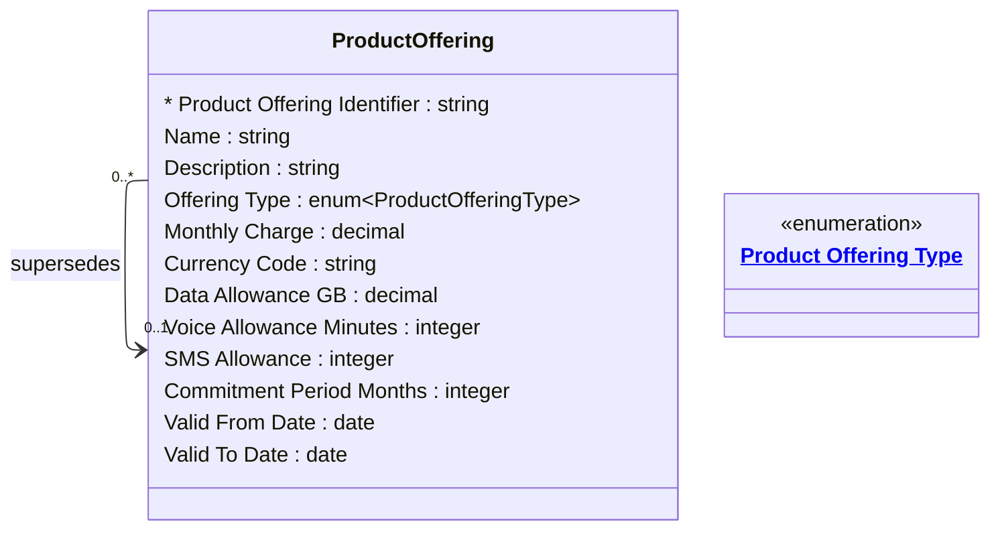

# [Telecom](../domain.md)

## Entities

### Product Offering

A commercial package of services, allowances, and terms made available for subscription. Product Offerings represent the catalog — what the telco sells, at what price, under what conditions.

Aligned to TM Forum TMF620, a Product Offering bundles one or more services (voice allowance, data quota, SMS bundle) with a price plan. When a product is updated — price change, allowance revision, new terms — a new Product Offering is created to supersede the old one. Existing subscribers on the old offering continue under their original terms until they migrate or their subscription expires.

Product Offerings are reference data: they change infrequently (a new catalog release is a major event) and are managed centrally by the product team.



```yaml
existence: independent
mutability: reference
temporal:
  tracking: valid_time
  description: >
    Valid time captures the period during which this offering is active in the
    catalog (Valid From Date to Valid To Date). When an offering is superseded,
    its Valid To Date is set to the effective date of the successor. Offers are
    never deleted — the full catalog history is preserved.
attributes:
  Product Offering Identifier:
    type: string
    identifier: primary
    description: Unique identifier for this product offering version.

  Name:
    type: string
    description: Commercial name of the offering as displayed to subscribers (e.g. "Unlimited Plus 60GB").

  Description:
    type: string
    description: Full description of what is included in this offering.

  Offering Type:
    type: enum:Product Offering Type
    description: Commercial classification — Prepaid, Postpaid, Hybrid, Business, or Wholesale.

  Monthly Charge:
    type: decimal
    description: Recurring monthly charge for this offering in the nominated currency.

  Currency Code:
    type: string
    description: ISO 4217 currency code for the Monthly Charge.

  Data Allowance GB:
    type: decimal
    description: Included data allowance in gigabytes per billing period. Null indicates unlimited.

  Voice Allowance Minutes:
    type: integer
    description: Included voice minutes per billing period. Null indicates unlimited.

  SMS Allowance:
    type: integer
    description: Included SMS messages per billing period. Null indicates unlimited.

  Commitment Period Months:
    type: integer
    description: Minimum contract duration in months. Zero indicates no commitment (month-to-month).

  Valid From Date:
    type: date
    description: Date from which this offering is available in the active catalog.

  Valid To Date:
    type: date
    description: Date after which this offering is no longer available for new subscriptions. Null indicates currently active.
```

```yaml
governance:
  pii: false
  classification: Internal
  access_role:
    - PRODUCT_MANAGEMENT
    - SUBSCRIBER_MANAGEMENT
    - PRICING_TEAM
```

## Relationships

### Product Offering Supersedes Product Offering

A new Product Offering may supersede an earlier version, replacing it in the active catalog. Cardinality is many-to-one: when a legacy plan is split into multiple variants (e.g., Prepaid Plus and Prepaid Lite both replacing the old Prepaid Standard), each successor independently supersedes the same predecessor. Existing subscribers on the superseded offering are not automatically migrated — they remain on their original terms.

```yaml
source: Product Offering
type: supersedes
target: Product Offering
cardinality: many-to-one
granularity: atomic
ownership: Product Offering
```
