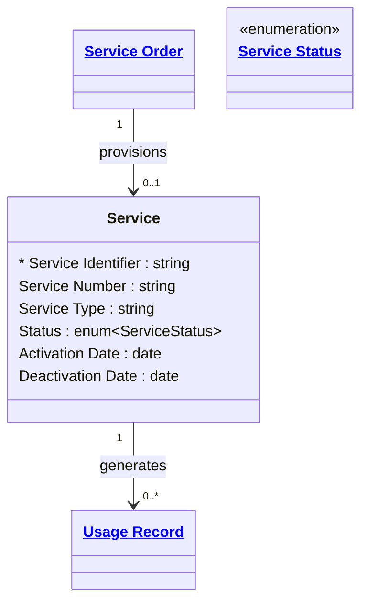

# [Telecom](../domain.md)

## Entities

### Service

A provisioned network or application service delivered to a subscriber. Service is the technical representation of what the network has configured — a mobile number, a data bearer, a fixed broadband connection — as distinct from the commercial Subscription that entitles the customer to it.

Aligned to TM Forum TMF638, Service captures the active service state and the service identifier (MSISDN for mobile, circuit ID for fixed). Service records change slowly: status transitions (Pending → Active → Suspended → Terminated) are the primary events, and each generates a Service Provisioned event.



```yaml
existence: dependent
mutability: slowly_changing
temporal:
  tracking: valid_time
  description: >
    Valid time tracks when the service was active (Activation Date to
    Deactivation Date). Point-in-time queries are required to determine
    what services were active at the time of a disputed charge.
attributes:
  Service Identifier:
    type: string
    identifier: primary
    description: Unique identifier for this service instance in the provisioning system.

  Service Number:
    type: string
    description: >
      The subscriber-facing service identifier — MSISDN (mobile number) for voice
      and SMS services, IP address or circuit ID for data services.

  Service Type:
    type: string
    description: Category of service (e.g. Mobile Voice, Mobile Data, Fixed Broadband, SMS).

  Status:
    type: enum:Service Status
    description: Operational status of the service as known to the network.

  Activation Date:
    type: date
    description: Date the service was activated on the network.

  Deactivation Date:
    type: date
    description: Date the service was deactivated. Null indicates currently active.
```

```yaml
governance:
  pii: true
  classification: Confidential
  retention: "7 years post deactivation"
  retention_basis: >
    Service records including MSISDN/service number are CPNI-regulated data.
    Retained for regulatory reporting and billing dispute resolution.
  access_role:
    - NETWORK_OPERATIONS
    - SUBSCRIBER_MANAGEMENT
    - REVENUE_ASSURANCE
  compliance_relevance:
    - CPNI — service identifiers are protected subscriber data
```

## Relationships

### Service Generates Usage Records

An active Service generates Usage Records for each completed call, SMS, or data session. Usage Records are immutable once written — they represent metered consumption events.

```yaml
source: Service
type: has
target: Usage Record
cardinality: one-to-many
granularity: atomic
ownership: Service
```
