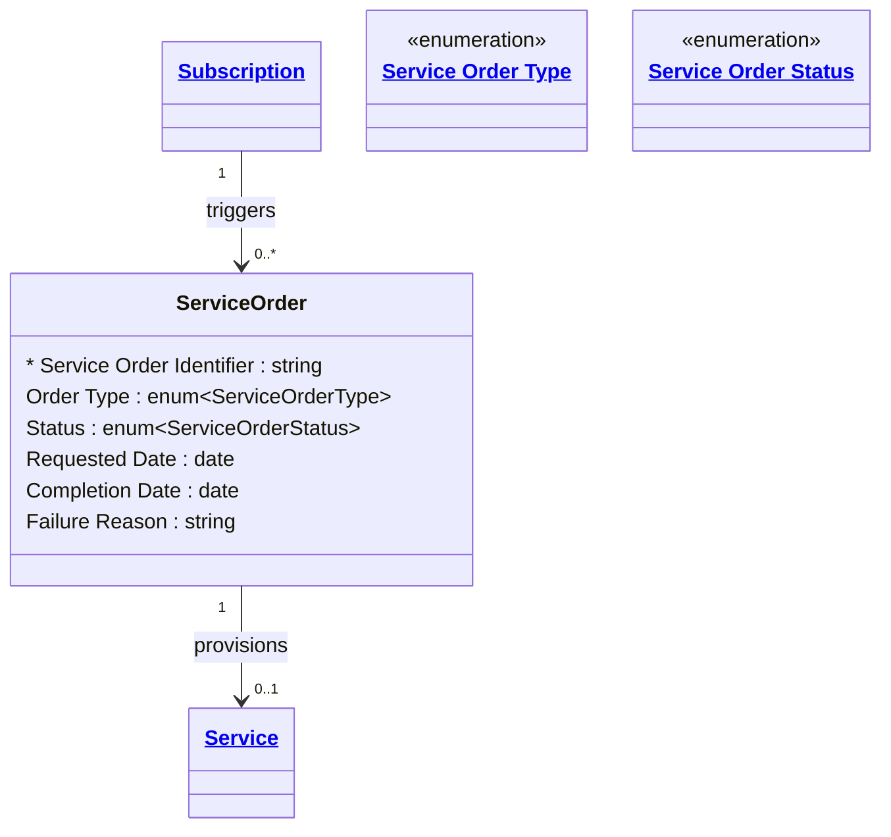

# [Telecom](../domain.md)

## Entities

### Service Order

A work order instructing the provisioning system to create, modify, suspend, resume, or terminate a network Service. Service Orders are created automatically when a Subscription lifecycle event occurs — they represent the technical execution of a commercial decision.

Aligned to TM Forum TMF641, Service Order is an `append_only` entity: once submitted, a service order record is never modified. Progress is tracked by appending new status records to the order's audit trail, not by updating the original. This preserves the full provisioning history for troubleshooting and regulatory audit.



```yaml
existence: dependent
mutability: append_only
temporal:
  tracking: transaction_time
  description: >
    Transaction time records when each service order row was committed to the system.
    Because Service Order is append_only, each status update (Acknowledged → In Progress
    → Completed/Failed) creates a new row with its own transaction timestamp. This supports
    full audit of the provisioning lifecycle and SLA measurement (time from Acknowledged
    to Completed).
attributes:
  Service Order Identifier:
    type: string
    identifier: primary
    description: Unique identifier for this service order.

  Order Type:
    type: enum:Service Order Type
    description: The type of action requested — Provision, Modify, Suspend, Resume, or Terminate.

  Status:
    type: enum:Service Order Status
    description: Current processing status of the service order.

  Requested Date:
    type: date
    description: Date the service order was submitted by the BSS system.

  Completion Date:
    type: date
    description: Date the service order was completed (successfully or with failure). Null if still in progress.

  Failure Reason:
    type: string
    description: Description of the failure cause when Status is Failed. Null for successful orders.
```

```yaml
governance:
  pii: false
  classification: Internal
  retention: "7 years"
  retention_basis: >
    Service order history is retained for regulatory compliance, SLA reporting,
    and network audit purposes.
  access_role:
    - NETWORK_OPERATIONS
    - SUBSCRIBER_MANAGEMENT
    - SERVICE_DESK
```

## Relationships

### Service Order Provisions Service

A completed Service Order results in the creation, modification, or termination of a Service. A Provision order creates a new Service; a Terminate order deactivates an existing one.

```yaml
source: Service Order
type: produces
target: Service
cardinality: many-to-one
granularity: atomic
ownership: Service Order
```
