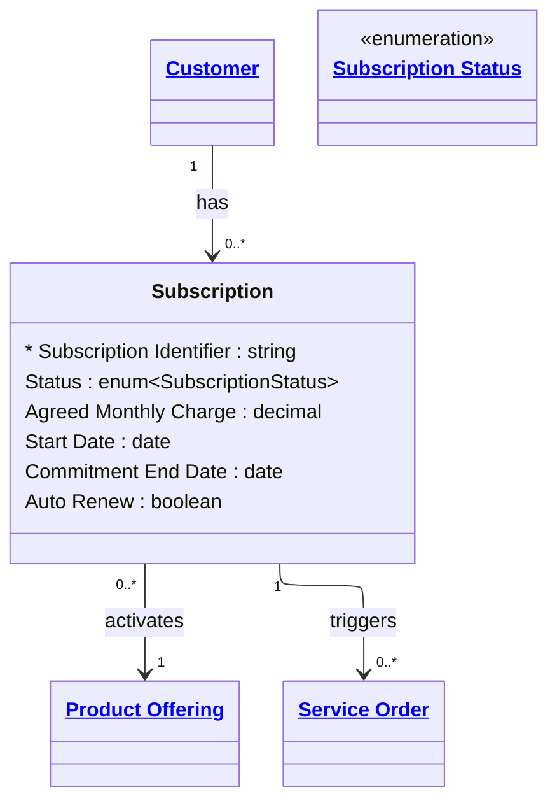

# [Telecom](../domain.md)

## Entities

### Subscription

The associative entity that links a Customer to a Product Offering, capturing the commercial terms agreed at point of sale. A Subscription records what the customer signed up for, when, at what price, and under what commitment.

Subscription is an `associative` entity — it exists to resolve the many-to-many relationship between Customers and Product Offerings while carrying attributes of the relationship itself (agreed price, commitment end date, activation timestamp). A single Customer may hold multiple concurrent Subscriptions (e.g. a mobile plan and a broadband plan), and the same Product Offering may be subscribed to by many Customers.

When a Subscription is activated, it `triggers` a Service Order to provision the underlying network service. When a Subscription is modified (plan change, data top-up), it triggers a further Service Order to update the service configuration.



```yaml
existence: associative
mutability: slowly_changing
temporal:
  tracking: valid_time
  description: >
    Valid time tracks the active period of the subscription from Start Date
    to the effective end date (Commitment End Date or cancellation date).
    Status transitions are the primary change events; each status change
    is recorded with its effective date for billing and dispute resolution.
attributes:
  Subscription Identifier:
    type: string
    identifier: primary
    description: Unique identifier for this subscription instance.

  Status:
    type: enum:Subscription Status
    description: Lifecycle status of the subscription (Pending, Active, Suspended, Cancelled, Expired).

  Agreed Monthly Charge:
    type: decimal
    description: >
      The monthly recurring charge agreed at point of sale. May differ from the
      Product Offering's current Monthly Charge if a promotional rate was applied.

  Start Date:
    type: date
    description: Date the subscription became active.

  Commitment End Date:
    type: date
    description: >
      Date after which the subscriber is free to cancel without penalty.
      Null for month-to-month subscriptions.

  Auto Renew:
    type: boolean
    description: >
      Whether the subscription automatically renews at the end of the commitment
      period. If false, a Cancelled or Expired status is applied at term end.
```

```yaml
constraints:
  Commitment End After Start:
    check: "Commitment End Date IS NULL OR Commitment End Date >= Start Date"
    description: Commitment end date must be on or after the start date.
```

```yaml
governance:
  pii: false
  classification: Confidential
  retention: "7 years post subscription end"
  retention_basis: >
    Subscription records support billing disputes, regulatory reporting, and
    revenue assurance. Retained for the full regulatory obligation period.
  access_role:
    - SUBSCRIBER_MANAGEMENT
    - BILLING_OPERATIONS
    - REVENUE_ASSURANCE
```

## Relationships

### Subscription Activates Product Offering

Each Subscription is bound to exactly one Product Offering at point of sale. The Product Offering defines the service entitlements and base price; the Subscription records what was actually agreed.

```yaml
source: Subscription
type: references
target: Product Offering
cardinality: many-to-one
granularity: atomic
ownership: Subscription
```

### Subscription Triggers Service Order

Activating or modifying a Subscription triggers a Service Order to provision, change, or terminate the underlying network Service. The trigger relationship makes explicit the causal chain from commercial event (subscription) to technical action (service order).

```yaml
source: Subscription
type: triggers
target: Service Order
cardinality: one-to-many
granularity: atomic
ownership: Subscription
```
