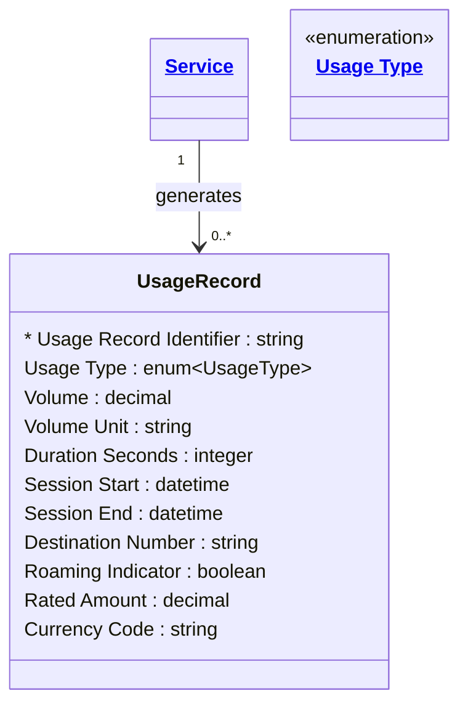

# [Telecom](../domain.md)

## Entities

### Usage Record

A single call detail record (CDR) or data session record capturing the metered consumption of a Service. Usage Records are the raw input for billing, allowance deduction, revenue assurance, and network fraud detection.

Aligned to TM Forum TMF635, Usage Record is `immutable` — once a CDR is committed, it is never modified. Corrections are handled by issuing a compensating record (a negative CDR), not by changing the original. This immutability guarantee is the basis for audit trail integrity and regulatory compliance.

Usage Record uses bitemporal tracking: valid time captures the actual start and end of the call or session in the real world, while transaction time captures when the CDR was committed to the billing system. The difference between the two — known as late-arrival — is significant in telecoms: CDRs from roaming partners can arrive hours or days after the call ends. The transaction time dimension allows the billing system to identify and correctly rate late CDRs.



```yaml
existence: dependent
mutability: immutable
temporal:
  tracking: bitemporal
  description: >
    Bitemporal tracking is essential for telecommunications CDR processing.
    Valid time captures the actual call or session window (Session Start to
    Session End) — when the usage occurred in the real world. Transaction time
    captures when the CDR was received and committed by the billing system.
    Roaming CDRs from partner networks routinely arrive 24-72 hours after
    the call ends. Without transaction time, late-arriving CDRs would be
    incorrectly attributed to the current billing period. The gap between
    valid time and transaction time is monitored as a revenue assurance KPI.
attributes:
  Usage Record Identifier:
    type: string
    identifier: primary
    description: Unique CDR identifier assigned by the network element or mediation layer.

  Usage Type:
    type: enum:Usage Type
    description: Category of usage — Voice, SMS, Data, MMS, Roaming Voice, or Roaming Data.

  Volume:
    type: decimal
    description: Quantity of usage consumed, in the units specified by Volume Unit.

  Volume Unit:
    type: string
    description: Unit of measurement for Volume (e.g. MB for data, count for SMS/MMS).

  Duration Seconds:
    type: integer
    description: Duration of the call or session in seconds. Applicable to Voice and Data; null for SMS/MMS.

  Session Start:
    type: datetime
    description: UTC timestamp when the call or data session began.

  Session End:
    type: datetime
    description: UTC timestamp when the call or data session ended.

  Destination Number:
    type: string
    description: E.164 destination number for Voice and SMS records. Null for data sessions.

  Roaming Indicator:
    type: boolean
    description: True if this usage was generated while the subscriber was roaming on a partner network.

  Rated Amount:
    type: decimal
    description: >
      Charge applied for this usage record after allowance deduction and rating.
      Zero if the usage was within an included allowance.

  Currency Code:
    type: string
    description: ISO 4217 currency code for the Rated Amount.
```

```yaml
constraints:
  Session End After Start:
    check: "Session End > Session Start"
    description: Session end must be after session start.
  Volume Non Negative:
    check: "Volume >= 0"
    description: Usage volume must be non-negative.
```

```yaml
governance:
  pii: true
  classification: Highly Confidential
  retention: "7 years"
  retention_basis: >
    CDR data is subject to telecommunications data retention regulations.
    Contains subscriber usage patterns, call destinations, and location data.
    Access is tightly controlled and subject to lawful interception obligations.
  access_role:
    - BILLING_OPERATIONS
    - REVENUE_ASSURANCE
    - NETWORK_FRAUD
    - DATA_GOVERNANCE
  compliance_relevance:
    - CPNI — call detail records are protected subscriber data
    - Telecommunications Act — data retention obligations
    - Lawful interception frameworks (jurisdiction-specific)
```
