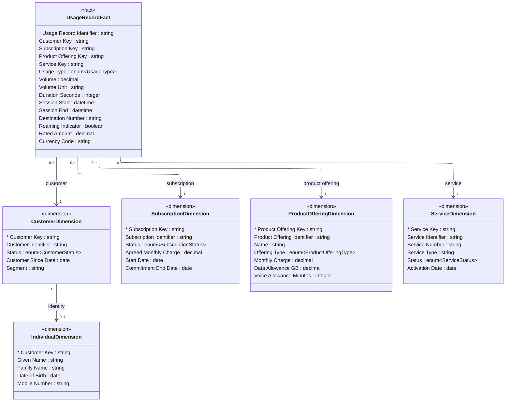

# [Telecom](../domain.md)

## Data Products

### Subscriber Usage Analytics

A dimensional star schema combining subscriber identity, subscription terms, and usage volumes for network analytics and revenue assurance reporting. Designed for OLAP-style queries — slicing usage by customer segment, service type, geography, and time period.

The dimensional model places Usage Record at the centre as the fact table, with Customer, Subscription, Product Offering, and Service as surrounding dimension tables. This structure enables efficient query patterns for standard analytics use cases without requiring joins across the full normalized model.

```yaml
class: consumer-aligned
schema_type: dimensional
owner: revenue.assurance@telco.com
consumers:
  - Network Analytics
  - Revenue Assurance
  - Executive Reporting
status: Active
version: "1.0.0"

entities:
  - Usage Record Fact
  - Customer Dimension
  - Individual Dimension
  - Subscription Dimension
  - Product Offering Dimension
  - Service Dimension

lineage:
  - domain: Telecom
    entities:
      - Usage Record
      - Service
      - Subscription
      - Product Offering
      - Customer
      - Individual

governance:
  classification: Confidential
  pii: true
  retention: "7 years"
  masking:
    - attribute: "Individual Dimension.Given Name"
      strategy: null
    - attribute: "Individual Dimension.Family Name"
      strategy: null
    - attribute: "Individual Dimension.Date of Birth"
      strategy: year-only
    - attribute: "Usage Record Fact.Destination Number"
      strategy: truncate

sla:
  freshness: "< 1 hour"
  availability: "99.5%"

refresh: hourly
```

#### Logical Model

Dimensional model with Usage Record as the central fact and five surrounding
dimension tables. All measures and foreign keys live in the fact; descriptive
attributes live in the dimensions.



#### Attribute Mapping

##### Usage Record Fact

Product Attribute | Source | Path | Transform
--- | --- | --- | ---
Usage Record Identifier | Usage Record.Usage Record Identifier | — | —
Customer Key | Customer.Customer Identifier | Usage Record → Service → Subscription → Customer | —
Subscription Key | Subscription.Subscription Identifier | Usage Record → Service → Subscription | —
Product Offering Key | Product Offering.Product Offering Identifier | Usage Record → Service → Subscription → Product Offering | —
Service Key | Service.Service Identifier | Usage Record → Service | —
Usage Type | Usage Record.Usage Type | — | —
Volume | Usage Record.Volume | — | —
Volume Unit | Usage Record.Volume Unit | — | —
Duration Seconds | Usage Record.Duration Seconds | — | —
Session Start | Usage Record.Session Start | — | —
Session End | Usage Record.Session End | — | —
Destination Number | Usage Record.Destination Number | — | —
Roaming Indicator | Usage Record.Roaming Indicator | — | —
Rated Amount | Usage Record.Rated Amount | — | —
Currency Code | Usage Record.Currency Code | — | —

##### Customer Dimension

Product Attribute | Source | Path | Transform
--- | --- | --- | ---
Customer Key | Customer.Customer Identifier | — | —
Customer Identifier | Customer.Customer Identifier | — | —
Status | Customer.Status | — | —
Customer Since Date | Customer.Customer Since Date | — | —
Segment | Customer.Segment | — | —

##### Individual Dimension

Product Attribute | Source | Path | Transform
--- | --- | --- | ---
Customer Key | Customer.Customer Identifier | Individual → Party → Customer | —
Given Name | Individual.Given Name | — | —
Family Name | Individual.Family Name | — | —
Date of Birth | Individual.Date of Birth | — | —
Mobile Number | Individual.Mobile Number | — | —

##### Subscription Dimension

Product Attribute | Source | Path | Transform
--- | --- | --- | ---
Subscription Key | Subscription.Subscription Identifier | — | —
Subscription Identifier | Subscription.Subscription Identifier | — | —
Status | Subscription.Status | — | —
Agreed Monthly Charge | Subscription.Agreed Monthly Charge | — | —
Start Date | Subscription.Start Date | — | —
Commitment End Date | Subscription.Commitment End Date | — | —

##### Product Offering Dimension

Product Attribute | Source | Path | Transform
--- | --- | --- | ---
Product Offering Key | Product Offering.Product Offering Identifier | — | —
Product Offering Identifier | Product Offering.Product Offering Identifier | — | —
Name | Product Offering.Name | — | —
Offering Type | Product Offering.Offering Type | — | —
Monthly Charge | Product Offering.Monthly Charge | — | —
Data Allowance GB | Product Offering.Data Allowance GB | — | —
Voice Allowance Minutes | Product Offering.Voice Allowance Minutes | — | —

##### Service Dimension

Product Attribute | Source | Path | Transform
--- | --- | --- | ---
Service Key | Service.Service Identifier | — | —
Service Identifier | Service.Service Identifier | — | —
Service Number | Service.Service Number | — | —
Service Type | Service.Service Type | — | —
Status | Service.Status | — | —
Activation Date | Service.Activation Date | — | —
