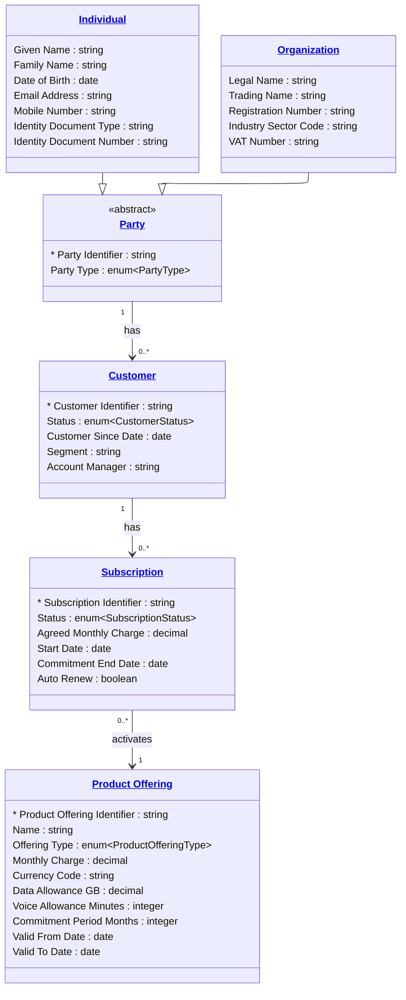

# [Telecom](../domain.md)

## Data Products

### Canonical Subscriber

The authoritative domain-aligned view of subscriber identity, commercial status, and active subscriptions. This product is the primary integration surface for other domains that need subscriber context — it exposes the canonical Telecom domain model without denormalization or product-specific shaping.

```yaml
class: domain-aligned
schema_type: normalized
owner: domain.telecom@telco.com
consumers:
  - Cross-domain Integration
  - Identity Resolution Platform
  - Financial Crime Analytics
status: Active
version: "1.0.0"

entities:
  - Party
  - Individual
  - Organization
  - Customer
  - Subscription
  - Product Offering

lineage:
  - source: bss-oss
    tables:
      - table_subscriber
      - table_business_account
      - table_customer
      - table_product_catalog
      - table_subscription

governance:
  classification: Confidential
  pii: true
  retention: "7 years post contract end"

masking:
  - attribute: "Individual.Date of Birth"
    strategy: year-only
  - attribute: "Individual.Identity Document Number"
    strategy: hash

sla:
  freshness: "< 5 minutes"
  availability: "99.9%"

refresh: real-time
```

#### Logical Model


