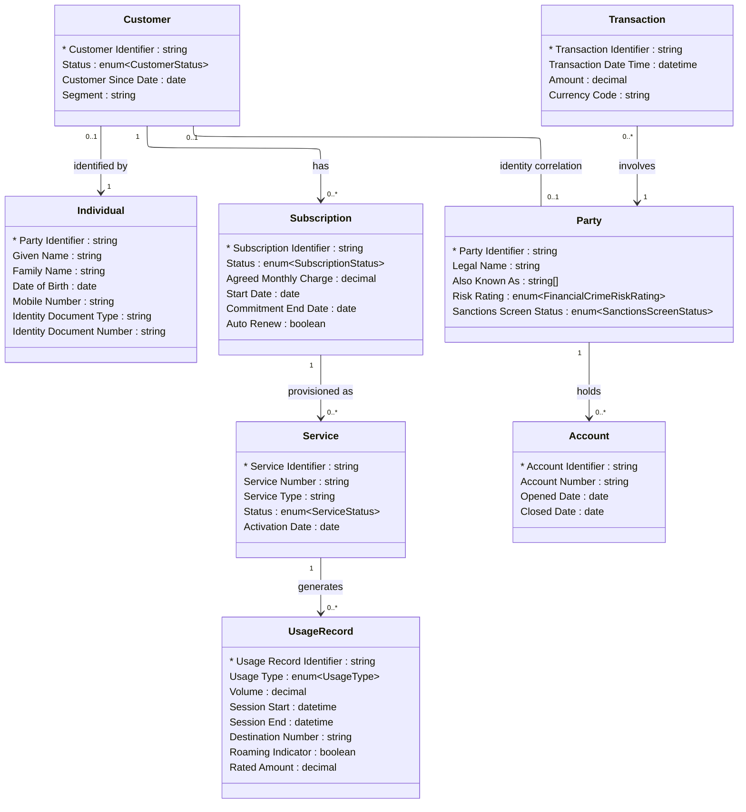

# [Telecom](../domain.md)

## Data Products

### Telecom Fraud Intelligence

Consumer-aligned product combining subscriber identity, usage patterns, and subscription activity with financial transaction data from the Financial Crime domain to detect cross-channel fraud — SIM swap attacks, subscription fraud, account takeover, and synthetic identity schemes that span both telecom and financial systems.

Governance note: This product combines PCI-DSS-regulated telecom data with AML/GDPR-regulated financial crime data. The effective classification is Highly Confidential and the regulatory scope is the union of both contributing domains. The strictest retention obligation (10 years, from Financial Crime) applies.

```yaml
class: consumer-aligned
schema_type: normalized
owner: telecom.fraud@telco.com
consumers:
  - Financial Crime Analytics
  - Telecom Fraud Operations
  - Enterprise Fraud Operations
status: Active
version: "1.0.0"

entities:
  - Customer
  - Individual
  - Subscription
  - Service
  - Usage Record
  - Party
  - Transaction
  - Account

lineage:
  - domain: Telecom
    entities:
      - Customer
      - Individual
      - Subscription
      - Service
      - Usage Record
  - domain: Financial Crime
    entities:
      - Party
      - Transaction
      - Account

governance:
  classification: Highly Confidential
  pii: true
  retention: "10 years"
  regulatory_scope:
    - PCI-DSS (Payment Card Industry Data Security Standard)
    - GDPR (General Data Protection Regulation)
    - AML (Anti-Money Laundering)
    - KYC (Know Your Customer)
    - CPNI (Customer Proprietary Network Information)
  masking:
    - attribute: "Individual.Given Name"
      strategy: tokenize
    - attribute: "Individual.Family Name"
      strategy: tokenize
    - attribute: "Individual.Date of Birth"
      strategy: year-only
    - attribute: "Individual.Identity Document Number"
      strategy: hash
    - attribute: "Usage Record.Destination Number"
      strategy: hash
    - attribute: "Party.Legal Name"
      strategy: hash

sla:
  freshness: "< 15 minutes"
  availability: "99.9%"
  latency_p99: "< 500ms"

refresh: real-time
```

#### Logical Model

Normalized structure preserving entity boundaries across both contributing
domains. Telecom entities source from the Canonical Subscriber product;
Financial Crime entities source from the Canonical Party product.



#### Attribute Mapping

##### Customer

Product Attribute | Source | Transform
--- | --- | ---
Customer Identifier | Customer.Customer Identifier | —
Status | Customer.Status | —
Customer Since Date | Customer.Customer Since Date | —
Segment | Customer.Segment | —

##### Individual

Product Attribute | Source | Transform
--- | --- | ---
Party Identifier | Individual.Party Identifier | —
Given Name | Individual.Given Name | —
Family Name | Individual.Family Name | —
Date of Birth | Individual.Date of Birth | —
Mobile Number | Individual.Mobile Number | —
Identity Document Type | Individual.Identity Document Type | —
Identity Document Number | Individual.Identity Document Number | —

##### Subscription

Product Attribute | Source | Transform
--- | --- | ---
Subscription Identifier | Subscription.Subscription Identifier | —
Status | Subscription.Status | —
Agreed Monthly Charge | Subscription.Agreed Monthly Charge | —
Start Date | Subscription.Start Date | —
Commitment End Date | Subscription.Commitment End Date | —
Auto Renew | Subscription.Auto Renew | —

##### Service

Product Attribute | Source | Transform
--- | --- | ---
Service Identifier | Service.Service Identifier | —
Service Number | Service.Service Number | —
Service Type | Service.Service Type | —
Status | Service.Status | —
Activation Date | Service.Activation Date | —

##### Usage Record

Product Attribute | Source | Transform
--- | --- | ---
Usage Record Identifier | Usage Record.Usage Record Identifier | —
Usage Type | Usage Record.Usage Type | —
Volume | Usage Record.Volume | —
Session Start | Usage Record.Session Start | —
Session End | Usage Record.Session End | —
Destination Number | Usage Record.Destination Number | —
Roaming Indicator | Usage Record.Roaming Indicator | —
Rated Amount | Usage Record.Rated Amount | —

##### Party

Product Attribute | Source | Transform
--- | --- | ---
Party Identifier | Financial Crime.Party.Party Identifier | —
Legal Name | Financial Crime.Party.Legal Name | —
Also Known As | Financial Crime.Party.Also Known As | —
Risk Rating | Financial Crime.Party.Risk Rating | —
Sanctions Screen Status | Financial Crime.Party.Sanctions Screen Status | —

##### Transaction

Product Attribute | Source | Transform
--- | --- | ---
Transaction Identifier | Financial Crime.Transaction.Transaction Identifier | —
Transaction Date Time | Financial Crime.Transaction.Transaction Date Time | —
Amount | Financial Crime.Transaction.Amount | —
Currency Code | Financial Crime.Transaction.Currency Code | —

##### Account

Product Attribute | Source | Transform
--- | --- | ---
Account Identifier | Financial Crime.Account.Account Identifier | —
Account Number | Financial Crime.Account.Account Number | —
Opened Date | Financial Crime.Account.Opened Date | —
Closed Date | Financial Crime.Account.Closed Date | —
