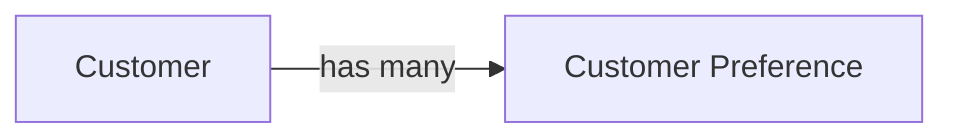

# Customer

The Customer domain contains all concepts related to customer identity,
profiles, preferences, and lifecycle.

## Metadata
```yaml
owners:
  - data.manager@example.com
stewards:
  - jane.doe@example.com
tags:
  - core
  - pii
```
### Domain Diagram 



## Entities

### Customer
The primary representation of a customer in the organisation.

```yaml
attributes:
  - name: Customer Id
    type: string
    identifier: true
  - name: Email
    type: string
    pii: true
  - name: Loyalty Tier
    type: enum:LoyaltyTier
```

### Customer Preference
Represents customer‑specific settings and preferences.

```yaml
attributes:
  - name: Preference Name
    type: string
  - name: Value
    type: string
```

## Enums

### Loyalty Tier
```yaml
values:
  - Bronze
  - Silver
  - Gold
  - Platinum
```

## Relationships

### Customer Has Preferences
Customers can have zero or more preferences, and preferences are owned by a customer. A preference cannot exist without a customer, and a customer can exist without preferences. 

```yaml
source: Customer
target: Customer Preference
cardinality: one-to-many
ownership: Customer
```
