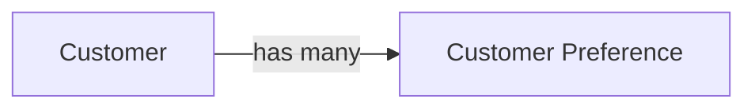

# Customer Domain

The Customer domain contains all concepts related to customer identity, profiles, preferences, and lifecycle.

## Metadata

```yaml
owners:
  - data.manager@example.com
stewards:
  - jane.doe@example.com
tags:
  - core
  - pii
```

### Customer Overview Diagram



## Entities

*Note this simple example uses a single file for the details of entities, enums, relationships and events. This is for brevity and to show how linking works. Decide on your file structure based on it's readability for humans and context management for AI.*

### Customer

The primary representation of a customer in the organisation.
[detail](details-customer.md#customer-1)

### Customer Preference

Represents customer‑specific settings and preferences.
[detail](details-customer.md#customer-preference)

## Enums

### Loyalty Tier

A structured level within a loyalty program that offers different benefits and rewards based on engagement or spending.
[detail](details-customer.md#loyalty-tier)

## Relationships

### Customer Has Preferences

Customers can have zero or more preferences, and preferences are owned by a customer.
[detail](details-customer.md#customer-has-preferences)
