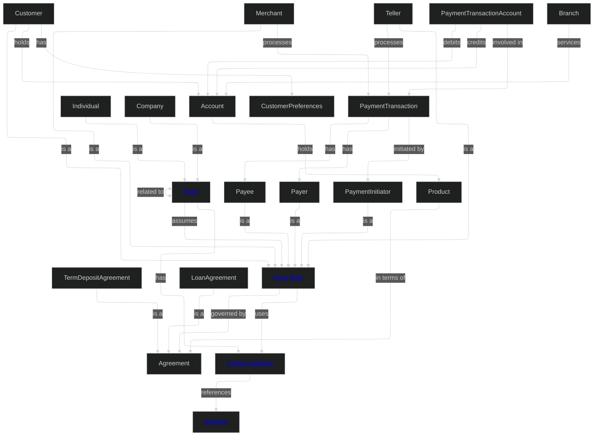
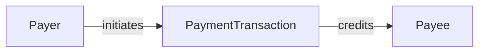
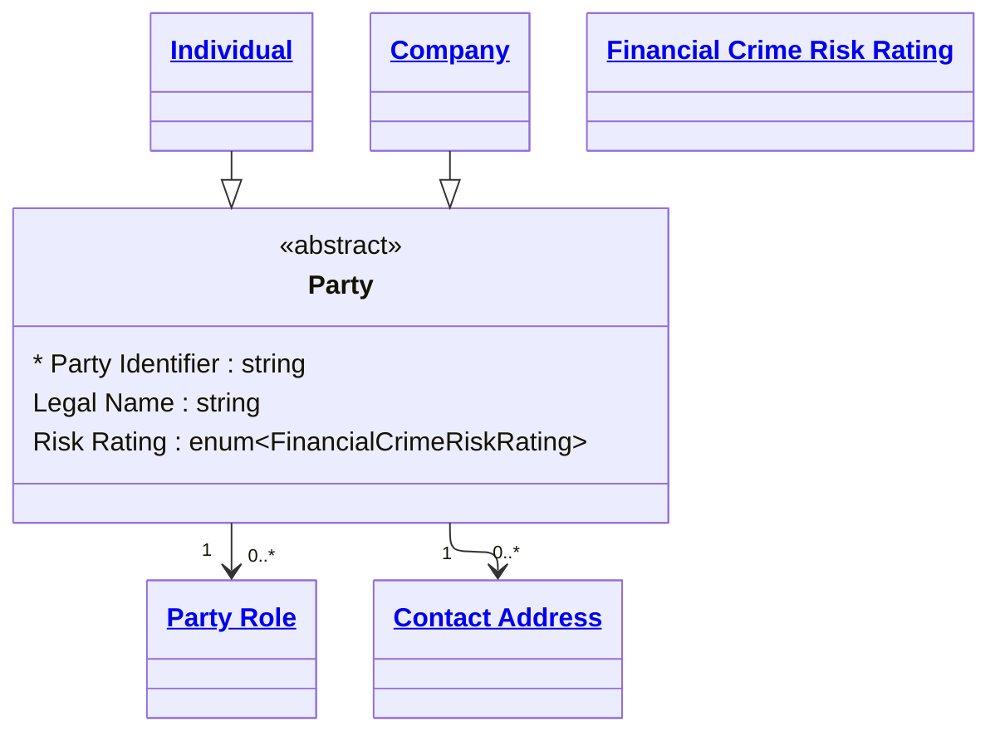
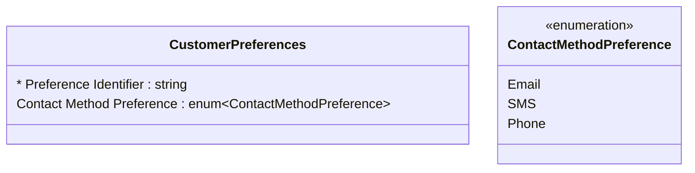
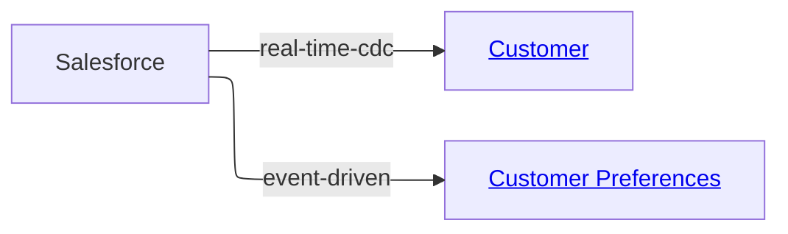

# MD-DDL Diagram Style Guide

*A non-normative companion guide to the MD-DDL specification. The specification itself asks only that a domain file include a Domain Overview Diagram whose edge labels match the Relationships section, and recommends a `classDiagram` in entity detail files. Everything in this guide — layout engines, linking syntax, element ordering — is convention for producing consistent, readable diagrams. Deviations are observations, not errors.*

---

## Domain Overview Diagrams

The Domain Overview Diagram is the first artefact an AI agent or a new team member loads when working with a domain. It establishes:

- **Scope**: what concepts are owned by this domain
- **Structure**: how inheritance hierarchies are organised
- **Connectivity**: which entities are central vs peripheral
- **Navigation**: hyperlinks on key entities provide one-click access to detail files from the diagram itself

A well-maintained domain diagram makes the two-layer structure of MD-DDL work in practice — the domain file is the map, and the diagram is the visual index of that map.

### What to Include

The overview diagram works best when it shows:

1. **All entities** defined in the domain
2. **Inheritance relationships** using `-->|is a|` notation
3. **All relationships** between entities using labelled edges whose verb matches the relationship name defined in the Relationships section
4. **Hyperlinks** on key navigable entities using `EntityName["<a href='path'>Display Name</a>"]` syntax. Not every node needs a link — prioritise the abstract and most-referenced entities.

And leaves out:

- Attributes (these belong in entity detail files)
- Cardinality notation (this belongs in relationship detail files)
- Enumeration values (these belong in enum detail files)

### Syntax Conventions

- Use `graph TD` (top-down) for domains with deep inheritance hierarchies; `graph LR` (left-right) otherwise
- Use the ELK layout engine (`layout: elk`) with `mergeEdges: false` for complex graphs to prevent edge crossings
- Relationship edge labels use the verb form from the Relationships section: `-->|assumes|`, `-->|references|`, `-->|governed by|`
- Inheritance is expressed as `Child -->|is a|Parent`
- Bidirectional relationships use `<-->|label|`
- Entity hyperlinks use plain anchor tags: `<a href='path'>Display Name</a>` with no additional CSS class attributes
- Node identifiers in the graph use PascalCase for readability (e.g., `PartyRole`, `ContactAddress`) but the display label uses natural language where a hyperlink is defined

### Example: Financial Crime Domain Overview Diagram

````markdown
### Domain Overview Diagram


````

### Additional Diagrams

Beyond the overview, a domain file may contain additional level-3 diagrams focusing on a specific sub-area. For example:

````markdown
### Transaction Flow Diagram
Shows how payment transactions move through party roles.


````

Additional diagrams are optional.

---

## Entity Class Diagrams

An entity detail file's `classDiagram` sits immediately after the entity description and before the YAML definition blocks. It shows the entity's own attributes, its position in the inheritance hierarchy, and its immediate relationships to other entities. The YAML block remains authoritative — the diagram is a rendering of it.

### Configuration

Entity diagrams use the ELK layout engine for consistent rendering:

````markdown
```mermaid
---
config:
  layout: elk
---
classDiagram
  ...
```
````

### The Subject Class

The entity being defined is the **subject class**. It is written as a full class block with its attributes listed inside:

```text
  class Party{
    <<abstract>>
    * Party Identifier : string
    Legal Name : string
    Party Status : enum~PartyStatus~
  }
```

Conventions for the subject class:

- The class name uses PascalCase matching the entity heading (e.g., `Party`, `ContactAddress`, `PartyRole`)
- If the entity is abstract — never instantiated directly, only specialised — add `<<abstract>>` as the first line inside the class block
- The primary identifier attribute is prefixed with `*` to mark it as the key
- All attributes defined in the entity's YAML block appear in the diagram
- Attribute types use the Mermaid classifier syntax:
  - Primitives: `string`, `integer`, `decimal`, `boolean`, `date`, `datetime`
  - Enumerations: `enum~EnumName~` (e.g., `enum~PartyStatus~`, `enum~CountryCode~`)
  - Arrays: append `[]` to the type (e.g., `enum~CountryCode~[]`, `string[]`)
- Inherited attributes from parent entities are **not** repeated in the subject class — only attributes defined in this entity's own YAML block are shown
- Attribute format is `AttributeName : Type` with a space either side of the colon

### Reference Classes

All other classes that appear in the diagram — parents, children, related entities, and referenced enums — are **reference classes** unless they are enums detailed in the same file. Reference classes are never defined with attribute blocks. Instead they use the linked class syntax:

```text
  class Party["<a href='party.md'>Party</a>"]
```

Conventions for reference classes:

- Use plain anchor tags: `<a href='path'>Display Name</a>`
- No CSS class attributes on the anchor tag
- The `href` path is relative to the current file's location and uses snake_case filenames (e.g., `party.md`, `party_role.md`, `contact_address.md`)
- Display Name uses natural language with spaces matching the entity heading (e.g., `Party Role`, `Contact Address`)
- All reference class definitions are grouped at the bottom of the diagram, after all relationship lines
- If a specialisation child has no detail file yet, it may appear as a bare unlinked class: `class Customer` — without a block or link

### Enum Classes

Any enum used by the subject class attributes appears in the class diagram, using one of two patterns:

1. **Referenced enum (detail in another file)** — show as a linked reference class:

```text
  class PartyStatus["<a href='../enums/party_status.md'>Party Status</a>"]
```

2. **Co-located enum (detail in the same file)** — show as an expanded enum class with values:

```text
  class PartyStatus{
    <<enumeration>>
    Active
    Inactive
    Under Review
  }
```

Conventions for enum classes:

- Every enum type referenced in the subject class (for example `enum~PartyStatus~`) appears exactly once in the diagram
- If the enum is defined in the same detail file under `## Enums`, render it as an expanded enum class with its values and include `<<enumeration>>`
- If the enum is defined elsewhere, render it as a linked reference class to its enum detail file and include only the `<<enumeration>>` tag in the class detail
- Use PascalCase class names for enum class identifiers (for example `PartyStatus`, `CountryCode`)
- Display names in links use natural language (for example `Party Status`, `Country Code`)

### Inheritance

Inheritance uses the Mermaid `--|>` arrow with the child on the left:

```text
  Individual --|> Party
  Company --|> Party
```

This reads as "Individual is a specialisation of Party." The direction matches the domain overview diagram convention of `Child -->|is a|Parent`.

When an entity **is** a specialisation, show the parent as a reference class:

```text
  Individual --|> Party
  class Party["<a href='party.md'>Party</a>"]
```

When an entity **has** specialisations, show each child as a reference class (or bare class if not yet defined):

```text
  Individual --|> Party
  Company --|> Party
  class Individual["<a href='individual.md'>Individual</a>"]
  class Company["<a href='company.md'>Company</a>"]
```

### Relationships and Cardinality

All immediate relationships to and from the entity are shown with labelled arrows and cardinality. The classDiagram is a logical realization of the entity — relationship labels here describe the structural link (e.g., has, references) and do not need to match the conceptual relationship names defined in the domain Relationships section. A single conceptual relationship may realize as multiple logical associations, and some logical associations may have no direct conceptual counterpart.

```text
  Party "1" --> "0..*" PartyRole
  PartyRole "0..*" --> "0..*" ContactAddress
  ContactAddress "0..*" --> "1" Address
```

Conventions for relationships:

- Cardinality is shown on both ends using quoted strings: `"1"`, `"0..1"`, `"0..*"`, `"1..*"`
- Relationship labels are optional; when included, they describe the structural navigation intent, not the conceptual relationship name
- The arrow direction reflects the ownership or navigational direction: the entity that *holds the reference* is the source (`-->`)
- Bidirectional relationships use `<-->`
- Every entity in a relationship line has a corresponding reference class definition at the bottom of the diagram

### Ordering Within the Diagram

To keep diagrams readable and consistent, follow this ordering:

1. The subject class block (with attributes)
2. Specialisation child classes (bare or linked, one per line)
3. Inheritance arrows (`--|>`)
4. Relationship lines (`-->` with cardinality and label)
5. Enum classes (expanded if co-located; linked reference if external)
6. All remaining reference class definitions (`class Foo["<a href='...'>...</a>"]`)

### Examples

**Abstract entity with specialisations and outbound relationships (Party):**

````markdown

````

**Entity with co-located enum values:**

````markdown

````

---

## Source Overview Diagrams

Source files ([Section 7 — Sources](../md-ddl-specification/7-Sources.md)) may include a diagram showing which canonical entities the source feeds and the change model for each. The same conventions apply: ELK layout, labelled edges (here labelled with the change model), and linked nodes for canonical entities:

````markdown
### Source Overview Diagram


````
