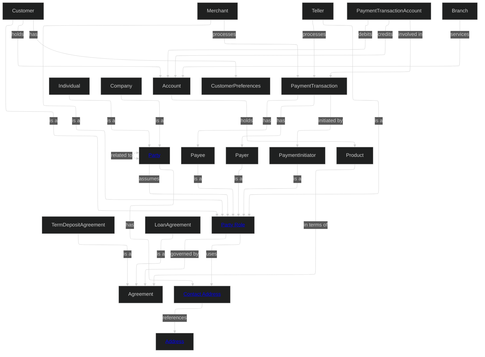
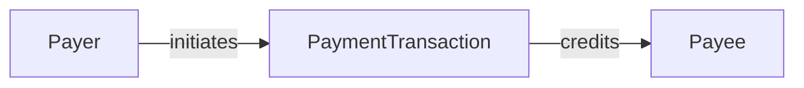

# MD-DDL

## **Domains**

In MD-DDL, the Domain file acts as the router for the Knowledge Graph. While detail files provide the DNA (Attributes/Constraints), the Domain file provides the Anatomy (How entities, events, and relationships sit together).

### **Domain Declaration**

A domain is declared using a **level‑1 Markdown heading**:

```markdown
# Customer
```

### **Domain Description**

All free‑text Markdown under the H1 heading and before the next H2 heading is considered the domain description.

### **Domain Metadata**

Metadata is appears under a level‑2 heading:

```markdown
## Metadata
```

Domain Metadata sets the default posture for all contained objects unless overridden. Metadata is:

Category|Metadata Keys|Purpose
--------|-------------|-------
Accountability|owners, stewards, technical_leads|Who is responsible for the business vs. technical health.
Governance & Security|classification, confidentiality, pii|The default security posture for the entire domain.
Compliance|sox_scope, gdpr_relevant, retention_policy|Legal and regulatory frameworks governing this data.
Lifecycle|status (Draft/Live), version, source_systems|The maturity and origin of the data domain.
Discovery|tags|Searchability

#### **Metadata Format**

Metadata is expressed as YAML or JSON inside a fenced code block:

````markdown
## Metadata

```yaml
# Accountability
owners:
  - data.customer@example.com
stewards:
  - jane.doe@example.com
technical_leads:
  - architecture.team@example.com

# Governance & Security
classification: "Highly Confidential"
pii: true
regulatory_scope:
  - GDPR
  - CCPA
default_retention: "7 years"

# Lifecycle & Discovery
status: "Production"
version: "2.1.0"
tags:
  - Core
  - MasterData
  - B2C
source_systems:
  - "Salesforce CRM"
  - "SAP ERP"
```
````

#### **Diagrams**

Diagrams appear under level‑3 headings inside the Metadata section, after the YAML metadata block. This separates data *about* the domain from visuals *of* the domain.

A domain file should contain at least one **Domain Overview Diagram** that shows the full entity graph for the domain. This diagram is the primary navigational and communicative artefact of the domain file — it must give any reader an immediate understanding of how all concepts relate to each other.

The Domain Overview Diagram uses `graph TD` (top-down) or `graph LR` (left-right) Mermaid syntax with the ELK layout engine for consistent, readable positioning of complex graphs.

##### **What to include in the Domain Overview Diagram**

The diagram must show:

1. **All entities** defined in the domain
2. **Inheritance relationships** using `-->|is a|` notation
3. **All relationships** between entities using labelled edges whose verb matches the relationship name defined in the Relationships section
4. **Hyperlinks** on key navigable entities using `EntityName["<a href='path'>Display Name</a>"]` syntax. Not every node needs a link — prioritise the abstract and most-referenced entities.

The diagram must not show:

- Attributes (these belong in entity detail files)
- Cardinality notation (this belongs in relationship detail files)
- Enumeration values (these belong in enum detail files)

##### **Diagram Syntax Rules**

- Use `graph TD` for domains with deep inheritance hierarchies
- Use the ELK layout engine (`layout: elk`) with `mergeEdges: false` for complex graphs to prevent edge crossings
- Relationship edge labels must use the verb form from the Relationships
  section: `-->|assumes|`, `-->|references|`, `-->|governed by|`
- Inheritance is always expressed as `Child -->|is a|Parent`
- Bidirectional relationships use `<-->|label|`
- Entity hyperlinks use plain anchor tags: `<a href='path'>Display Name</a>`
  with no additional CSS class attributes
- Node identifiers in the graph use PascalCase for readability
  (e.g., `PartyRole`, `ContactAddress`) but the display label uses
  natural language where a hyperlink is defined

##### **Example: Financial Crime Domain Overview Diagram**

````markdown
### Domain Overview Diagram


````

##### **Why the Domain Overview Diagram matters**

The domain diagram is the first artefact an AI agent or a new team member loads when working with a domain. It establishes:

- **Scope**: what concepts are owned by this domain
- **Structure**: how inheritance hierarchies are organised
- **Connectivity**: which entities are central vs peripheral
- **Navigation**: hyperlinks on key entities provide one-click access to detail files from the diagram itself

A well-maintained domain diagram makes the two-layer structure of MD‑DDL work in practice — the domain file is the map, and the diagram is the visual index of that map.

##### **Additional Diagrams**

Beyond the overview, a domain file may contain additional level‑3 diagrams focusing on a specific sub-area. For example:

````markdown
### Transaction Flow Diagram
Shows how payment transactions move through party roles.


````

Additional diagrams are optional. The Domain Overview Diagram is required.

#### Conceptual vs Logical Diagrams

MD-DDL uses two distinct diagram types for different purposes:

Diagram|Location|Purpose|Relationship Labels
-------|--------|-------|-------------------
`graph TD/LR`|Domain file|Conceptual model — business meaning and named relationships|Required — must match Relationships section
`classDiagram`|Entity detail file|Logical model — structural realization of the entity|Optional — structural intent only

The classDiagram is not required to mirror the domain graph one-for-one. Modellers have freedom to realize conceptual relationships as they see fit at the logical level.

---

### **Domain Structure**

Below the metadata section there are several sections, each with a level‑2 heading. The sections are:

```markdown
## Entities

### <entity name>
Conceptual definition.
- detail: [<entity name>](link to details)
- specializes: [<entity name>](link to parent entity details)
- references: 
    - [<external reference1>](reference url1)
    - [<external reference2>](reference url2)

## Enums
...
## Relationships
...
## Events
...
```

The order of these sections is not important. See the specification details of each for more information.

#### Sample Structure

- Recommended: Entity-Centric Detail Files
- A common and encouraged pattern is to define, in a single file, one entity alongside all relationships that originate from it. This keeps ownership clear and reduces cross-file navigation. Example layout:

```shell
entities/party.md        ← Party entity + Party Has Role + Party Has Contact Address
entities/party-role.md   ← Party Role entity + Party Role Uses Contact Address
entities/address.md      ← Address entity (no outbound relationships)
```

Below is an example of how a domain file is structured.

```markdown
# Domain Name

Domain description...

## Metadata
Formal JSON/YAML block and diagrams...

### Domain Overview Diagram
- [Domain Overview](diagrams/overview.md)

## Entities

### Customer
The primary representation of a customer in the organisation.
- detail: [Customer](entities/customer.md)

### Customer Preference
Represents customer‑specific settings and preferences.
- detail [Customer Preference](entities/customer-preference.md) 

## Enums

### Loyalty Tier
A structured level within a loyalty program that offers different benefits and rewards based on engagement or spending.
- detail: [Loyalty Tier](enums/loyalty-tier.md) 

## Relationships

### Customer Has Preferences
A customer can have 0 to many preferences which are used for interactions with our business.
- detail: [Customer Has Preferences](relationships/customer-has-preferences.md) 

## Events

### Customer Preference Updated
Emited when any system updates a field which is used to configure customer interactions.
- detail: [Customer Preference Updated](events/customer-preference-updated.md) 

```

### Rules for Summary Definitions

- The summary must include a short natural‑language description.
- The summary must include a detail: link to the full definition file. Where multiple concepts share a detail file, each concept's summary links to the same file. The compiler resolves each concept by its level‑3 heading within that file.
- If the entity specializes another entity, include a `specializes:` link to the parent entity before the detail link.
- The summary should not include YAML or formal attributes. It is a conceptual definition.
- The summary must be below the entity's level‑3 heading.
- The summary is authoritative but high level for the entity name.
- The summary is intentionally brief, designed for AI agents to load upfront and humans to scan quickly.

This allows the domain file to act as a semantic index of the domain.

#### Specialization in Summaries

When an entity specializes (inherits from) another entity, declare this in the summary with a link to the parent:

```markdown
### Individual
A natural person who participates in financial activities.
- specializes: [Party](entities/party.md)
- detail: [Individual](entities/individual.md)
```

---

...next: [Entities](3-Entities.md)
