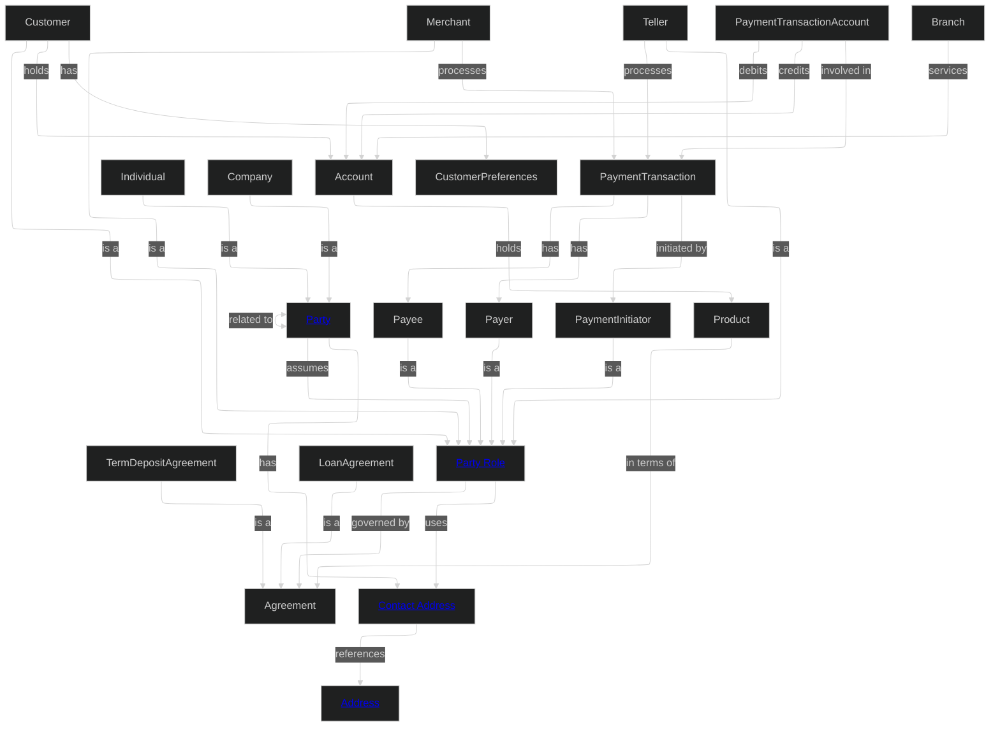
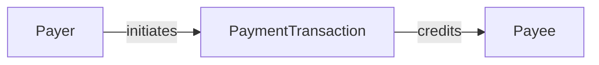
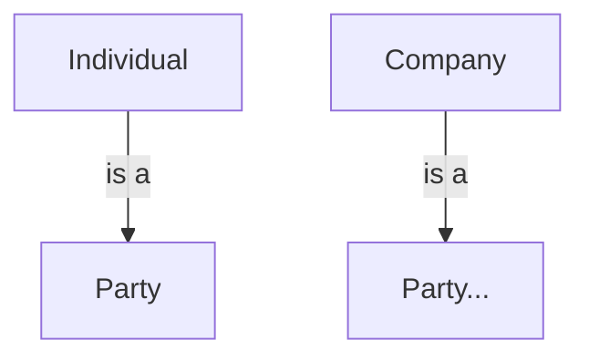

# MD‑DDL Specification (Draft 0.8.2)

## **Domains**

In MD-DDL, the Domain file acts as the router for the Knowledge Graph. While detail files provide the DNA (Attributes/Constraints), the Domain file provides the Anatomy (How entities, events, and relationships sit together).

### **Domain Declaration**

A domain is declared using a **level‑1 Markdown heading**:

```markdown
# Customer
```

### **Domain Description**

All free‑text Markdown under the H1 heading and before the next H2 heading is considered the domain description.

### **Domain Metadata**

Metadata appears under a level‑2 heading:

```markdown
## Metadata
```

Domain Metadata sets the default posture for all contained objects unless overridden. Metadata is:

Governance and compliance metadata declared at the domain level is inherited by all contained entities, relationships, and events. Detail files should not repeat governance attributes when values are unchanged from the domain defaults.

Include a `governance:` block in detail files only when specifying an exception or stricter requirement than the domain default.

Category|Metadata Keys|Purpose
--------|-------------|-------
Accountability|owners, stewards, technical_leads|Who is responsible for the business vs. technical health.
Governance & Security|classification, confidentiality, pii|The default security posture for the entire domain.
Compliance|sox_scope, gdpr_relevant, retention_policy|Legal and regulatory frameworks governing this data.
Lifecycle|status (Draft/Live), version|The maturity of the data domain.
Discovery|tags|Searchability

#### **Metadata Format**

Metadata is expressed as YAML or JSON inside a fenced code block:

````markdown
## Metadata

```yaml
# Accountability
owners:
  - data.customer@example.com
stewards:
  - jane.doe@example.com
technical_leads:
  - architecture.team@example.com

# Governance & Security
classification: "Highly Confidential"
pii: true
regulatory_scope:
  - GDPR
  - CCPA
default_retention: "7 years"

# Lifecycle & Discovery
status: "Production"
version: "2.1.0"
tags:
  - Core
  - MasterData
  - B2C
```
````

### **Source Systems**

Source systems are first-class domain summary objects and must be declared under a level‑2 heading immediately after `## Metadata`.

Use a Markdown table with the following columns:

Column | Purpose
--- | ---
**Business Application** | Source application or product name, expressed as a Markdown link to the source markdown file.
**Platform** | Technology platform or deployment model.
**Capability Domain** | Business capability or functional area served by the source.

Example:

````markdown
## Source Systems

Business Application | Platform | Capability Domain
--- | --- | ---
[Temenos Payment](sources/temenos-payment/source.md) | Temenos SaaS | Payment Execution
[SAP Fraud Management](sources/sap-fraud-management/source.md) | SAP | Fraud
````

#### **Diagrams**

Diagrams appear under level‑3 headings inside the Metadata section, after the YAML metadata block. This separates data *about* the domain from visuals *of* the domain.

A domain file should contain at least one **Domain Overview Diagram** that shows the full entity graph for the domain. This diagram is the primary navigational and communicative artefact of the domain file — it must give any reader an immediate understanding of how all concepts relate to each other.

The Domain Overview Diagram uses `graph TD` (top-down) or `graph LR` (left-right) Mermaid syntax with the ELK layout engine for consistent, readable positioning of complex graphs.

##### **What to include in the Domain Overview Diagram**

The diagram must show:

1. **All entities** defined in the domain
2. **Inheritance relationships** using `-->|is a|` notation
3. **All relationships** between entities using labelled edges whose verb matches the relationship name defined in the Relationships section
4. **Hyperlinks** on key navigable entities using `EntityName["<a href='path'>Display Name</a>"]` syntax. Not every node needs a link — prioritise the abstract and most-referenced entities.

The diagram must not show:

- Attributes (these belong in entity detail files)
- Cardinality notation (this belongs in relationship detail files)
- Enumeration values (these belong in enum detail files)

##### **Diagram Syntax Rules**

- Use `graph TD` for domains with deep inheritance hierarchies
- Use the ELK layout engine (`layout: elk`) with `mergeEdges: false` for complex graphs to prevent edge crossings
- Relationship edge labels must use the verb form from the Relationships
  section: `-->|assumes|`, `-->|references|`, `-->|governed by|`
- Inheritance is always expressed as `Child -->|is a|Parent`
- Bidirectional relationships use `<-->|label|`
- Entity hyperlinks use plain anchor tags: `<a href='path'>Display Name</a>`
  with no additional CSS class attributes
- Node identifiers in the graph use PascalCase for readability
  (e.g., `PartyRole`, `ContactAddress`) but the display label uses
  natural language where a hyperlink is defined

##### **Example: Financial Crime Domain Overview Diagram**

````markdown
### Domain Overview Diagram


```mermaid
---
config:
  layout: elk
  elk:
    mergeEdges: false
    nodePlacementStrategy: LINEAR_SEGMENTS
  look: classic
  theme: dark
---
graph TD

  Individual --> |is a|Party
  Company --> |is a|Party
  TermDepositAgreement --> |is a|Agreement
  LoanAgreement --> |is a|Agreement

  Party <--> |related to|Party
  Party --> |assumes|PartyRole

  Customer --> |is a|PartyRole
  Merchant --> |is a|PartyRole
  Payee --> |is a|PartyRole
  Payer --> |is a|PartyRole
  Teller --> |is a|PartyRole
  PaymentInitiator --> |is a|PartyRole

  Party --> |has|ContactAddress
  PartyRole --> |uses|ContactAddress
  ContactAddress --> |references|Address

  Customer --> |holds|Account
  Customer --> |has|CustomerPreferences
  PartyRole --> |governed by|Agreement
  PaymentTransaction --> |has|Payer
  PaymentTransaction --> |has|Payee
  PaymentTransaction --> |initiated by|PaymentInitiator
  PaymentTransactionAccount --> |involved in|PaymentTransaction
  PaymentTransactionAccount --> |debits|Account
  PaymentTransactionAccount --> |credits|Account
  Teller --> |processes|PaymentTransaction
  Merchant --> |processes|PaymentTransaction

  Account --> |holds|Product
  Branch --> |services|Account
  Product --> |in terms of|Agreement

  Party["<a href='entities/party.md'>Party</a>"]
  PartyRole["<a href='entities/party_role.md'>Party Role</a>"]
  ContactAddress["<a href='entities/contact_address.md'>Contact Address</a>"]
  Address["<a href='entities/address.md'>Address</a>"]
```
````

##### **Why the Domain Overview Diagram matters**

The domain diagram is the first artefact an AI agent or a new team member loads when working with a domain. It establishes:

- **Scope**: what concepts are owned by this domain
- **Structure**: how inheritance hierarchies are organised
- **Connectivity**: which entities are central vs peripheral
- **Navigation**: hyperlinks on key entities provide one-click access to detail files from the diagram itself

A well-maintained domain diagram makes the two-layer structure of MD‑DDL work in practice — the domain file is the map, and the diagram is the visual index of that map.

##### **Additional Diagrams**

Beyond the overview, a domain file may contain additional level‑3 diagrams focusing on a specific sub-area. For example:

````markdown
### Transaction Flow Diagram
Shows how payment transactions move through party roles.


```mermaid
graph LR
  Payer --> |initiates|PaymentTransaction
  PaymentTransaction --> |credits|Payee
```
````

Additional diagrams are optional. The Domain Overview Diagram is required.

#### Conceptual vs Logical Diagrams

MD-DDL uses two distinct diagram types for different purposes:

Diagram|Location|Purpose|Relationship Labels
-------|--------|-------|-------------------
`graph TD/LR`|Domain file|Conceptual model — business meaning and named relationships|Required — must match Relationships section
`classDiagram`|Entity detail file|Logical model — structural realization of the entity|Optional — structural intent only

The classDiagram is not required to mirror the domain graph one-for-one. Modellers have freedom to realize conceptual relationships as they see fit at the logical level.

---

### **Domain Structure**

Below the metadata section, the Domain file organizes concepts into six primary sections using level‑2 headings: `## Source Systems`, `## Entities`, `## Enums`, `## Relationships`, `## Events`, and `## Data Products`.

In the Domain file, these sections **must use Markdown tables** for high-level summaries. This ensures the domain file acts as a compact "Router" for the knowledge graph.

#### Sample File Structure

```shell
domain.md
entities/party.md        ← Party entity + Party Has Role + Party Has Contact Address
entities/party-role.md   ← Party Role entity + Party Role Uses Contact Address
entities/address.md      ← Address entity (no outbound relationships)
products/analytics.md    ← Consumer-aligned data products
products/canonical.md    ← Domain-aligned data products
sources/temenos-payment/source.md
sources/sap-fraud-management/source.md
```

#### **Source Systems Table**

Summarizes operational source applications relevant to the domain.

Column | Purpose
--- | ---
**Application** | Markdown link to the source markdown file.
**Platform** | Technology platform or deployment model.
**Capability Domain** | Business capability or functional area served by the source.

---

#### **Entities Table**

The Entities table summarizes the core concepts of the domain.

 Column | Purpose
 --- | ---
**Name** | The natural language name of the entity, linked to its anchor in a detail file.
**Specializes** | If applicable, a link to the parent entity being specialized.
**Description** | A brief conceptual definition (1–2 sentences).
**Reference** | Optional URL to external industry standards (e.g., BIAN, FIBO, ISO).

---

#### **Enums Table**

Summarizes the discrete value sets used within the domain. Enums should be named as a plural - E.g. Customer Types.

Column | Purpose
--- | ---
**Name** | The name of the enumeration, linked to the detail file.
**Description** | What this set of values represents.
**Reference** | Optional external reference for standardized codes.

---

#### **Relationships Table**

Summarizes the semantic connections between entities.

Column | Purpose
--- | ---
**Name** | The action-oriented name (e.g., Customer Has Preferences), linked to details.
**Description** | The business meaning of the connection.
**Reference** | Optional link to relationship patterns or external schemas.

---

#### **Events Table**

Summarizes the meaningful business changes that occur within the domain.

Column | Purpose
--- | ---
**Name** | The natural language name of the event, linked to details.
**Actor** | The primary entity or role that initiates the event.
**Entity** | The primary entity affected by the event.
**Description** | The business trigger for this event.

---

#### **Data Products Table**

Summarizes the data products published by the domain.

Column | Purpose
--- | ---
**Name** | The product name, linked to its detail definition.
**Class** | `source-aligned`, `domain-aligned`, or `consumer-aligned`.
**Consumers** | Primary consumers of this product.
**Status** | Lifecycle state: `Draft`, `Production`, `Deprecated`, `Retired`.

---

### **Rules for Summary Definitions**

- **Tabular Authority:** The Domain file summary **must** use the table formats defined above. H3 headings are reserved for **Detail Files**.
- **Linking Strategy:** The `Name` column must contain a Markdown link pointing to the specific H3 anchor in the detail file (e.g., `[Entity Name](./path/to/file.md#entity-name)`).
- **AI Scoping:** AI agents should ingest these tables first to understand the "Anatomy" of the domain before requesting the "DNA" (YAML blocks) from the detail files.
- **No Boilerplate:** If a column like `Specializes` or `Reference` is empty for all entries in a section, it may be omitted from the table, but the `Name` and `Description` columns are mandatory.
- The description must include a short natural‑language description. A longer description will be included in the detail file.

This allows the domain file to act as a semantic index of the domain.

---

### **Domain Evolution**

Domains are living artifacts. They evolve as business understanding deepens, new source systems are integrated, regulatory requirements change, and consumer needs shift. The `version` field in domain metadata tracks this evolution using semantic versioning.

#### Version Bump Rules

Change Type | Version Impact | Examples
--- | --- | ---
**Breaking** — changes meaning or removes concepts | Major bump | Removing an entity; renaming an entity; changing a relationship's cardinality, granularity, or direction; removing an attribute that downstream products consume
**Additive** — extends the model without altering existing meaning | Minor bump | Adding a new entity, enum, relationship, or event; adding attributes to existing entities; declaring a new source system or data product
**Corrective** — fixes errors without changing intended meaning | Patch bump | Fixing a typo in a description; correcting a broken link; updating a `# TODO:` with the resolved value; adjusting formatting

#### Breaking vs Non-Breaking Changes

A change is **breaking** if a correctly-authored downstream consumer (data product, physical artifact, or integration) would produce different or incorrect output after the change is applied. Specifically:

- Removing or renaming an entity or enum is always breaking.
- Changing relationship cardinality (e.g., `1:N` to `M:N`) is breaking — physical schemas may need restructuring.
- Changing relationship granularity (`atomic` to `period`) is breaking — it alters the semantics of the join.
- Removing an attribute is breaking if any data product includes that entity.
- Changing an attribute's type or constraints is breaking if it narrows the valid domain.

A change is **non-breaking** if existing consumers continue to produce correct output without modification.

#### Evolution Workflow

When modifying an existing domain:

1. Identify the change and classify it as breaking, additive, or corrective.
2. Bump the `version` field in metadata according to the rules above.
3. If breaking: review all data products that reference the affected entities and update them accordingly.
4. If additive: update the relevant summary tables and create/update detail files.
5. If corrective: fix the error in place.

---

#### **Domain Structure Example**

Below is an example of how a domain file is structured.

````markdown
# Domain Name

Domain description...

## Metadata
Formal JSON/YAML block and diagrams...

## Source Systems

Business Application | Platform | Capability Domain
--- | --- | ---
[Customer CRM](sources/salesforce-crm/source.md) | Salesforce SaaS | Customer Relationship Management

### Domain Overview Diagram


```mermaid
graph TD

  Individual --> |is a|Party
  Company --> |is a|Party...
```

## Entities

Name | Specializes | Description | Reference
--- | --- | --- | ---
[Customer](./details.md#customer) | [Party Role](./details.md#party-role) | An individual or legal entity that has a relationship with the organization. | [BIAN: Party Role](https://...) |
[Individual](./details.md#individual) | [Party](./details.md#party) | A natural person as opposed to a legal entity. | |

When an entity specializes (inherits from) another entity, declare this in the specializes column with a link to the parent.

## Enums

Name | Description | Reference
--- | --- | ---
[Loyalty Tier](./details.md#loyalty-tier) | Categorizes customers by annual spend and engagement. | |

## Relationships

Name | Description | Reference
--- | --- | ---
[Customer Has Preferences](./details.md#customer-has-preferences) | Maps a customer to their specific interaction settings. |

## Events

Name | Actor | Entity | Description
--- | --- | --- | ---
[Preference Updated](./details.md#preference-updated) | Customer | Customer Preference | Emitted when interaction settings are modified.

## Data Products

Name | Class | Consumers | Status
--- | --- | --- | ---
[Customer 360 Profile](products/analytics.md#customer-360-profile) | consumer-aligned | Retail Analytics Team | Production

````

---

...next: [Entities](3-Entities.md)
