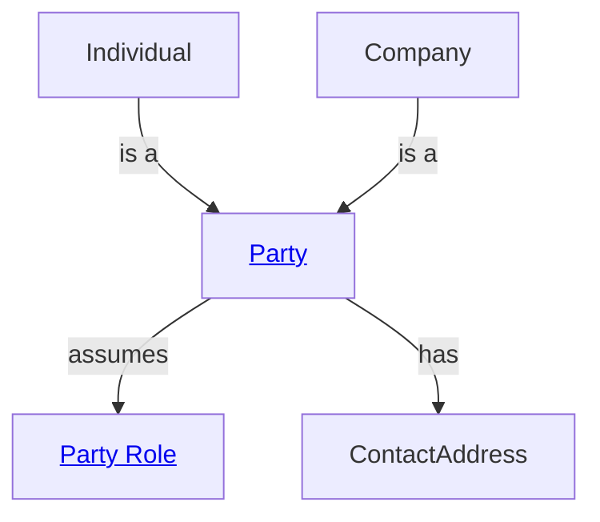
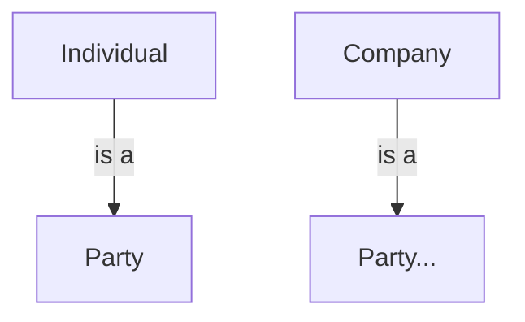

# MD‑DDL Specification (Draft 0.9.2)

## **Domains**

In MD-DDL, the domain level is the domain's **ontology** — the shared vocabulary of concepts a business uses and the named, meaningful relationships between them. It is also the router for the Knowledge Graph: the detail level supplies the DNA (attributes and constraints), while the domain level supplies the anatomy — which concepts exist, how they specialise one another, and how they relate.

### **Semantics Without Formalism**

MD-DDL is deliberately a *light* ontology. It shares the intent of formal ontology languages — explicit concepts, explicit named relationships, alignment to shared vocabularies — without their machinery. There are no formal axioms, no reasoner, no required upper ontology, and no obligation to express the model as triples.

Meaning is carried instead by:

- **Natural-language names** — a concept is named as the business names it, so the label itself carries meaning
- **Prose descriptions** — every summary entry describes what the concept means; ambiguity is resolved in words, not logic
- **Named relationships** — every connection between concepts is a labelled predicate using a business verb, never an anonymous link
- **Optional alignment** — the `Reference` column ties a local concept to an external vocabulary (BIAN, FIBO, ISO, FHIR, TM Forum) where one applies

This is enough for agents to reason over the model and for domain experts to maintain it without specialist training. An organisation that needs formal semantics can project the model into RDF/OWL; MD-DDL does not require it.

### **Domain Declaration**

A domain is declared using a **level‑1 Markdown heading**:

```markdown
# Customer
```

### **Domain Description**

All free‑text Markdown under the H1 heading and before the next H2 heading is considered the domain description.

### **Domain Metadata**

Metadata appears under a level‑2 heading:

```markdown
## Metadata
```

Domain Metadata sets the default posture for all contained objects: governance and compliance metadata declared here is inherited by every entity, relationship, event, and data product in the domain. Detail definitions declare a `governance:` block only when overriding the domain default. The governance field schema and inheritance rules are defined once, in [Section 3 — Governance Metadata Schema](./3-Entities.md#governance-metadata-schema).

Category|Metadata Keys|Purpose
--------|-------------|-------
Accountability|owners, stewards, technical_leads|Who is responsible for the business vs. technical health.
Governance & Security|classification, pii|The default security posture for the entire domain.
Compliance|regulatory_scope, default_retention|Legal and regulatory frameworks governing this data and its retention obligations.
Lifecycle|status, version|The lifecycle state and semantic version of the domain definition. See [Domain Lifecycle](#domain-lifecycle) below.
Discovery|tags|Searchability
Adoption|adoption (maturity, adoption_started, target_maturity, target_date, progress, notes)|Brownfield adoption tracking. Required when `baselines/` exists. See [Section 10 — Adoption](./10-Adoption.md).
Platform|platform (posture, technologies, product_scope, notes)|How data products relate to infrastructure. See [Section 9 — Data Products](./9-Data-Products.md#platform-posture).

#### **Metadata Format**

Metadata is expressed as YAML or JSON inside a fenced code block:

````markdown
## Metadata

```yaml
# Accountability
owners:
  - data.customer@example.com
stewards:
  - jane.doe@example.com
technical_leads:
  - architecture.team@example.com

# Governance & Security
classification: "Highly Confidential"
pii: true
regulatory_scope:
  - GDPR
  - CCPA
default_retention: "7 years"

# Lifecycle & Discovery
status: "Active"
version: "2.1.0"
tags:
  - Core
  - MasterData
  - B2C
```
````

### **Source Systems**

Source systems are first-class domain summary objects and must be declared under a level‑2 heading immediately after `## Metadata`.

Use a Markdown table with the following columns:

Column | Purpose
--- | ---
**Business Application** | Source application or product name, expressed as a Markdown link to the source's summary heading in the source layer.
**Platform** | Technology platform or deployment model.
**Capability Domain** | Business capability or functional area served by the source.

Example:

````markdown
## Source Systems

Business Application | Platform | Capability Domain
--- | --- | ---
[Temenos Payment](sources/sources.md#temenos-payment) | Temenos SaaS | Payment Execution
[SAP Fraud Management](sources/sources.md#sap-fraud-management) | SAP | Fraud
````

This table is the domain-level summary; the source layer holds the detail. See [Section 7 — Sources](./7-Sources.md) for the source summary and transform detail structure.

#### **Diagrams**

Diagrams appear under level‑3 headings inside the Metadata section, after the YAML metadata block. This separates data *about* the domain from visuals *of* the domain.

The domain level should contain a **Domain Overview Diagram** — a Mermaid `graph TD` (top-down) or `graph LR` (left-right) showing the domain's entities and how they relate. It is the visual rendering of the ontology: the summary tables declare the concepts, and the diagram shows the semantic web they form.

Every edge is a **semantic assertion**, readable as a sentence in subject–predicate–object order: `Party --> |assumes| PartyRole` asserts that a Party assumes a Party Role. Two rules follow from this:

- Edges are always labelled, and the label matches the relationship name declared in the Relationships section (e.g., `-->|assumes|`). An unlabelled edge asserts nothing and is not a relationship. Specialisation is asserted as `Child -->|is a|Parent`.
- The overview asserts meaning, not structure. Attributes, cardinality notation, and enumeration values belong in the detail level, not the overview.

Nodes may hyperlink to detail definitions for navigation, and additional level‑3 diagrams focusing on specific sub-areas may follow the overview. Layout configuration, linking syntax, and worked examples are collected in the non-normative [Diagram Style Guide](../guides/diagram-style.md).

Example (abbreviated):

````markdown
### Domain Overview Diagram


```mermaid
graph TD

  Individual --> |is a|Party
  Company --> |is a|Party

  Party --> |assumes|PartyRole
  Party --> |has|ContactAddress

  Party["<a href='entities/party.md'>Party</a>"]
  PartyRole["<a href='entities/party_role.md'>Party Role</a>"]
```
````

#### Semantic vs Logical Diagrams

MD-DDL uses two distinct diagram types for different purposes:

Diagram|Location|Purpose|Relationship Labels
-------|--------|-------|-------------------
`graph TD/LR`|Domain level|Semantic model — the ontology: concepts and the named relationships asserted between them|Required — match the Relationships section
`classDiagram`|Entity detail level|Logical model — one structural realization of those concepts|Optional — structural intent only

The semantic layer is authoritative for *meaning*; the logical layer is one realization of it. The classDiagram is therefore not required to mirror the domain graph one-for-one — a single semantic relationship may realize as several logical associations, and modellers have freedom in how they do it.

---

### **Domain Structure**

Below the metadata section, the domain level organizes concepts into six primary sections using level‑2 headings: `## Source Systems`, `## Entities`, `## Enums`, `## Relationships`, `## Events`, and `## Data Products`.

At the domain level, these sections **must use Markdown tables** for high-level summaries. This keeps the ontology scannable — a compact, complete index of the domain's vocabulary that both humans and agents can read before descending into detail.

#### Splitting Across Files

The heading hierarchy above is what the standard defines. How it is distributed across files is the author's choice: a single file may carry the domain summary and every detail definition, or the detail level may be split across many files in nested folders. When detail is split out, each file repeats the hierarchy — a level‑1 heading naming the domain (linked back to the domain summary), the relevant level‑2 section heading, then the level‑3 definitions — so that agents can reassemble the full model from any arrangement.

A common split, for illustration only:

```shell
domain.md
entities/party.md        ← Party entity + Party Has Role + Party Has Contact Address
entities/party-role.md   ← Party Role entity + Party Role Uses Contact Address
entities/address.md      ← Address entity (no outbound relationships)
products/analytics.md    ← Consumer-aligned data products
products/canonical.md    ← Domain-aligned data products
sources/sources.md       ← All source summaries for the domain
sources/temenos-payment/table_PAYMENT_EVENT.md
```

#### **Source Systems Table**

Summarizes operational source applications relevant to the domain, using the column format defined in [Source Systems](#source-systems) above.

---

#### **Entities Table**

The Entities table declares the concepts of the domain ontology — the things the business talks about.

 Column | Purpose
 --- | ---
**Name** | The natural language name of the concept, linked to its detail-level anchor.
**Specializes** | If applicable, a link to the parent concept. Specialization asserts *is-a*: every instance of this concept is also an instance of the parent, and inherits its attributes, constraints, and governance.
**Description** | A brief definition of what the concept means (1–2 sentences).
**Reference** | Optional alignment to an external vocabulary or standard (e.g., BIAN, FIBO, ISO, FHIR). This is how a local concept is tied to a shared industry meaning.

---

#### **Enums Table**

Declares the controlled vocabularies of the domain — the closed value sets that concepts draw on. By convention, an enum's name describes the value set (e.g., Loyalty Tier, Customer Types) — be consistent within a domain.

Column | Purpose
--- | ---
**Name** | The name of the enumeration, linked to its detail-level anchor.
**Description** | What this set of values represents.
**Reference** | Optional external reference for standardized codes.

---

#### **Relationships Table**

Declares the predicates of the domain ontology — the named, meaningful connections asserted between concepts. Each row is an assertion the business would recognise as true.

Column | Purpose
--- | ---
**Name** | The action-oriented name, reading as subject–predicate–object (e.g., Customer Has Preferences), linked to details.
**Description** | What the connection means in the business, and when it holds.
**Reference** | Optional alignment to an external relationship pattern or vocabulary.

---

#### **Events Table**

Declares the meaningful state changes in the domain. An event names *what happened* in business terms, and binds it to the concepts that participate: who acted, and what was affected.

Column | Purpose
--- | ---
**Name** | The natural language name of the event, linked to details.
**Actor** | The concept or role that initiates the event.
**Entity** | The concept whose state the event changes.
**Description** | The business trigger and meaning of this event.

---

#### **Data Products Table**

Summarizes the data products published by the domain.

Column | Purpose
--- | ---
**Name** | The product name, linked to its detail definition.
**Class** | `source-aligned`, `domain-aligned`, or `consumer-aligned`.
**Consumers** | Primary consumers of this product.
**Status** | Lifecycle state: `Draft`, `Active`, `Deprecated`, `Retired`.

---

### **Rules for Summary Definitions**

- **Tabular Authority:** The domain-level summary **must** use the table formats defined above. H3 headings under these sections are reserved for **detail definitions**.
- **Linking Strategy:** The `Name` column must contain a Markdown link pointing to the H3 anchor of the detail definition — `[Entity Name](#entity-name)` when detail sits in the same file, or `[Entity Name](entities/customer.md#entity-name)` when it is split out.
- **AI Scoping:** AI agents should ingest these tables first to understand the domain's ontology — its concepts and their relationships — before requesting attribute-level detail (YAML blocks) from the detail level.
- **No Boilerplate:** If a column like `Specializes` or `Reference` is empty for all entries in a section, it may be omitted from the table, but the `Name` and `Description` columns are mandatory.
- The description must include a short natural‑language description. A longer description belongs at the detail level.

This allows the domain level to act as a semantic index of the domain.

---

### **Domain Lifecycle**

Every domain definition has a lifecycle — it moves from initial authoring through validation to production use, and eventually to deprecation and retirement. The `status` and `version` fields in domain metadata track this progression.

#### Domain Status

The `status` field declares the current lifecycle state of the domain definition:

Value | Description
--- | ---
`Draft` | Under active development. Not yet validated. Do not consume.
`Review` | Under structured review. Stable enough for early feedback; breaking changes possible.
`Active` | Validated and available for consumption. Stability guaranteed within major version.
`Deprecated` | Retained for reference and migration support. Consumers should migrate to the superseding definition, which may be declared in a `superseded_by` metadata field.
`Retired` | No longer maintained. Historical record only.

#### Domain Version

The `version` field uses semantic versioning (`MAJOR.MINOR.PATCH`): major for breaking changes, minor for additive changes, patch for corrective changes. A change is **breaking** if a correctly-authored downstream consumer (data product, physical artifact, or integration) would produce different or incorrect output after the change is applied.

A domain may also maintain a lifecycle history document (conventionally `LIFECYCLE.md`) combining a machine-readable change manifest with a human-readable changelog.

Lifecycle transition rules, version-bump guidance, the breaking-change taxonomy, the evolution workflow, and the `LIFECYCLE.md` format are collected in the non-normative [Lifecycle & Versioning Guide](../guides/lifecycle-versioning.md).

---

#### **Domain Structure Example**

Below is an example of how the domain level is structured.

````markdown
# Domain Name

Domain description...

## Metadata
Formal JSON/YAML block and diagrams...

## Source Systems

Business Application | Platform | Capability Domain
--- | --- | ---
[Customer CRM](sources/salesforce-crm/source.md) | Salesforce SaaS | Customer Relationship Management

### Domain Overview Diagram


```mermaid
graph TD

  Individual --> |is a|Party
  Company --> |is a|Party...
```

## Entities

Name | Specializes | Description | Reference
--- | --- | --- | ---
[Customer](./details.md#customer) | [Party Role](./details.md#party-role) | An individual or legal entity that has a relationship with the organization. | [BIAN: Party Role](https://...) |
[Individual](./details.md#individual) | [Party](./details.md#party) | A natural person as opposed to a legal entity. | |

When an entity specializes (inherits from) another entity, declare this in the specializes column with a link to the parent.

## Enums

Name | Description | Reference
--- | --- | ---
[Loyalty Tier](./details.md#loyalty-tier) | Categorizes customers by annual spend and engagement. | |

## Relationships

Name | Description | Reference
--- | --- | ---
[Customer Has Preferences](./details.md#customer-has-preferences) | Maps a customer to their specific interaction settings. |

## Events

Name | Actor | Entity | Description
--- | --- | --- | ---
[Preference Updated](./details.md#preference-updated) | Customer | Customer Preference | Emitted when interaction settings are modified.

## Data Products

Name | Class | Consumers | Status
--- | --- | --- | ---
[Customer 360 Profile](products/analytics.md#customer-360-profile) | consumer-aligned | Retail Analytics Team | Active

````

---

...next: [Entities](3-Entities.md)
