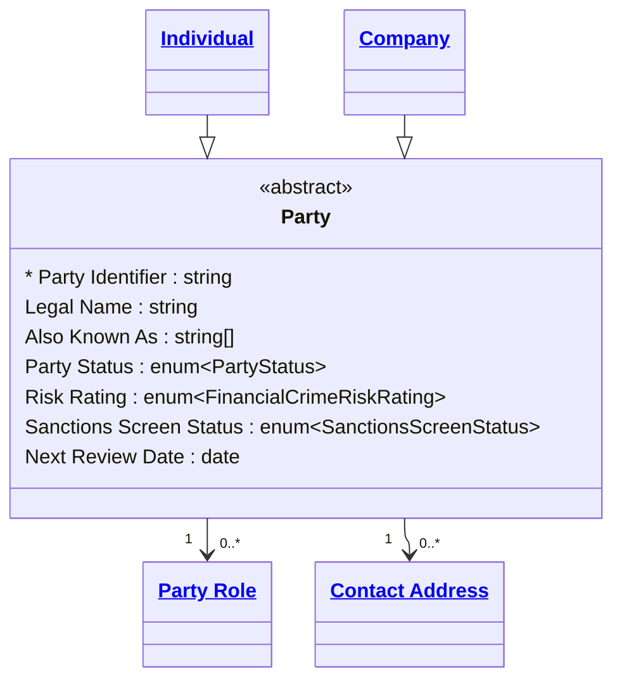

# **Entities**
Each file must declare which domain it is part of by starting with a Level 1 heading with the domain name. 


## **Entity Declaration**

The Entities section appear under a level‑2 heading:

```markdown
## Entities
```

Each entity is introduced with a **level‑3 heading**:

```markdown
### Customer
```

## **Entity Description**

Free‑text Markdown under the heading describes the entity in more detail than was found in the domain summary.

## **Entity Diagram**

Every entity detail file must include a `classDiagram` immediately after the entity description and before the YAML definition blocks. The diagram is the visual contract for the entity — it shows the entity's own attributes, its position in the inheritance hierarchy, and all of its immediate relationships to other entities.

### **Diagram Configuration**

All entity diagrams use the ELK layout engine for consistent rendering:

````markdown
```mermaid
---
config:
  layout: elk
---
classDiagram
  ...
```
````

### **The Subject Class**

The entity being defined is the **subject class**. It is always written as a
full class block with its attributes listed inside:

```
  class Party{
    <<abstract>>
    * Party Identifier : string
    Legal Name : string
    Party Status : enum~PartyStatus~
  }
```

**Rules for the subject class:**

- The class name uses PascalCase matching the entity heading (e.g., `Party`,
  `ContactAddress`, `PartyRole`)
- If the entity is abstract — never instantiated directly, only specialised —
  add `<<abstract>>` as the first line inside the class block
- The primary identifier attribute is prefixed with `*` to mark it as the key
- All attributes defined in the entity's YAML block must appear in the diagram
- Attribute types use the Mermaid classifier syntax:
  - Primitives: `string`, `integer`, `decimal`, `boolean`, `date`, `datetime`
  - Enumerations: `enum~EnumName~` (e.g., `enum~PartyStatus~`, `enum~CountryCode~`)
  - Arrays: append `[]` to the type (e.g., `enum~CountryCode~[]`, `string[]`)
- Inherited attributes from parent entities are **not** repeated in the
  subject class — only attributes defined in this entity's own YAML block
  are shown
- Attribute format is `AttributeName : Type` with a space either side of
  the colon

### **Related Classes**

All other classes that appear in the diagram — parents, children, and related
entities — are **reference classes**. They are never defined with attribute
blocks. Instead they use the linked class syntax:

```
  class Party["<a href='party.md'>Party</a>"]
```

**Rules for reference classes:**

- Use plain anchor tags: `<a href='path'>Display Name</a>`
- No CSS class attributes on the anchor tag
- The `href` path is relative to the current file's location and uses
  snake_case filenames (e.g., `party.md`, `party_role.md`,
  `contact_address.md`)
- Display Name uses natural language with spaces matching the entity heading
  (e.g., `Party Role`, `Contact Address`)
- All reference class definitions are grouped at the bottom of the diagram,
  after all relationship lines
- If a specialisation child has no detail file yet, it may appear as a bare
  unlinked class: `class Customer` — without a block or link

### **Inheritance**

Inheritance uses the Mermaid `--|>` arrow with the child on the left:

```
  Individual --|> Party
  Company --|> Party
```

This reads as "Individual is a specialisation of Party." The direction matches
the domain overview diagram convention of `Child -->|is a|Parent`.

When an entity **is** a specialisation, show the parent as a reference class:

```
  Individual --|> Party
  class Party["<a href='party.md'>Party</a>"]
```

When an entity **has** specialisations, show each child as a reference class
(or bare class if not yet defined):

```
  Individual --|> Party
  Company --|> Party
  class Individual["<a href='individual.md'>Individual</a>"]
  class Company["<a href='company.md'>Company</a>"]
```

### **Relationships**

All immediate relationships to and from the entity are shown with labelled
arrows, cardinality, and a relationship label that matches the verb used in
the Relationships section of the domain file:

```
  Party "1" --> "0..*" PartyRole : assumes
  PartyRole "0..*" --> "0..*" ContactAddress : uses
  ContactAddress "0..*" --> "1" Address : references
```

**Rules for relationships:**

- Cardinality is always shown on both ends using quoted strings:
  `"1"`, `"0..1"`, `"0..*"`, `"1..*"`
- The relationship label after `:` uses the verb from the domain Relationships
  section — it must match exactly
- The arrow direction reflects the ownership or navigational direction:
  the entity that *holds the reference* is the source (`-->`)
- Bidirectional relationships use `<-->`
- Every entity in a relationship line must have a corresponding reference
  class definition at the bottom of the diagram

### **Ordering Within the Diagram**

To keep diagrams readable and consistent, follow this ordering:

1. The subject class block (with attributes)
2. Specialisation child classes (bare or linked, one per line)
3. Inheritance arrows (`--|>`)
4. Relationship lines (`-->` with cardinality and label)
5. All reference class definitions (`class Foo["<a href='...'>...</a>"]`)

### **Example**

**Abstract entity with specialisations and outbound relationships (Party):**

````markdown

````

## **Entity Definition**

A structured block defines the entity's attributes and logic. MD‑DDL follows a Key-as-Name philosophy to eliminate redundancy and ensure that the human-readable label used in the documentation is the exact same identifier used in the Knowledge Graph.:

````markdown
```yaml
extends: Party Role
temporal:
  tracking: valid_time
  description: Preferences are valid for specific time periods and can be future-dated
attributes:
  Customer Number:
    type: string
    identifier: true
  Email Address:
    type: string
    pii: true
  Balance:
    type: Decimal
```

```yaml
constraints:
  Valid Date Range:
    check: "End Date > Start Date"
  Positive Liquidity:
    check: "Balance > 0"
```

```yaml
governance:
  pii: true
  retention: 7 years
  access_role: HR_ADMIN
  classification: Confidential
```
````

**The "Key-as-Name" Principle**

By using the business term (e.g., Positive Liquidity) as the YAML key rather than a nested property (e.g., name: Positive Liquidity), we achieve:

- Semantic Uniqueness: Every constraint and attribute is forced to have a distinct, meaningful identity within its context.
- Reduced Friction: There is no "translation layer" between the documentation and the database schema. What you see in the heading or key is what appears in the Graph node.
- Logical Referencing: Sub-entities that inherit from this entity can specifically override or reference a constraint by its key name, allowing for a cleaner "Logic Lineage."

## Temporal Tracking Types

This optional section defines how temporal tracking is applied to the entity. This is optional and will default to current state tracking if not specified or inherit from parent entities if they have temporal tracking defined. 

Type|Description|Compiler Behavior
----|-----------|------------------
`valid_time`|Business time - when is this true in the real world?|Adds effective/expiration date columns, supports point-in-time queries
`transaction_time`|System time - when was this recorded?|Adds created/superseded timestamps, immutable records
`bitemporal`|Both valid and transaction time|Adds both sets of columns, full temporal reconstruction
`point_in_time`|Event timestamp only|For events - single timestamp, immutable

---

## Attribute Definition

### Attribute Properties

Property|Required|Description|Example
--------|--------|-----------|-------
`type`|Yes|The data type of the attribute|`string`, `integer`, `decimal`, `boolean`, `date`, `datetime`, `timestamp`, `string[]`, `enum:Loyalty Tier`
`description`|No|Human-readable explanation of the attribute's purpose|"The primary email address for customer communication"
`identifier`|No|Marks this attribute as an identifier (default: `false`). Values: `primary`, `alternate`, `natural`, `surrogate`|`primary`, `alternate`
`unique`|No|Whether values must be unique across all instances (default: `false`)|`true` or `false`
`default`|No|Default value when not explicitly provided|`0`, `"Unknown"`, `false`

### Type System

Type|Description|Examples
----|-----------|--------
`string`|Text data.|"John Doe", "abc123"
`integer`|Whole numbers without decimals|42, -17, 0
`decimal`|Numeric values with decimal precision|99.99, -0.001, 3.14159
`boolean`|True or false values|`true`, `false`
`date`|Calendar date without time|2024-03-15
`datetime`|Date with time (timezone-aware)|2024-03-15T14:30:00Z
`enum:<Enum Name>`|Reference to a defined enumeration|`enum:Loyalty Tier`, `enum:Country Code`

### Arrays

All types above support arrays by appending `[]` to the type name. For example, `string[]` or `decimal[]`

Array constraints can be specified in the square brackets. For example, `string[1..5]` means 1 to 5 strings. `decimal[0..*]` means 0 or more decimals. `enum:Country Code[2]` means exactly 2 country codes.

- Valid cardinality syntax: `[n]`, `[n..m]`, `[n..*]`, or `[*]`
- If no carditality is provided, `[*]` is assumed.


## Constraint Definition

Constraints define validation rules and business logic that span one or more attributes. They appear under a `constraints:` section in the entity or relationship YAML.

### Constraint Properties

Property|Purpose|Example
--------|-------|-------
`unique`|Enforce uniqueness of one or more attributes|`unique: Email Address` or `unique: [Country, State, Postal Code]`
`not_null`|Require attribute to have a value|`not_null: Email Address` or `not_null: [First Name, Last Name]`
`check`|Boolean expression that must be true|`check: "Age >= 18"`
`derived`|Define computed/calculated attributes|`derived: {attribute: Full Name, expression: "First Name + ' ' + Last Name"}`
`lifecycle_stage`: Enforce completeness at specific lifecycle stages|`lifecycle_stage: [Registration, KYC Complete]`
`description`|Human-readable explanation|"Customer must be 18 or older"

One of unique, not_null, check, or derived must be present.

Example:
```yaml
constraints:
  Contact Information Required:
    not_null: [Email Address, Phone Number]
    lifecycle_stage: Activation
    description: At least one contact method must be provided at activation
```

---

## Rules

**Inheritance:**
- Attribute Inheritance: Customer gets all attributes of Party Role
- Constraint Inheritance: If Party Role has a constraint, Customer must follow it.

**Identifiers:**

Every Entity should have at least one attribute marked identifier: true. If missing, the Knowledge Graph treats the entity as a "Logic Object" rather than a "Data Object."

**Parser:**

The parser will merge all YAML/JSON blocks found under a single L3 heading into a single Entity node.

**No Relationship Attributes:**

Explicitly forbid Customer Id appearing inside a Preference entity YAML. Instead, the Relationships section handles the link. This prevents "Foreign Key Drift."

### **Naming Rules**

- Natural Language Priority: Entity and attribute names must use natural language (e.g., Email Address, not email_addr).
- Case & Spaces: Names are case-sensitive and support spaces.
- No Redundancy: Do not include a name: field inside the YAML block. The Markdown heading serves as the Entity name, and the YAML keys serve as Attribute/Constraint names.
- Machine Normalisation: While the Knowledge Graph preserves these natural labels for navigability, the MD‑DDL compiler automatically handles the normalisation (e.g., conversion to snake_case) for physical system generation.

---

...next: [Enums](4-Enumerations.md)
